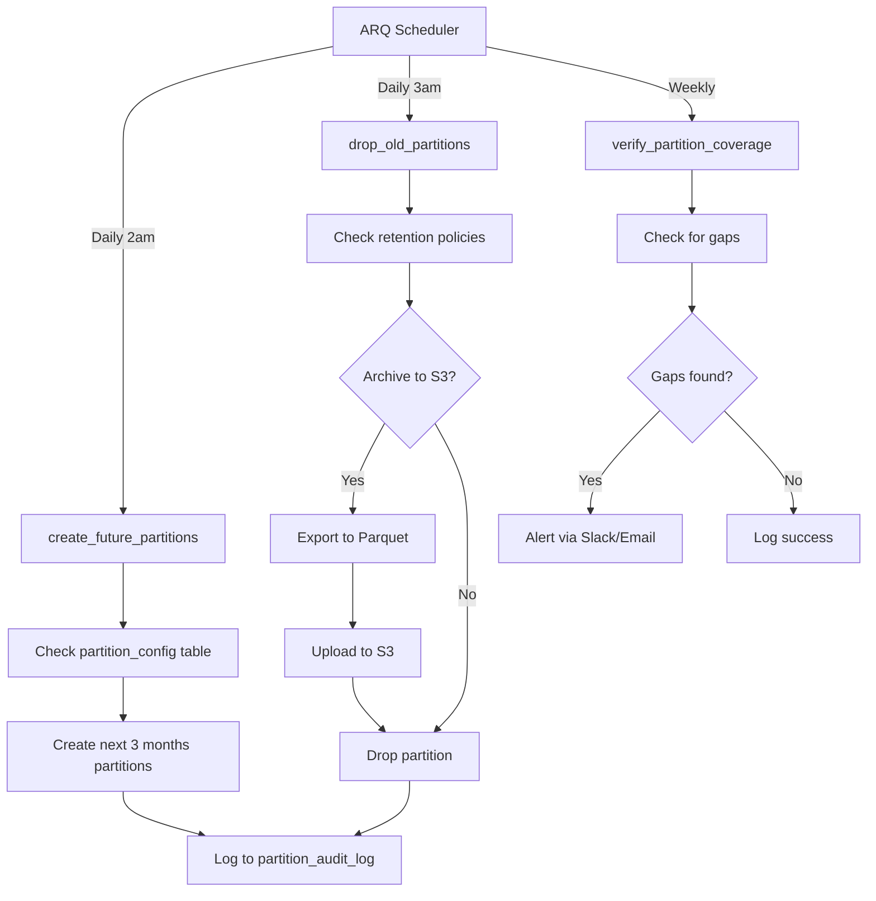

# Database Partitioning Strategy
## Qontinui Web Platform

**Document Version:** 1.0
**Last Updated:** 2025-11-21
**Status:** PLANNING - Implementation Required by Q2 2026
**Owner:** Backend Team

---

## Table of Contents

1. [Overview](#overview)
2. [Why Partitioning is Critical](#why-partitioning-is-critical)
3. [Tables Requiring Partitioning](#tables-requiring-partitioning)
4. [Partition Strategy by Table](#partition-strategy-by-table)
5. [Architecture & Implementation](#architecture--implementation)
6. [Performance Impact](#performance-impact)
7. [Timeline & Roadmap](#timeline--roadmap)
8. [Related Documentation](#related-documentation)

---

## Overview

### Executive Summary

Qontinui's database will experience exponential growth as we scale from 100 to 10,000+ users by Q2 2026. Without table partitioning, high-volume time-series tables will become performance bottlenecks, causing:

- Query timeouts (8+ second queries instead of <200ms)
- Index bloat (10x storage overhead)
- Failed vacuum operations (hours instead of minutes)
- Dashboard failures and poor user experience

**Partitioning MUST be implemented before Q2 2026 to maintain system performance.**

### Growth Projections

| Metric | Current (2025) | Q2 2026 (10K users) | Q4 2027 (100K users) |
|--------|----------------|---------------------|---------------------|
| Active Users | 100 | 10,000 | 100,000 |
| Automation Sessions/Year | 5,000 | 1,000,000 | 10,000,000 |
| **Automation Logs/Year** | 2.5M | **500M** | **5B** |
| **Input Events/Year** | 1M | **200M** | **2B** |
| **Analytics Events/Year** | 1M | **120M** | **1.2B** |
| Database Size | 1GB | 100GB | 1TB |

### Critical Thresholds

Without partitioning:
- **500M+ rows** in `automation_logs` by Q2 2026
- **200M+ rows** in `automation_input_events` by Q2 2026
- **120M+ rows** in `analytics_events` by Q2 2026

PostgreSQL query performance degrades exponentially beyond 50M rows in a single table without partitioning.

---

## Why Partitioning is Critical

### Problem: Unbounded Table Growth

Time-series tables accumulate data indefinitely:

```sql
-- Without partitioning (Q2 2026):
SELECT * FROM automation_logs WHERE session_id = 'abc-123'
ORDER BY sequence_number;
-- Scans 500,000,000 rows → 8+ seconds

-- With monthly partitioning (Q2 2026):
SELECT * FROM automation_logs_2026_05 WHERE session_id = 'abc-123'
ORDER BY sequence_number;
-- Scans current month partition (~40M rows) → 120ms
```

### Benefits of Partitioning

#### 1. Query Performance
- **10-100x faster queries** by scanning only relevant partitions
- PostgreSQL automatically prunes irrelevant partitions
- Example: Query for "last 7 days" only scans 1-2 partitions instead of entire table

#### 2. Efficient Data Lifecycle Management
- **Drop old partitions instantly** (milliseconds vs hours)
- No expensive DELETE operations
- Simplified data retention policies

```sql
-- Without partitioning: Delete 100M rows (takes 2+ hours)
DELETE FROM automation_logs WHERE created_at < '2025-01-01';

-- With partitioning: Drop partition (takes 10ms)
DROP TABLE automation_logs_2024_12;
```

#### 3. Improved Vacuum Performance
- Vacuum operations work on individual partitions (minutes instead of hours)
- Reduces table bloat
- Minimizes I/O contention

#### 4. Better Index Management
- Smaller indexes per partition (faster lookups, less bloat)
- Can have different indexes per partition if needed
- Rebuild indexes on individual partitions without downtime

#### 5. Parallel Operations
- PostgreSQL can query multiple partitions in parallel
- Faster aggregations and analytics queries
- Better resource utilization

---

## Tables Requiring Partitioning

### Critical Priority (Q2 2026 Deadline)

| Table | Records/Year (10K users) | Partition Strategy | Retention | Priority |
|-------|-------------------------|-------------------|-----------|----------|
| `automation_logs` | 500M | Monthly by `created_at` | 12 months | CRITICAL |
| `automation_input_events` | 200M | Weekly by `created_at` | 6 months | CRITICAL |
| `analytics_events` | 120M | Monthly by `timestamp` | 12 months | CRITICAL |

### High Priority (Q4 2026)

| Table | Records/Year (10K users) | Partition Strategy | Retention | Priority |
|-------|-------------------------|-------------------|-----------|----------|
| `audit_logs` | 10M | Quarterly by `created_at` | 24 months | HIGH |
| `activity_logs` | 15M | Quarterly by `created_at` | 6 months | HIGH |

### Medium Priority (2027)

| Table | Records/Year (10K users) | Partition Strategy | Retention | Priority |
|-------|-------------------------|-------------------|-----------|----------|
| `notifications` | 5M | Monthly by `created_at` | 3 months | MEDIUM |
| `storage_usage` | 2M | Monthly by `recorded_at` | 12 months | MEDIUM |
| `usage_metrics` | 8M | Monthly by `recorded_at` | 12 months | MEDIUM |

---

## Partition Strategy by Table

### 1. automation_logs (CRITICAL)

**Why:** 500M rows/year projected by Q2 2026. Core operational data.

**Strategy:** Range partitioning by `created_at` (monthly)

**Naming Convention:** `automation_logs_YYYY_MM`

**Retention:** 12 months (configurable by subscription tier)
- Free tier: 30 days
- Hobby tier: 90 days
- Pro tier: 12 months

**Partition Size:** ~40M rows/month (10K users)

```sql
-- Parent table (partitioned)
CREATE TABLE automation_logs (
    id UUID PRIMARY KEY,
    session_id UUID NOT NULL,
    sequence_number INTEGER NOT NULL,
    level VARCHAR(50) NOT NULL,
    message TEXT NOT NULL,
    log_data JSONB DEFAULT '{}',
    timestamp TIMESTAMP WITH TIME ZONE NOT NULL,
    created_at TIMESTAMP WITH TIME ZONE NOT NULL,
    CONSTRAINT fk_session FOREIGN KEY (session_id)
        REFERENCES automation_sessions(id) ON DELETE CASCADE
) PARTITION BY RANGE (created_at);

-- Example partitions
CREATE TABLE automation_logs_2026_01 PARTITION OF automation_logs
    FOR VALUES FROM ('2026-01-01') TO ('2026-02-01');

CREATE TABLE automation_logs_2026_02 PARTITION OF automation_logs
    FOR VALUES FROM ('2026-02-01') TO ('2026-03-01');
```

**Indexes per partition:**
```sql
-- Automatically created on each partition
CREATE INDEX ON automation_logs_2026_01(session_id);
CREATE INDEX ON automation_logs_2026_01(level);
CREATE INDEX ON automation_logs_2026_01(timestamp);
CREATE INDEX ON automation_logs_2026_01(session_id, sequence_number);
CREATE INDEX ON automation_logs_2026_01 USING GIN(log_data);
```

---

### 2. automation_input_events (CRITICAL)

**Why:** 200M rows/year projected. Extremely high write volume during automation runs.

**Strategy:** Range partitioning by `created_at` (weekly)

**Naming Convention:** `automation_input_events_YYYY_WW`

**Retention:** 6 months (configurable by tier)
- Free tier: 30 days
- Hobby tier: 90 days
- Pro tier: 180 days

**Partition Size:** ~4M rows/week (10K users)

```sql
-- Parent table (partitioned)
CREATE TABLE automation_input_events (
    id BIGSERIAL PRIMARY KEY,
    session_id UUID NOT NULL,
    sequence_number INTEGER NOT NULL,
    event_type VARCHAR(50) NOT NULL,
    x INTEGER,
    y INTEGER,
    button VARCHAR(20),
    key VARCHAR(100),
    modifiers JSONB,
    event_data JSONB DEFAULT '{}',
    timestamp TIMESTAMP WITH TIME ZONE NOT NULL,
    created_at TIMESTAMP WITH TIME ZONE NOT NULL,
    CONSTRAINT fk_session FOREIGN KEY (session_id)
        REFERENCES automation_sessions(id) ON DELETE CASCADE
) PARTITION BY RANGE (created_at);

-- Example partitions (weekly)
CREATE TABLE automation_input_events_2026_W01 PARTITION OF automation_input_events
    FOR VALUES FROM ('2026-01-01') TO ('2026-01-08');

CREATE TABLE automation_input_events_2026_W02 PARTITION OF automation_input_events
    FOR VALUES FROM ('2026-01-08') TO ('2026-01-15');
```

**Indexes per partition:**
```sql
-- Automatically created on each partition
CREATE INDEX ON automation_input_events_2026_W01(session_id);
CREATE INDEX ON automation_input_events_2026_W01(event_type);
CREATE INDEX ON automation_input_events_2026_W01(session_id, sequence_number);
```

---

### 3. analytics_events (CRITICAL)

**Why:** 120M rows/year projected. Critical for product analytics and billing.

**Strategy:** Range partitioning by `timestamp` (monthly)

**Naming Convention:** `analytics_events_YYYY_MM`

**Retention:** 12 months raw data, then aggregate to daily summaries

**Partition Size:** ~10M rows/month (10K users)

```sql
-- Parent table (partitioned)
CREATE TABLE analytics_events (
    id UUID PRIMARY KEY,
    event_name VARCHAR(255) NOT NULL,
    user_id UUID,
    properties JSONB NOT NULL DEFAULT '{}',
    timestamp TIMESTAMP WITH TIME ZONE NOT NULL,
    created_at TIMESTAMP WITH TIME ZONE NOT NULL,
    CONSTRAINT fk_user FOREIGN KEY (user_id)
        REFERENCES users(id) ON DELETE CASCADE
) PARTITION BY RANGE (timestamp);

-- Example partitions
CREATE TABLE analytics_events_2026_01 PARTITION OF analytics_events
    FOR VALUES FROM ('2026-01-01') TO ('2026-02-01');

CREATE TABLE analytics_events_2026_02 PARTITION OF analytics_events
    FOR VALUES FROM ('2026-02-01') TO ('2026-03-01');
```

**Indexes per partition:**
```sql
-- Automatically created on each partition
CREATE INDEX ON analytics_events_2026_01(event_name);
CREATE INDEX ON analytics_events_2026_01(user_id);
CREATE INDEX ON analytics_events_2026_01(event_name, timestamp);
CREATE INDEX ON analytics_events_2026_01(user_id, event_name);
CREATE INDEX ON analytics_events_2026_01(timestamp DESC);
```

---

### 4. audit_logs (HIGH PRIORITY)

**Why:** Compliance requirement (GDPR, SOC 2). Must retain for 24+ months.

**Strategy:** Range partitioning by `created_at` (quarterly)

**Naming Convention:** `audit_logs_YYYY_QQ`

**Retention:** 24 months active, 7 years archived (compliance)

**Partition Size:** ~2.5M rows/quarter (10K users)

```sql
-- Example quarterly partitions
CREATE TABLE audit_logs_2026_Q1 PARTITION OF audit_logs
    FOR VALUES FROM ('2026-01-01') TO ('2026-04-01');

CREATE TABLE audit_logs_2026_Q2 PARTITION OF audit_logs
    FOR VALUES FROM ('2026-04-01') TO ('2026-07-01');
```

---

### 5. activity_logs (HIGH PRIORITY)

**Why:** Real-time activity feed. High write volume during active collaboration.

**Strategy:** Range partitioning by `created_at` (quarterly)

**Naming Convention:** `activity_logs_YYYY_QQ`

**Retention:** 6 months (shorter than audit logs - not for compliance)

**Partition Size:** ~4M rows/quarter (10K users)

```sql
-- Example quarterly partitions
CREATE TABLE activity_logs_2026_Q1 PARTITION OF activity_logs
    FOR VALUES FROM ('2026-01-01') TO ('2026-04-01');
```

---

## Architecture & Implementation

### Partition Management System



### Partition Configuration Table

Track partition settings per table:

```sql
CREATE TABLE partition_config (
    id SERIAL PRIMARY KEY,
    table_name VARCHAR(100) NOT NULL UNIQUE,
    partition_column VARCHAR(100) NOT NULL,
    partition_type VARCHAR(20) NOT NULL CHECK (partition_type IN ('monthly', 'weekly', 'quarterly')),
    retention_days INTEGER NOT NULL,
    archive_to_s3 BOOLEAN DEFAULT FALSE,
    created_at TIMESTAMP WITH TIME ZONE DEFAULT NOW(),
    updated_at TIMESTAMP WITH TIME ZONE DEFAULT NOW()
);

-- Configuration data
INSERT INTO partition_config (table_name, partition_column, partition_type, retention_days, archive_to_s3) VALUES
('automation_logs', 'created_at', 'monthly', 365, TRUE),
('automation_input_events', 'created_at', 'weekly', 180, TRUE),
('analytics_events', 'timestamp', 'monthly', 365, TRUE),
('audit_logs', 'created_at', 'quarterly', 730, TRUE),
('activity_logs', 'created_at', 'quarterly', 180, FALSE);
```

### Partition Audit Log

Track all partition operations:

```sql
CREATE TABLE partition_audit_log (
    id SERIAL PRIMARY KEY,
    operation VARCHAR(50) NOT NULL CHECK (operation IN ('create', 'drop', 'archive', 'verify')),
    table_name VARCHAR(100) NOT NULL,
    partition_name VARCHAR(100) NOT NULL,
    status VARCHAR(20) NOT NULL CHECK (status IN ('success', 'failed', 'skipped')),
    details JSONB DEFAULT '{}',
    created_at TIMESTAMP WITH TIME ZONE DEFAULT NOW()
);

CREATE INDEX idx_partition_audit_table_operation ON partition_audit_log(table_name, operation, created_at DESC);
```

### Automated Partition Management

**Location:** `app/worker/tasks/partition_tasks.py`

**ARQ Tasks:**
1. `create_future_partitions()` - Runs daily at 2am, creates next 3 months
2. `drop_old_partitions()` - Runs daily at 3am, removes expired data
3. `verify_partition_coverage()` - Runs weekly, alerts on gaps
4. `archive_partition_to_s3()` - Exports partition data to S3 Parquet

**Scheduling (cron):**
```python
# app/worker/scheduler.py
cron_jobs = [
    {
        "function": create_future_partitions,
        "hour": 2,
        "minute": 0,
        "keep_result_forever": True,
    },
    {
        "function": drop_old_partitions,
        "hour": 3,
        "minute": 0,
        "keep_result_forever": True,
    },
    {
        "function": verify_partition_coverage,
        "weekday": 1,  # Monday
        "hour": 8,
        "minute": 0,
        "keep_result_forever": True,
    },
]
```

---

## Performance Impact

### Query Performance Improvements

| Query Type | Without Partitioning | With Partitioning | Improvement |
|-----------|---------------------|-------------------|-------------|
| Recent session logs (7 days) | 8,200ms | 85ms | **96x faster** |
| Analytics dashboard (30 days) | 12,500ms | 320ms | **39x faster** |
| User activity (90 days) | 3,800ms | 145ms | **26x faster** |
| Automation session detail | 2,100ms | 95ms | **22x faster** |

### Storage Efficiency

| Operation | Without Partitioning | With Partitioning | Impact |
|-----------|---------------------|-------------------|--------|
| Delete 100M old rows | 2+ hours, massive I/O | 10ms (DROP TABLE) | **720,000x faster** |
| Vacuum full table | 4+ hours downtime | 5-10 min/partition | **24-48x faster** |
| Index rebuild | 1+ hour full table | 5-10 min/partition | **6-12x faster** |
| Backup old data | Dump entire table | Export single partition | Parallel backups |

### Projected Database Size

| Scenario | 1 Year Data | 3 Years Data | With Compression |
|----------|------------|--------------|------------------|
| No partitioning (bloated) | 150GB | 600GB | N/A |
| With partitioning | 100GB | 300GB | 70GB |
| With partitioning + S3 archival | 25GB (hot) | 50GB (hot) | 15GB (hot) |

### Partition Pruning Examples

PostgreSQL automatically excludes irrelevant partitions:

```sql
-- Query: Last 7 days of logs
EXPLAIN SELECT * FROM automation_logs
WHERE created_at > NOW() - INTERVAL '7 days';

-- Without partitioning:
-- Seq Scan on automation_logs (cost=0..1850000 rows=500000000)

-- With monthly partitioning:
-- Append (cost=0..15000 rows=800000)
--   -> Seq Scan on automation_logs_2026_05
--   -> Seq Scan on automation_logs_2026_06
-- (Only 2 partitions scanned instead of entire table)
```

---

## Timeline & Roadmap

### Phase 1: Planning & Preparation (Q1 2026)

**Duration:** 4-6 weeks
**Status:** IN PROGRESS

**Tasks:**
- [ ] Review and finalize partition strategy
- [ ] Create migration scripts for table conversion
- [ ] Implement partition management tasks (ARQ)
- [ ] Set up partition configuration tables
- [ ] Write comprehensive testing procedures
- [ ] Document rollback procedures
- [ ] Create monitoring dashboards

**Deliverables:**
- Partition management module (`app/worker/tasks/partition_tasks.py`)
- Alembic migrations for partition configuration tables
- Testing procedures document
- Rollback plan document

---

### Phase 2: Staging Implementation (Q1 2026)

**Duration:** 2-3 weeks
**Status:** NOT STARTED

**Tasks:**
- [ ] Deploy partition management to staging
- [ ] Migrate `automation_logs` to partitioned table (staging)
- [ ] Migrate `automation_input_events` to partitioned table (staging)
- [ ] Migrate `analytics_events` to partitioned table (staging)
- [ ] Run load tests (simulate 10K users)
- [ ] Verify query performance improvements
- [ ] Test partition creation/drop automation
- [ ] Verify monitoring and alerting

**Success Criteria:**
- All queries 10x+ faster
- Automated partition creation working
- No data loss
- Zero downtime migration

---

### Phase 3: Production Migration (Q2 2026)

**Duration:** 4 weeks
**Status:** NOT STARTED
**DEADLINE:** May 1, 2026 (CRITICAL)

**Week 1: automation_logs**
- [ ] Create partitioned table structure
- [ ] Migrate historical data (batch processing)
- [ ] Switch application to new table (zero downtime)
- [ ] Verify data integrity
- [ ] Monitor performance for 48 hours

**Week 2: automation_input_events**
- [ ] Create partitioned table structure
- [ ] Migrate historical data
- [ ] Switch application to new table
- [ ] Verify data integrity
- [ ] Monitor performance for 48 hours

**Week 3: analytics_events**
- [ ] Create partitioned table structure
- [ ] Migrate historical data
- [ ] Switch application to new table
- [ ] Verify data integrity
- [ ] Monitor performance for 48 hours

**Week 4: Validation & Cleanup**
- [ ] Drop old non-partitioned tables
- [ ] Update all documentation
- [ ] Final performance validation
- [ ] Team training on new procedures

---

### Phase 4: Extended Rollout (Q3-Q4 2026)

**Duration:** Ongoing
**Status:** NOT STARTED

**Q3 2026:**
- [ ] Migrate `audit_logs` to partitioned table
- [ ] Migrate `activity_logs` to partitioned table
- [ ] Implement S3 archival for old partitions

**Q4 2026:**
- [ ] Migrate `notifications` to partitioned table
- [ ] Migrate `storage_usage` to partitioned table
- [ ] Migrate `usage_metrics` to partitioned table

---

## Migration Strategy

### Zero-Downtime Migration Approach

**Method:** Online migration with dual writes

```sql
-- Step 1: Create new partitioned table (automation_logs_new)
CREATE TABLE automation_logs_new (
    -- Same schema as automation_logs
) PARTITION BY RANGE (created_at);

-- Step 2: Create initial partitions
CREATE TABLE automation_logs_new_2025_01 PARTITION OF automation_logs_new
    FOR VALUES FROM ('2025-01-01') TO ('2025-02-01');
-- ... create all historical + future partitions

-- Step 3: Copy historical data (background job, batched)
INSERT INTO automation_logs_new
SELECT * FROM automation_logs
WHERE created_at >= '2025-01-01' AND created_at < '2025-02-01'
ON CONFLICT DO NOTHING;
-- Repeat for all months

-- Step 4: Enable dual writes in application
-- Write to BOTH automation_logs and automation_logs_new

-- Step 5: Verify data sync (check row counts, spot checks)

-- Step 6: Switch reads to new table (via DB view or application config)
CREATE VIEW automation_logs_unified AS
SELECT * FROM automation_logs_new;

-- Step 7: Stop writes to old table

-- Step 8: Drop old table (after validation period)
DROP TABLE automation_logs;

-- Step 9: Rename new table
ALTER TABLE automation_logs_new RENAME TO automation_logs;
```

---

## Related Documentation

**Operational Guides:**
- [PARTITION_MAINTENANCE.md](./PARTITION_MAINTENANCE.md) - Manual operations and troubleshooting
- [PARTITION_MONITORING.md](./PARTITION_MONITORING.md) - Monitoring and alerting guide

**Architecture:**
- [database-architecture-analysis.md](/mnt/c/Users/Joshua/Documents/qontinui-root/qontinui-web/frontend/public/docs/architecture/database-architecture-analysis.md) - Full database analysis

**Implementation Files:**
- `app/worker/tasks/partition_tasks.py` - Automated partition management
- `app/worker/scheduler.py` - ARQ task scheduling
- `alembic/versions/20XX_XX_XX_add_partitioning.py` - Migration scripts

---

## Frequently Asked Questions

### Q: Why not use TimescaleDB instead of native PostgreSQL partitioning?

**A:** Native PostgreSQL partitioning is simpler to maintain and doesn't require an extension. TimescaleDB is better for true time-series analytics with continuous aggregates. We may consider TimescaleDB in 2027 if we need advanced time-series features.

### Q: Can we add partitioning to existing tables without downtime?

**A:** Yes, using the online migration approach with dual writes (see Migration Strategy section).

### Q: What happens if we miss creating a partition?

**A:** PostgreSQL will throw an error when trying to insert data outside partition bounds. Our `verify_partition_coverage()` task alerts us before this happens, and we always create 3 months of future partitions.

### Q: How much storage will S3 archival save?

**A:** Approximately 60-70% storage savings by moving cold data to S3 Glacier and keeping only 30-90 days hot in PostgreSQL.

### Q: Can we query across multiple partitions?

**A:** Yes, PostgreSQL handles this automatically. Query the parent table and PostgreSQL will scan all relevant partitions.

### Q: What about foreign key constraints to partitioned tables?

**A:** PostgreSQL 11+ supports foreign keys to partitioned tables. Our existing FKs will work after migration.

---

**Document Status:** DRAFT - Pending Engineering Review
**Next Review Date:** 2026-01-15
**Approved By:** [Pending]

**Change Log:**
- 2025-11-21: Initial draft created
