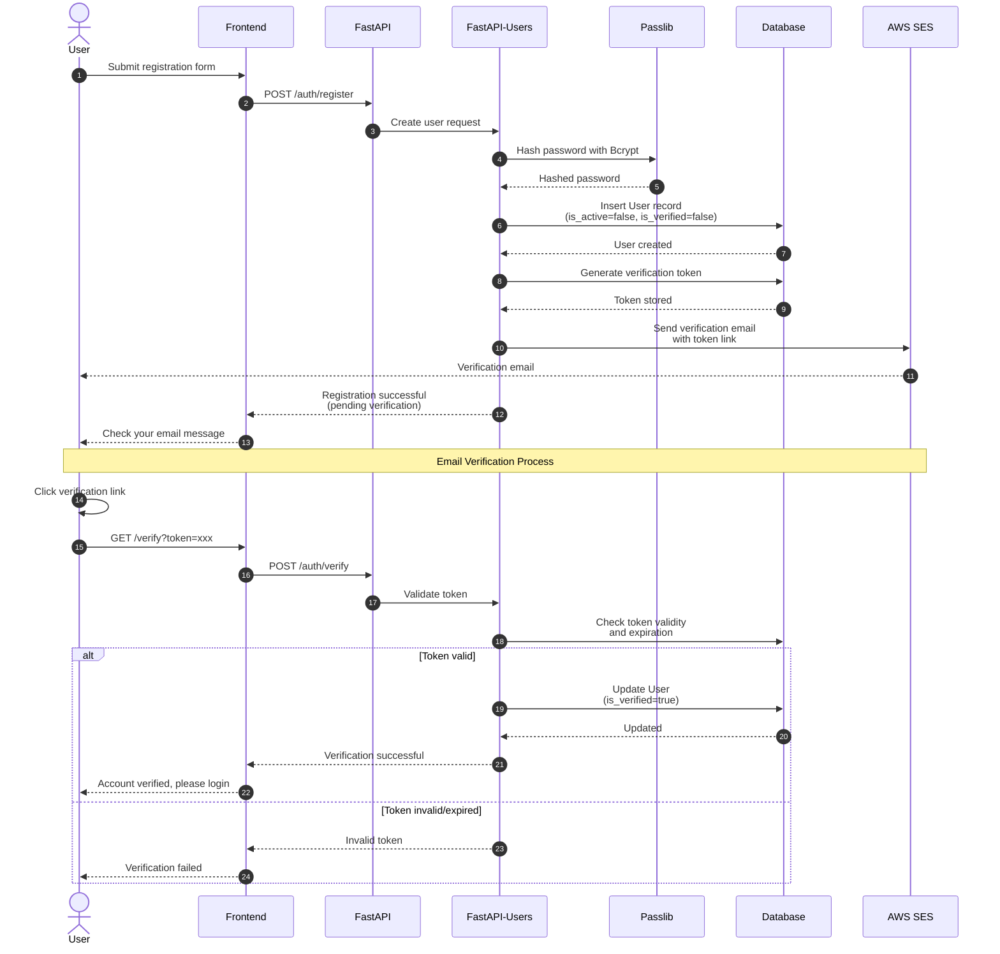
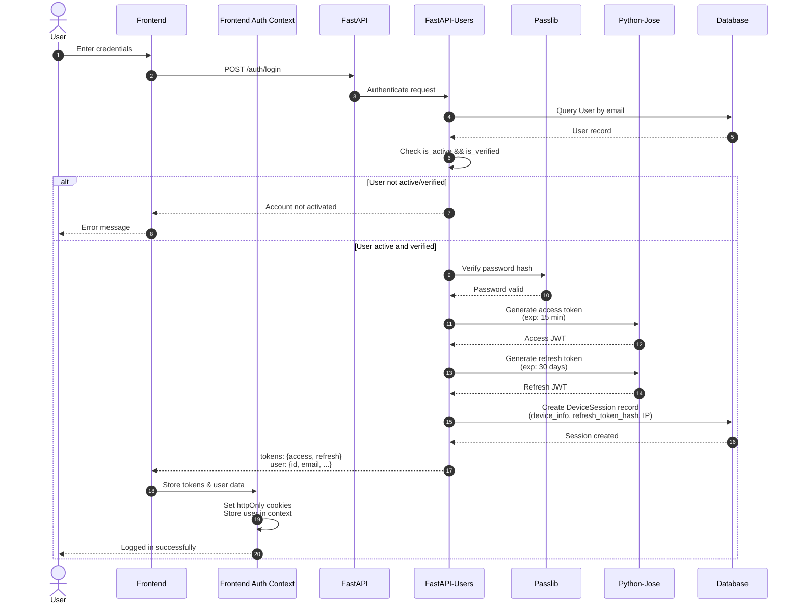
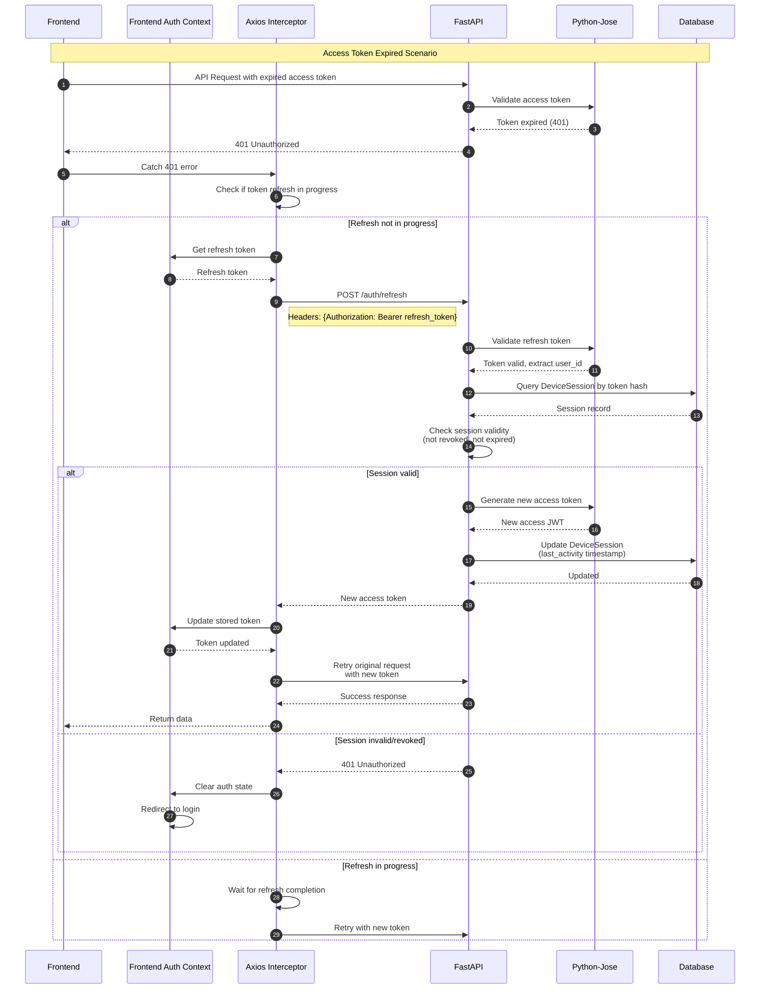
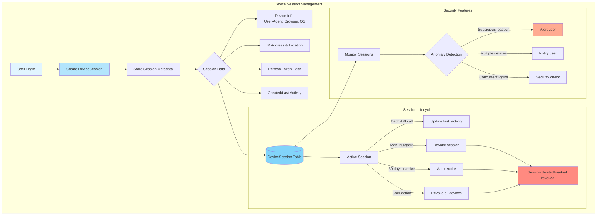
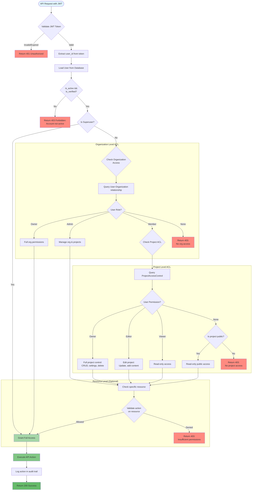
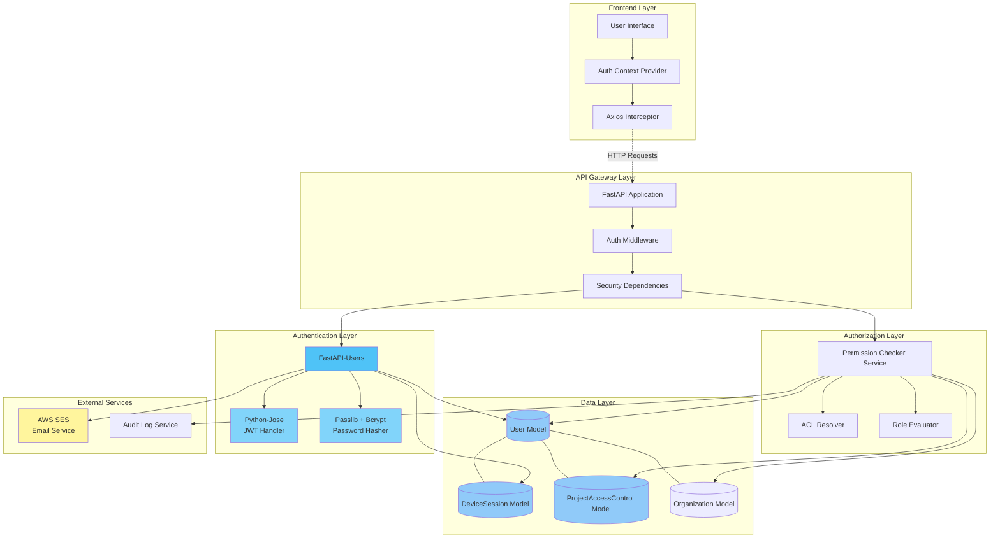

# Authentication & Authorization Architecture

## Overview
This document outlines the complete authentication and authorization architecture for Qontinui, including user registration, login flows, token management, and permission checking mechanisms.

## System Components

### Core Frameworks & Libraries
- **FastAPI-Users**: Comprehensive authentication system for FastAPI
- **Python-Jose**: JWT token creation and validation
- **Passlib with Bcrypt**: Secure password hashing
- **AWS SES**: Email delivery for verification and notifications
- **PostgreSQL**: User data, sessions, and ACL storage

### Database Models
- **User**: User credentials and profile information
- **DeviceSession**: Active device sessions and refresh tokens
- **ProjectAccessControl**: Project-level permissions and ACLs

## Architecture Diagrams

### 1. Registration & Email Verification Flow



### 2. Login & JWT Generation Flow



### 3. Token Refresh Mechanism



### 4. Device Session Tracking



### 5. Permission Checking Cascade



### 6. Complete System Integration



## Security Measures

### Password Security
- **Hashing**: Bcrypt with automatic salt generation (via Passlib)
- **Work Factor**: Configurable rounds (default: 12)
- **Validation**: Minimum 8 characters, complexity requirements enforced

### Token Security

#### Access Tokens (JWT)
- **Algorithm**: HS256 (HMAC-SHA256)
- **Expiration**: 15 minutes
- **Claims**: user_id, email, exp, iat, jti
- **Storage**: Memory only (Frontend Auth Context)

#### Refresh Tokens
- **Algorithm**: HS256 (HMAC-SHA256)
- **Expiration**: 30 days
- **Storage**: httpOnly cookie + hashed in DeviceSession table
- **Rotation**: Optional on each refresh
- **Revocation**: Supported via DeviceSession deletion

### Session Security
- **Device Fingerprinting**: User-Agent, IP address tracking
- **Concurrent Session Limits**: Configurable max devices per user
- **Anomaly Detection**: Geographic location changes, unusual access patterns
- **Session Revocation**: Individual or bulk session termination

### API Security
- **CORS**: Strict origin validation
- **Rate Limiting**: Per-endpoint and per-user limits
- **CSRF Protection**: Token validation for state-changing operations
- **SQL Injection Prevention**: Parameterized queries via SQLAlchemy ORM

### Email Security
- **Verification Tokens**: Cryptographically secure random tokens
- **Token Expiration**: 24 hours for email verification
- **One-time Use**: Tokens invalidated after successful verification
- **Rate Limiting**: Email send limits to prevent abuse

## Permission Levels

### System Level
- **Superuser**: Full system access, bypass all ACLs

### Organization Level
- **Owner**: Full organization control, billing, member management
- **Admin**: Project management, member role assignment
- **Member**: Access to assigned projects only

### Project Level
- **Owner**: Full project control, deletion, settings
- **Editor**: Modify project content, invite collaborators
- **Viewer**: Read-only access to project
- **Public**: Unauthenticated read access (if enabled)

## Data Flow Examples

### Example 1: New User Registration
1. User submits registration form
2. Password hashed with Bcrypt (12 rounds)
3. User record created (inactive, unverified)
4. Verification token generated and stored
5. AWS SES sends verification email
6. User clicks link, token validated
7. User record updated (verified=true)
8. User can now login

### Example 2: Authenticated API Request
1. Frontend sends request with access token (Authorization header)
2. FastAPI middleware intercepts request
3. Python-Jose validates JWT signature and expiration
4. User ID extracted from token claims
5. Permission checker validates user access to resource
6. ACL cascade: User → Organization → Project → Resource
7. Action executed if authorized
8. Audit log entry created
9. Response returned

### Example 3: Token Refresh
1. Access token expires (15 min)
2. Axios interceptor catches 401 error
3. Refresh token sent to /auth/refresh endpoint
4. Server validates refresh token
5. DeviceSession checked (not revoked, not expired)
6. New access token generated
7. DeviceSession.last_activity updated
8. Original request retried with new access token

## Database Schema

### User Table
```
- id (UUID, PK)
- email (String, Unique, Indexed)
- hashed_password (String)
- is_active (Boolean)
- is_verified (Boolean)
- is_superuser (Boolean)
- created_at (Timestamp)
- updated_at (Timestamp)
```

### DeviceSession Table
```
- id (UUID, PK)
- user_id (UUID, FK → User.id, Indexed)
- refresh_token_hash (String, Unique)
- device_info (JSON: user_agent, browser, os, device_type)
- ip_address (String)
- location (JSON: city, country, coordinates)
- created_at (Timestamp)
- last_activity (Timestamp, Indexed)
- expires_at (Timestamp, Indexed)
- is_revoked (Boolean, Default: False)
```

### ProjectAccessControl Table
```
- id (UUID, PK)
- user_id (UUID, FK → User.id, Indexed)
- project_id (UUID, FK → Project.id, Indexed)
- permission_level (Enum: owner, editor, viewer)
- granted_by (UUID, FK → User.id)
- granted_at (Timestamp)
- expires_at (Timestamp, Nullable)
- UNIQUE(user_id, project_id)
```

## Configuration

### Environment Variables
```
# JWT Settings
JWT_SECRET_KEY=<cryptographically-secure-random-key>
JWT_ALGORITHM=HS256
ACCESS_TOKEN_EXPIRE_MINUTES=15
REFRESH_TOKEN_EXPIRE_DAYS=30

# Password Hashing
BCRYPT_ROUNDS=12

# AWS SES
AWS_REGION=us-east-1
AWS_SES_SENDER_EMAIL=noreply@qontinui.com
AWS_ACCESS_KEY_ID=<key>
AWS_SECRET_ACCESS_KEY=<secret>

# Security
ALLOWED_ORIGINS=https://qontinui.io
MAX_DEVICES_PER_USER=5
SESSION_INACTIVITY_DAYS=30
```

## Monitoring & Observability

### Metrics to Track
- Failed login attempts (potential brute force)
- Token refresh rate (anomaly detection)
- Active sessions per user
- Email verification conversion rate
- Permission denied requests (403 responses)
- Token expiration/refresh cycles

### Audit Events
- User registration
- Email verification
- Login/logout events
- Token refresh
- Password changes
- Permission grants/revocations
- Session revocations
- Failed authentication attempts

## Future Enhancements

1. **OAuth2 Integration**: Google, GitHub, Microsoft SSO
2. **Multi-Factor Authentication (MFA)**: TOTP, SMS, email codes
3. **Passwordless Authentication**: Magic links, WebAuthn
4. **Advanced Session Management**: Trusted devices, remember me
5. **Granular Permissions**: Resource-level permissions, custom roles
6. **Federation**: Cross-organization access, guest users
7. **Biometric Authentication**: Face ID, Touch ID support
8. **Security Keys**: Hardware token support (YubiKey, etc.)

## References

- [FastAPI-Users Documentation](https://fastapi-users.github.io/fastapi-users/)
- [Python-Jose Documentation](https://python-jose.readthedocs.io/)
- [Passlib Documentation](https://passlib.readthedocs.io/)
- [AWS SES Documentation](https://docs.aws.amazon.com/ses/)
- [JWT Best Practices](https://datatracker.ietf.org/doc/html/rfc8725)
- [OWASP Authentication Cheat Sheet](https://cheatsheetseries.owasp.org/cheatsheets/Authentication_Cheat_Sheet.html)
