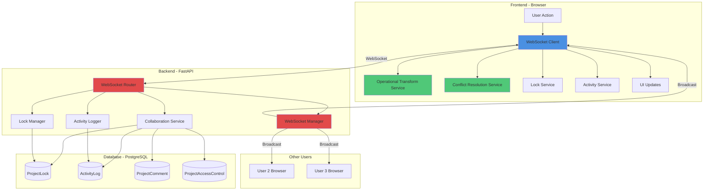
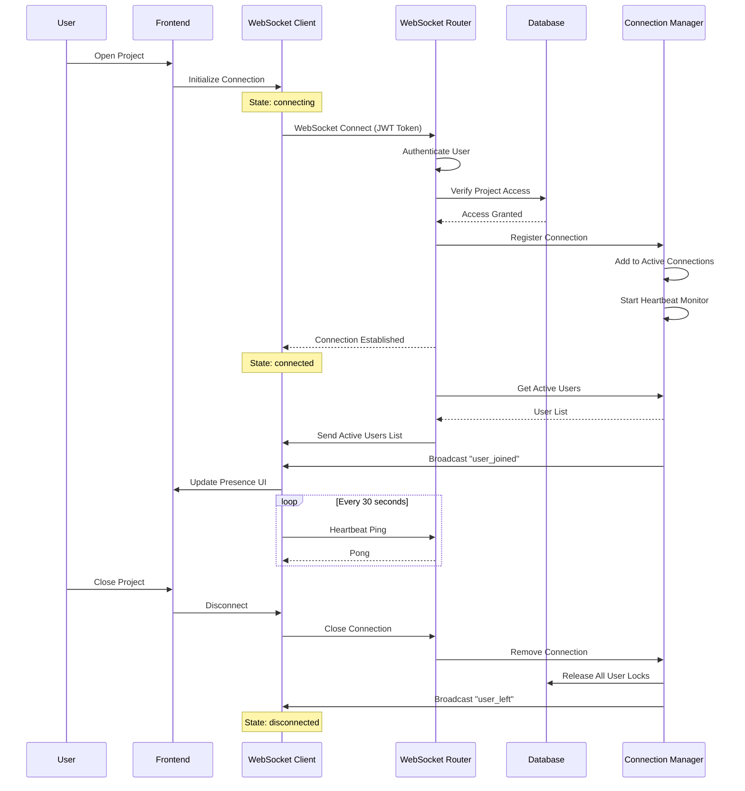
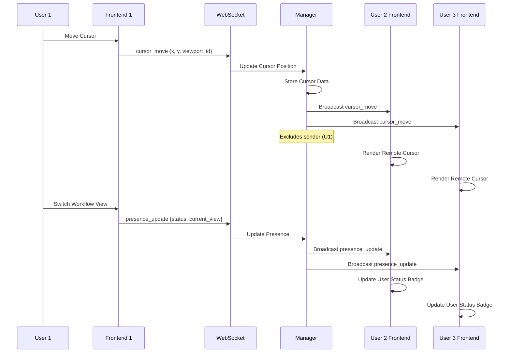
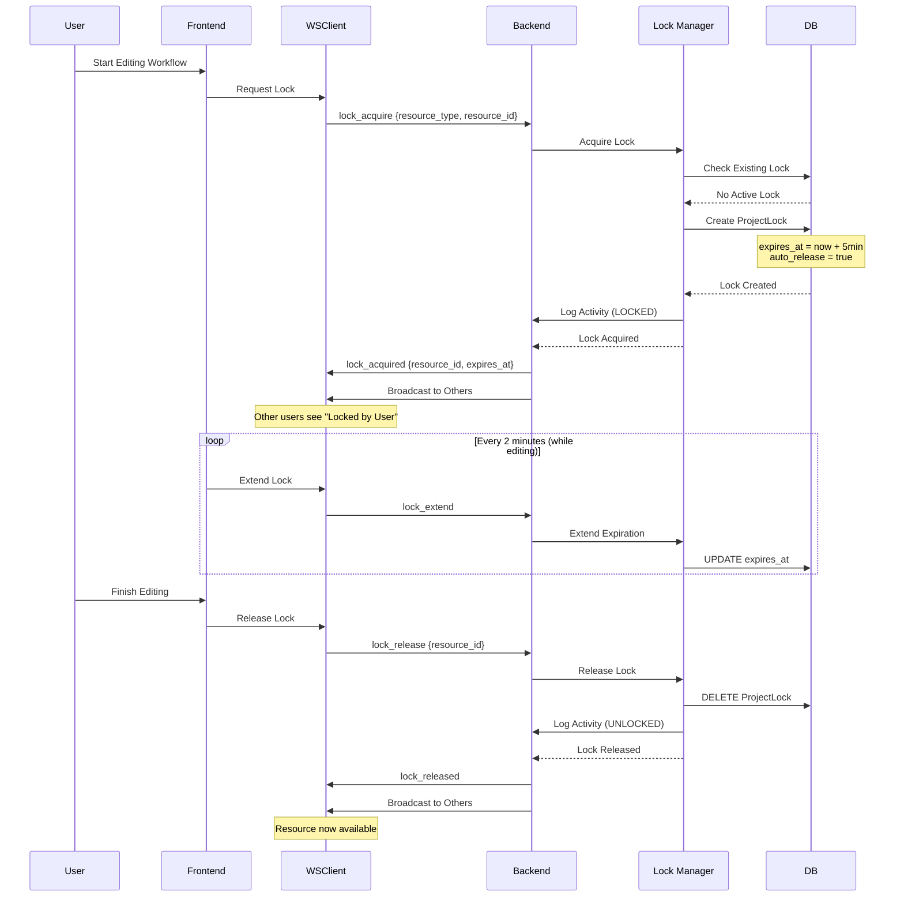
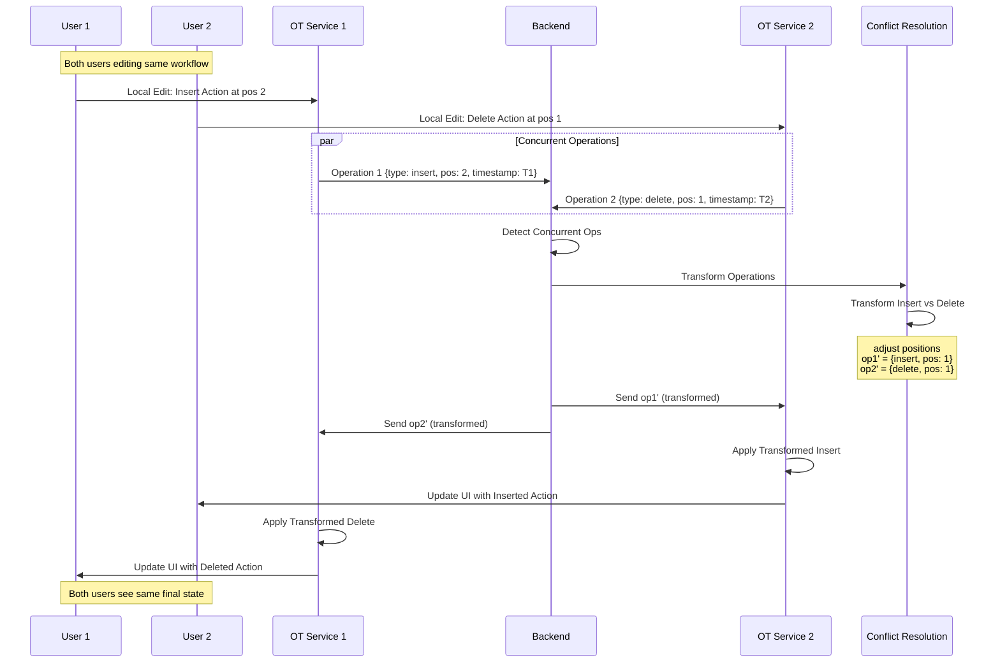
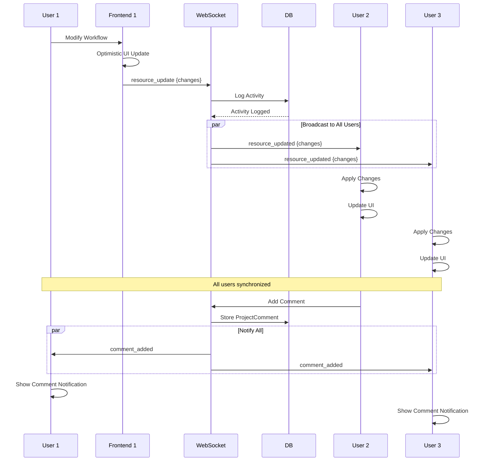
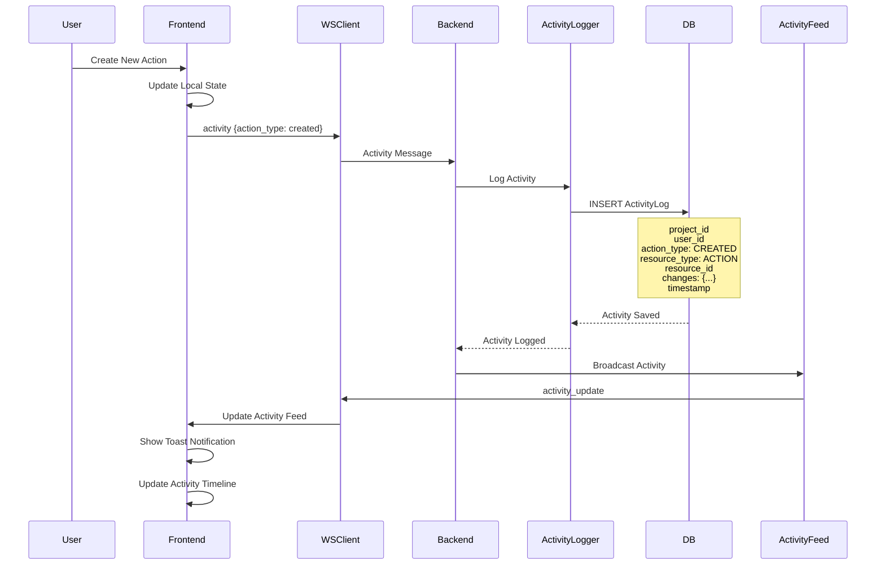
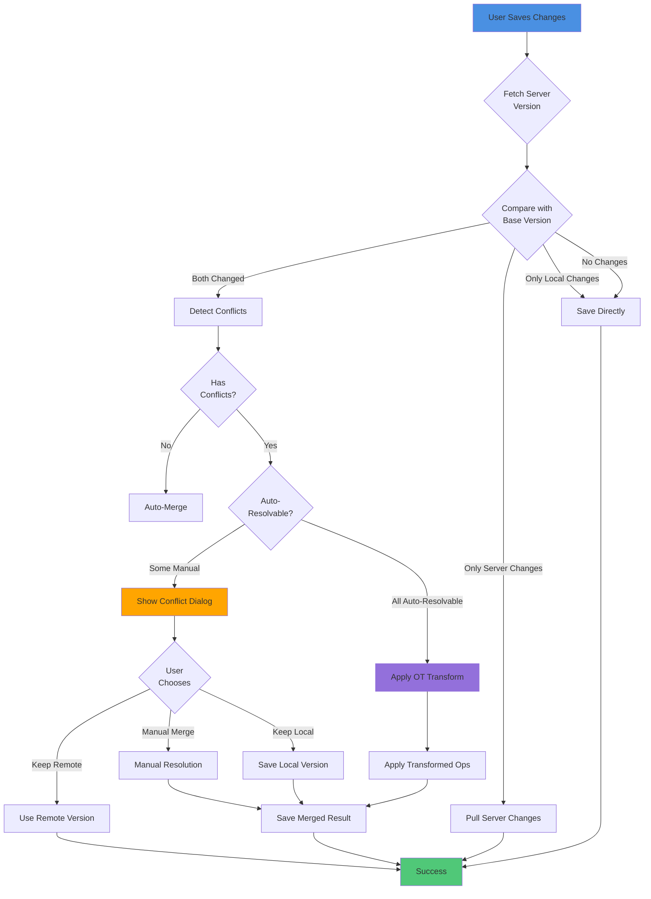

# Multi-User Collaboration Architecture

> Real-time collaboration system for concurrent editing with presence tracking, resource locking, and conflict resolution

## Overview

The Multi-User Collaboration system enables multiple users to work on the same project simultaneously with real-time synchronization, conflict detection, and automatic resolution using Operational Transform algorithms.

## High-Level Architecture



## Detailed Flow Diagrams

### 1. WebSocket Connection Lifecycle



### 2. Presence Tracking & Cursor Sharing



### 3. Lock Acquisition & Release Flow



### 4. Conflict Detection & Resolution with Operational Transform



### 5. Real-Time Synchronization Between Users



### 6. Activity Logging Flow



### 7. Conflict Resolution Decision Tree



## Component Details

### Frontend Components

#### 1. WebSocket Client (`websocket-collaboration-service.ts`)
**Responsibilities:**
- Establish and maintain WebSocket connection
- Automatic reconnection with exponential backoff
- Message queuing during disconnection
- Heartbeat mechanism (ping/pong every 30s)
- Connection state management

**Key Features:**
```typescript
- connect(): Promise<void>
- disconnect(): void
- sendPresenceUpdate(status, currentView)
- sendCursorPosition(x, y, viewportId)
- sendResourceUpdate(resourceType, resourceId, changes)
- Auto-reconnect with exponential backoff
- Message queue for offline operations
```

#### 2. Operational Transform Service (`operational-transform-service.ts`)
**Responsibilities:**
- Transform concurrent operations
- Compose and invert operations
- Apply operations to documents
- Path transformation for nested changes

**Operation Types:**
- `insert` - Insert element at position
- `delete` - Remove element
- `update` - Modify property value
- `move` - Reorder elements
- `connect` - Create connection
- `disconnect` - Remove connection

**Transform Examples:**
```typescript
// Insert vs Insert: Adjust positions
transform(op1: insert@2, op2: insert@2)
  → op1'@2, op2'@3 (based on timestamp)

// Delete vs Update: Delete wins
transform(op1: delete@2, op2: update@2)
  → op1'@2, op2'@null (update becomes no-op)

// Move vs Delete: Adjust positions
transform(op1: move(2→5), op2: delete@3)
  → op1'(1→4), op2'@3
```

#### 3. Conflict Resolution Service (`conflict-resolution-service.ts`)
**Responsibilities:**
- Detect conflicts using three-way merge
- Classify conflicts by severity
- Suggest resolution strategies
- Perform automatic resolution when possible

**Conflict Types:**
- `PropertyChanged` - Same property modified
- `ActionModified` - Concurrent action edits
- `ActionRemoved` - Delete vs modify conflict
- `ConnectionChanged` - Connection conflicts
- `StructureChanged` - Structural changes
- `MetadataChanged` - Metadata conflicts

**Resolution Strategies:**
- `KeepLocal` - Use local version
- `KeepRemote` - Use server version
- `Merge` - Automatic merge (OT)
- `Manual` - Requires user decision

#### 4. Lock Service (`lock-service.ts`)
**Responsibilities:**
- Request resource locks
- Manage lock lifecycle
- Handle lock expiration
- Automatic lock extension

**Lock Metadata:**
```typescript
{
  id: UUID
  resource_type: ResourceType
  resource_id: string
  user_id: UUID
  acquired_at: DateTime
  expires_at: DateTime
  auto_release: boolean
}
```

#### 5. Activity Service (`activity-service.ts`)
**Responsibilities:**
- Track all project activities
- Real-time activity feed
- Filter by action type/user
- Activity notifications

### Backend Components

#### 1. WebSocket Router (`collaboration_ws.py`)
**Responsibilities:**
- WebSocket endpoint: `/ws/projects/{project_id}/collaboration`
- JWT authentication
- Message validation with Pydantic
- Rate limiting (60 messages/min per user)
- Automatic lock cleanup on disconnect

**Message Types (Client → Server):**
```python
- heartbeat: Keep-alive ping
- cursor_move: {x, y, workflow_id}
- lock_acquire: {resource_type, resource_id}
- lock_release: {resource_id}
- resource_update: {resource_type, resource_id, action, changes}
- comment_add: {content, workflow_id, position, mentions}
- activity: {action_type, resource_type, resource_id}
```

**Message Types (Server → Client):**
```python
- heartbeat_ack: Pong response
- active_users: List of current users
- presence_update: User joined/left/active
- cursor_move: Real-time cursor positions
- lock_acquired/lock_released: Lock notifications
- lock_denied: Lock already held
- resource_updated: Workflow/action changes
- comment_added: New comment notification
- activity: Project activity updates
- error: Error messages
- rate_limit_exceeded: Rate limit warning
```

#### 2. WebSocket Manager (`websocket_manager.py`)
**Responsibilities:**
- Connection pooling per project
- Presence tracking
- Broadcast to all/specific users
- Rate limiting
- Automatic stale connection cleanup (90s timeout)
- Lock tracking per connection

**Features:**
```python
- connect(project_id, websocket, user) → WebSocketConnection
- disconnect(project_id, websocket)
- broadcast(project_id, message, exclude_user_id)
- send_personal(user_id, message)
- get_active_users(project_id) → List[UserPresence]
- update_heartbeat(project_id, user_id)
- update_cursor(project_id, user_id, cursor_position)
- add_lock/remove_lock(project_id, user_id, resource_id)
- check_rate_limit(user_id, max_messages, window_seconds)
- cleanup_inactive(timeout_seconds)
```

**Connection Data:**
```python
@dataclass
class WebSocketConnection:
    websocket: WebSocket
    user: User
    project_id: str
    connected_at: datetime
    last_heartbeat: datetime
    cursor_position: Optional[dict]
    active_locks: Set[str]
```

#### 3. Collaboration Service (`collaboration_service.py`)
**Responsibilities:**
- Access control verification
- Lock management
- Activity tracking
- Email notifications

**Access Control:**
```python
- check_user_has_access(user_id, project_id, permission)
- get_user_project_permission(user_id, project_id)
- Permission hierarchy: view < comment < edit < admin
```

**Lock Management:**
```python
- acquire_project_lock(user_id, project_id, resource_type, resource_id, duration_minutes)
- release_project_lock(lock_id, user_id)
- release_expired_locks() - Background cleanup task
- get_resource_lock(project_id, resource_type, resource_id)
- Default lock duration: 5 minutes
- Max lock duration: 30 minutes
- Auto-extend on activity
```

**Activity Tracking:**
```python
- track_activity(project_id, user_id, action_type, resource_type, resource_id, changes)
- Action types: CREATED, MODIFIED, DELETED, SHARED, COMMENTED, LOCKED, UNLOCKED, VIEWED
- Resource types: WORKFLOW, STATE, IMAGE, TRANSITION, ACTION, PROJECT
```

### Database Models

#### 1. ProjectLock
```python
Table: project_locks

Columns:
- id: UUID (PK)
- project_id: Integer (FK → projects.id)
- user_id: UUID (FK → users.id)
- resource_type: Enum (ResourceType)
- resource_id: String
- acquired_at: DateTime
- expires_at: DateTime
- auto_release: Boolean
- metadata: JSON

Methods:
- is_expired() → bool
- extend_lock(minutes: int) → None

Indexes:
- project_id
- user_id
- resource_id
```

#### 2. ActivityLog
```python
Table: activity_logs

Columns:
- id: UUID (PK)
- project_id: Integer (FK → projects.id)
- user_id: UUID (FK → users.id)
- action_type: Enum (ActionType)
- resource_type: Enum (ResourceType)
- resource_id: String
- resource_name: String (nullable)
- changes: JSON (nullable)
- metadata: JSON (nullable)
- created_at: DateTime

Indexes:
- project_id
- user_id
- action_type
- resource_id
- created_at

Factory Method:
- create_activity(project_id, user_id, action_type, resource_type, resource_id, ...)
```

#### 3. ProjectComment
```python
Table: project_comments

Columns:
- id: UUID (PK)
- project_id: Integer (FK → projects.id)
- workflow_id: String (nullable)
- action_id: String (nullable)
- author_id: UUID (FK → users.id)
- content: Text
- position: JSON {x, y} (nullable)
- mentions: JSON [user_ids] (nullable)
- resolved: Boolean
- resolved_by: UUID (FK → users.id, nullable)
- resolved_at: DateTime (nullable)
- parent_comment_id: UUID (FK → project_comments.id, nullable)
- created_at: DateTime
- updated_at: DateTime
- metadata: JSON (nullable)

Methods:
- resolve(user_id: UUID) → None
- unresolve() → None

Features:
- Threaded comments (parent_comment_id)
- Canvas positioning (position)
- User mentions (mentions)
- Resolution tracking
```

#### 4. ProjectAccessControl
```python
Table: project_access_control

Columns:
- id: UUID (PK)
- project_id: Integer (FK → projects.id)
- user_id: UUID (FK → users.id, nullable)
- organization_id: UUID (FK → organizations.id, nullable)
- permission_level: String (view/comment/edit/admin)
- created_by: UUID (FK → users.id)
- expires_at: DateTime (nullable)
- created_at: DateTime

Property:
- is_expired: bool → expires_at < now()

Used For:
- Project sharing
- Team collaboration
- Permission verification
```

## Operational Transform Algorithm Details

### Transform Matrix

| Operation 1 | Operation 2 | Transformation Logic |
|------------|------------|---------------------|
| Insert @ pos1 | Insert @ pos2 | If pos1 < pos2: keep both<br/>If pos1 == pos2: use timestamp<br/>If pos1 > pos2: adjust pos1++ |
| Insert @ pos1 | Delete @ pos2 | If pos1 <= pos2: keep both, adjust pos2++<br/>If pos1 > pos2: adjust pos1-- |
| Delete @ pos1 | Delete @ pos2 | If pos1 == pos2: make one no-op<br/>If pos1 < pos2: adjust pos2--<br/>If pos1 > pos2: adjust pos1-- |
| Update path1 | Update path2 | If same path: use timestamp<br/>If different: keep both |
| Move from→to | Delete @ pos | If from == pos: delete wins<br/>Else: adjust positions |
| Connect A→B | Disconnect A→B | Use timestamp to decide |

### OT Correctness Properties

**CP1 (Causality Preservation):**
```
If op1 happens-before op2, then:
  apply(apply(doc, op1), transform(op2, op1)) =
  apply(apply(doc, op1), op2)
```

**CP2 (Convergence):**
```
For concurrent ops op1 and op2:
  apply(apply(doc, op1), transform(op2, op1)) =
  apply(apply(doc, op2), transform(op1, op2))
```

**TP1 (Transformation Property 1):**
```
transform(op1, op2) → [op1', op2'] such that:
  apply(apply(doc, op1), op2') =
  apply(apply(doc, op2), op1')
```

### Path Transformation

When operations affect nested properties:

```typescript
// Example: Insert action in workflow
op1: insert @ path=['actions', 2]
op2: update @ path=['actions', 3, 'name']

// Transform op2's path based on op1:
op2': update @ path=['actions', 4, 'name'] // position adjusted
```

## Performance Optimization

### 1. Connection Management
- Connection pooling per project
- Lazy initialization
- Automatic cleanup of stale connections
- Memory-efficient data structures

### 2. Message Broadcasting
- Exclude sender from broadcasts (no echo)
- Batch operations where possible
- Rate limiting (60 msg/min per user)
- Message queue for offline operations

### 3. Lock Management
- In-memory lock tracking
- Periodic database sync
- Automatic expiration (5-30 minutes)
- Optimistic locking strategy

### 4. Activity Logging
- Async database writes
- Batch inserts for high-frequency events
- Indexed queries for fast retrieval
- Automatic archival of old logs

## Security Considerations

### 1. Authentication
- JWT token validation on connection
- Token refresh mechanism
- Automatic reconnection with new token

### 2. Authorization
- Project access verification on connect
- Permission checks per operation
- Resource-level access control

### 3. Rate Limiting
- 60 messages per minute per user
- Exponential backoff on rate limit
- IP-based limits (future)

### 4. Data Validation
- Pydantic schemas for all messages
- Input sanitization
- XSS prevention in comments
- SQL injection prevention (SQLAlchemy ORM)

## Monitoring & Observability

### Metrics to Track

1. **Connection Metrics:**
   - Active connections per project
   - Connection duration
   - Reconnection rate
   - Failed connection attempts

2. **Lock Metrics:**
   - Lock acquisition rate
   - Lock contention frequency
   - Average lock duration
   - Expired locks per day

3. **Conflict Metrics:**
   - Conflict detection rate
   - Auto-resolution success rate
   - Manual resolution frequency
   - Conflict severity distribution

4. **Performance Metrics:**
   - Message latency (end-to-end)
   - Broadcast latency
   - Database query time
   - WebSocket throughput

### Logging

Structured logging with `structlog`:

```python
logger.info(
    "collaboration_ws_connected",
    project_id=project_id,
    user_id=str(user.id),
    username=user.username
)

logger.warning(
    "lock_acquisition_failed",
    project_id=project_id,
    resource_id=resource_id,
    holder=existing_lock.user_id,
    requester=user_id
)
```

## Error Handling

### Connection Errors
1. **Network Failure:** Auto-reconnect with exponential backoff
2. **Authentication Failure:** Redirect to login
3. **Rate Limit Exceeded:** Show warning, queue messages
4. **Server Error:** Retry with backoff, fallback to polling

### Lock Errors
1. **Lock Already Held:** Show notification, offer to view
2. **Lock Expired:** Auto-release, notify user
3. **Lock Denied:** Request notification when available

### Conflict Errors
1. **Unresolvable Conflict:** Manual resolution dialog
2. **Transform Failure:** Fallback to keep local/remote
3. **Validation Error:** Revert to last known good state

## Future Enhancements

### 1. Conflict Resolution
- ML-based conflict prediction
- Automatic merge strategies based on patterns
- Conflict history analysis

### 2. Performance
- CRDT (Conflict-free Replicated Data Types) exploration
- Lazy loading of activity logs
- Optimistic UI updates with rollback

### 3. Features
- Voice/video chat integration
- Co-editing indicators (like Google Docs)
- Undo/redo with OT support
- Branch/merge workflows

### 4. Scalability
- Redis for connection state
- Distributed WebSocket servers
- Message queue (RabbitMQ/Kafka)
- Horizontal scaling

## Testing Strategy

### Unit Tests
- OT transform correctness (all combinations)
- Conflict detection accuracy
- Lock acquisition/release logic
- Message validation

### Integration Tests
- WebSocket connection lifecycle
- Multi-user scenarios
- Lock contention handling
- Activity logging

### E2E Tests
- Real-time synchronization
- Conflict resolution flows
- Presence tracking
- Comment threading

### Load Tests
- 100+ concurrent users per project
- 1000+ messages per second
- Lock contention stress test
- Connection recovery under load

## References

### Papers & Articles
- "Operational Transformation in Real-Time Group Editors" (Ellis & Gibbs, 1989)
- "Achieving Convergence with Operational Transformation" (Sun et al., 1998)
- "Google Wave Operational Transformation" (Google, 2009)

### Libraries Used
- **FastAPI WebSocket:** Real-time communication
- **SQLAlchemy:** ORM for database models
- **Pydantic:** Message validation
- **structlog:** Structured logging

### Related Documentation
- [Collaboration Features README](/docs/collaboration/README.md)
- [WebSocket API Reference](/docs/collaboration/api-reference.md)
- [Conflict Resolution Guide](/docs/collaboration/conflict-resolution.md)
- [Developer Guide](/docs/collaboration/developer-guide.md)

---

**Last Updated:** 2025-11-18
**Version:** 1.0.0
**Maintained By:** Qontinui Development Team
