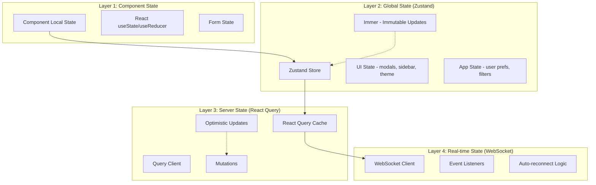
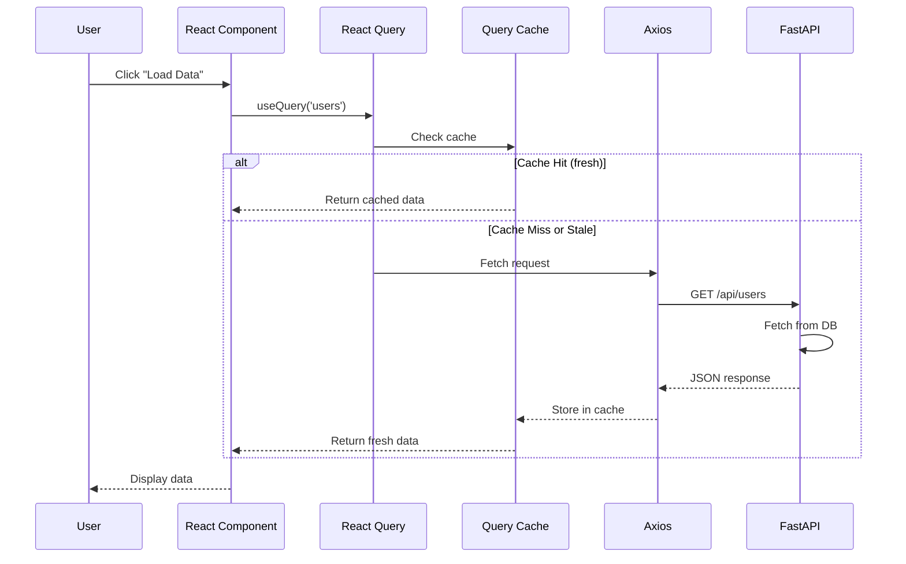
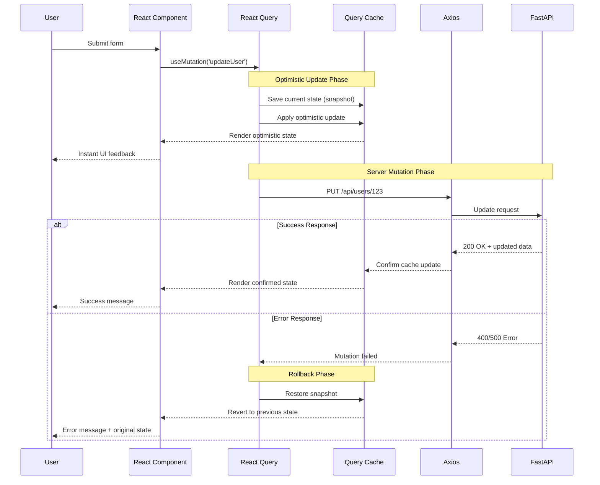
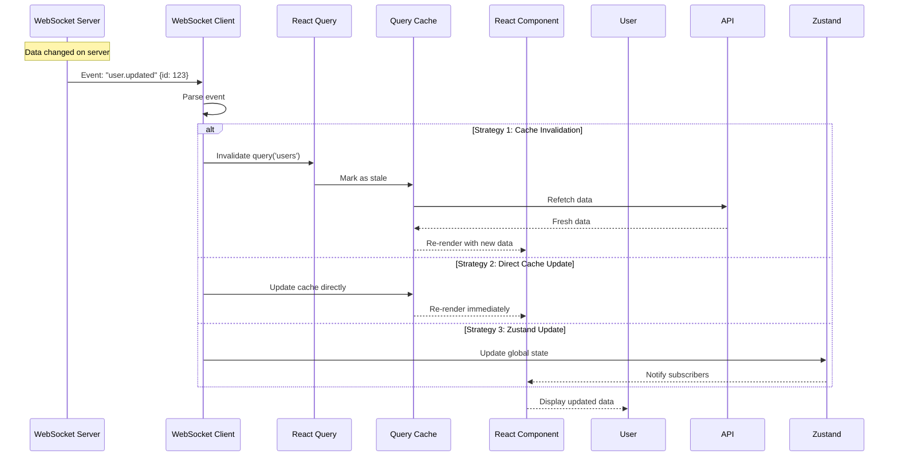
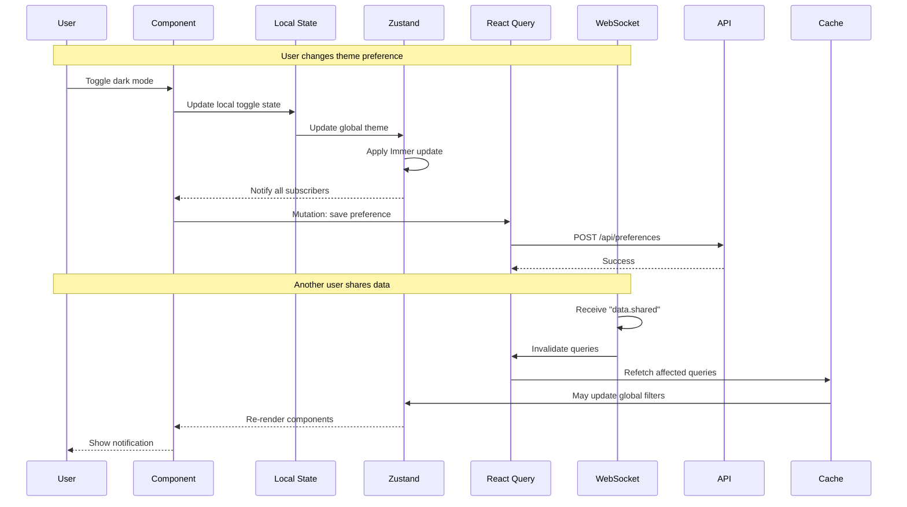

# Frontend-Backend Data Flow Architecture

## Overview
This document illustrates the complete data flow architecture for the application, showing how data moves through multiple state management layers and the interaction between frontend and backend systems.

## 4-Layer State Architecture



## Complete Data Flow Diagram

```mermaid
graph TB
    subgraph "Frontend - Next.js 15"
        subgraph "UI Layer"
            ReactComp[React Components]
            SSR[Server-Side Rendering]
            CSR[Client-Side Rendering]
        end

        subgraph "Component State Layer"
            LocalState[Local State]
            FormState[Form State]
        end

        subgraph "Global State Layer - Zustand 4.5"
            ZustandStore[Zustand Store]
            UISlice[UI Slice - modals, theme]
            AppSlice[App Slice - filters, prefs]
            Immer[Immer Producer]
        end

        subgraph "Server State Layer - React Query 5"
            QueryClient[QueryClient]
            QueryCache[Query Cache]
            MutationCache[Mutation Cache]

            subgraph "Query Hooks"
                useQuery[useQuery]
                useMutation[useMutation]
                useInfiniteQuery[useInfiniteQuery]
            end

            subgraph "Optimistic Updates"
                OptimisticUI[Optimistic UI State]
                RollbackLogic[Rollback on Error]
                CacheUpdate[Manual Cache Updates]
            end
        end

        subgraph "Real-time Layer - WebSocket"
            WSClient[WebSocket Client]
            WSEventBus[Event Bus]
            WSReconnect[Auto-reconnect]
            WSHeartbeat[Heartbeat]
        end

        subgraph "HTTP Layer"
            Axios[Axios Instance]
            FetchAPI[Fetch API]
            Interceptors[Request/Response Interceptors]
        end

        subgraph "Type Safety"
            TypeGen[OpenAPI-TypeScript]
            APITypes[Generated API Types]
            WSTypes[WebSocket Event Types]
        end
    end

    subgraph "Backend - FastAPI"
        subgraph "API Layer"
            RESTEndpoints[REST Endpoints]
            OpenAPISpec[OpenAPI Specification]
            ValidationLayer[Pydantic Validation]
        end

        subgraph "WebSocket Layer"
            WSServer[WebSocket Server]
            WSManager[Connection Manager]
            WSBroadcast[Broadcast Service]
        end

        subgraph "Business Logic"
            Services[Service Layer]
            Database[(Database)]
            Cache[(Redis Cache)]
        end
    end

    %% Component to State Flow
    ReactComp -->|1. User Action| LocalState
    LocalState -->|2. Update Global| ZustandStore
    ZustandStore -->|3. Uses| Immer

    %% REST API Flow
    ReactComp -->|4. Data Request| useQuery
    useQuery -->|5. Check Cache| QueryCache
    QueryCache -->|6a. Cache Hit| ReactComp
    QueryCache -->|6b. Cache Miss| Axios
    Axios -->|7. HTTP Request| Interceptors
    Interceptors -->|8. REST Call| RESTEndpoints
    RESTEndpoints -->|9. Process| Services
    Services -->|10. Query/Update| Database
    Services -->|11. Response| RESTEndpoints
    RESTEndpoints -->|12. JSON| Interceptors
    Interceptors -->|13. Transform| QueryCache
    QueryCache -->|14. Update UI| ReactComp

    %% Mutation with Optimistic Updates Flow
    ReactComp -->|15. User Mutation| useMutation
    useMutation -->|16. Apply Optimistic| OptimisticUI
    OptimisticUI -->|17. Instant UI Update| ReactComp
    useMutation -->|18. Send Request| Axios
    Axios -->|19. POST/PUT/DELETE| RESTEndpoints
    RESTEndpoints -->|20a. Success| MutationCache
    MutationCache -->|21a. Confirm Update| ReactComp
    RESTEndpoints -->|20b. Error| RollbackLogic
    RollbackLogic -->|21b. Revert UI| ReactComp

    %% WebSocket Real-time Flow
    WSServer -->|22. Real-time Event| WSClient
    WSClient -->|23. Parse Event| WSEventBus
    WSEventBus -->|24. Invalidate Cache| QueryCache
    QueryCache -->|25. Refetch Data| Axios
    Axios -->|26. Latest Data| QueryCache
    QueryCache -->|27. Live Update| ReactComp

    %% Alternative WebSocket Flow
    WSEventBus -->|28. Direct Update| ZustandStore
    ZustandStore -->|29. Notify Components| ReactComp

    %% Type Generation Flow
    OpenAPISpec -.->|Generate Types| TypeGen
    TypeGen -.->|Provide Types| APITypes
    APITypes -.->|Type Safety| useQuery
    APITypes -.->|Type Safety| Axios

    %% SSR Flow
    SSR -->|Initial Data| QueryClient
    QueryClient -->|Prefetch| Axios
    Axios -->|Server-side Fetch| RESTEndpoints
    RESTEndpoints -->|Initial State| SSR
    SSR -->|Hydrate| ReactComp

    %% Cache Management
    Services -->|Cache Read/Write| Cache

    style OptimisticUI fill:#f9f,stroke:#333,stroke-width:2px
    style RollbackLogic fill:#f99,stroke:#333,stroke-width:2px
    style QueryCache fill:#9f9,stroke:#333,stroke-width:2px
    style WSClient fill:#99f,stroke:#333,stroke-width:2px
    style ZustandStore fill:#ff9,stroke:#333,stroke-width:2px
```



## Framework Responsibilities

### Frontend Frameworks

#### Next.js 15
- **Role**: React framework with SSR/SSG capabilities
- **Responsibilities**:
  - Server-side rendering for initial page loads
  - Client-side navigation and routing
  - API route handlers (optional)
  - Static site generation for performance
  - Image optimization and asset handling

#### @tanstack/react-query 5
- **Role**: Server state management and caching
- **Responsibilities**:
  - Cache API responses with intelligent invalidation
  - Background refetching and data synchronization
  - Optimistic updates for mutations
  - Request deduplication and batching
  - Automatic retry logic for failed requests
  - Prefetching for improved UX
  - Server-side rendering support

#### Zustand 4.5
- **Role**: Global client state management
- **Responsibilities**:
  - UI state (modals, sidebars, theme)
  - User preferences and settings
  - Application-level state (filters, search)
  - Temporary state not suitable for server cache
  - Cross-component communication

#### Immer
- **Role**: Immutable state updates
- **Responsibilities**:
  - Simplify complex nested state updates
  - Ensure immutability in Zustand stores
  - Reduce boilerplate in state reducers
  - Type-safe state mutations

#### OpenAPI-TypeScript
- **Role**: Type generation from OpenAPI specs
- **Responsibilities**:
  - Generate TypeScript types from FastAPI OpenAPI spec
  - Ensure type safety between frontend and backend
  - Auto-update types when API changes
  - Provide autocomplete for API endpoints

#### Axios
- **Role**: HTTP client
- **Responsibilities**:
  - Make HTTP requests to REST API
  - Request/response interceptors for auth
  - Error handling and transformation
  - Request cancellation
  - Timeout management

#### WebSocket Client
- **Role**: Real-time bidirectional communication
- **Responsibilities**:
  - Maintain persistent connection to backend
  - Handle real-time event streams
  - Auto-reconnect on connection loss
  - Heartbeat/ping-pong for connection health
  - Event-based data updates

### Backend Frameworks

#### FastAPI
- **Role**: Python backend API framework
- **Responsibilities**:
  - RESTful API endpoints
  - Automatic OpenAPI documentation
  - Request validation with Pydantic
  - Dependency injection
  - CORS handling
  - Authentication/authorization
  - WebSocket endpoint support

## Data Flow Scenarios

### Scenario 1: Standard REST API Request with Caching



### Scenario 2: Mutation with Optimistic Updates and Rollback



### Scenario 3: Real-time WebSocket Updates



### Scenario 4: Multi-layer State Update Flow



## State Layer Decision Matrix

| State Type | Layer | Framework | Reason |
|------------|-------|-----------|--------|
| Server data (users, posts) | Layer 3 | React Query | Cacheable, needs sync |
| UI state (modal open) | Layer 2 | Zustand | Global but not server-persisted |
| Form input | Layer 1 | Local State | Component-specific, temporary |
| Real-time events | Layer 4 | WebSocket | Live updates, event-driven |
| User preferences | Layer 2 + 3 | Zustand + RQ | Local fast access + server persistence |
| Theme | Layer 2 | Zustand | Global UI state |
| Authentication | Layer 2 + 3 | Zustand + RQ | Token in Zustand, user data in RQ |

## Cache Invalidation Strategies

### 1. Time-based
```typescript
useQuery('users', fetchUsers, {
  staleTime: 5 * 60 * 1000, // 5 minutes
  cacheTime: 10 * 60 * 1000, // 10 minutes
})
```

### 2. Mutation-based
```typescript
useMutation(updateUser, {
  onSuccess: () => {
    queryClient.invalidateQueries(['users'])
  }
})
```

### 3. WebSocket-based
```typescript
ws.on('user.updated', (data) => {
  queryClient.invalidateQueries(['users', data.userId])
})
```

### 4. Manual
```typescript
queryClient.invalidateQueries(['users'])
queryClient.refetchQueries(['users'])
```

## Optimistic Update Patterns

### Pattern 1: Simple Optimistic Update
```typescript
const mutation = useMutation(updateUser, {
  onMutate: async (newUser) => {
    // Cancel outgoing refetches
    await queryClient.cancelQueries(['users', newUser.id])

    // Snapshot previous value
    const previousUser = queryClient.getQueryData(['users', newUser.id])

    // Optimistically update
    queryClient.setQueryData(['users', newUser.id], newUser)

    // Return context with snapshot
    return { previousUser }
  },
  onError: (err, newUser, context) => {
    // Rollback on error
    queryClient.setQueryData(
      ['users', newUser.id],
      context.previousUser
    )
  },
  onSettled: () => {
    // Always refetch after error or success
    queryClient.invalidateQueries(['users'])
  }
})
```

### Pattern 2: List Update with Optimistic Addition
```typescript
const mutation = useMutation(createUser, {
  onMutate: async (newUser) => {
    await queryClient.cancelQueries(['users'])
    const previousUsers = queryClient.getQueryData(['users'])

    // Add optimistic item with temp ID
    queryClient.setQueryData(['users'], (old) => [
      ...old,
      { ...newUser, id: 'temp-' + Date.now() }
    ])

    return { previousUsers }
  },
  onSuccess: (data, variables, context) => {
    // Replace temp item with real data
    queryClient.setQueryData(['users'], (old) =>
      old.map(user =>
        user.id.startsWith('temp-') ? data : user
      )
    )
  },
  onError: (err, variables, context) => {
    queryClient.setQueryData(['users'], context.previousUsers)
  }
})
```

## WebSocket Event Handling

### Event Types
```typescript
type WSEvent =
  | { type: 'user.created', payload: User }
  | { type: 'user.updated', payload: User }
  | { type: 'user.deleted', payload: { id: string } }
  | { type: 'notification', payload: Notification }

// Event handlers
const wsEventHandlers = {
  'user.created': (payload) => {
    queryClient.invalidateQueries(['users'])
  },
  'user.updated': (payload) => {
    queryClient.setQueryData(['users', payload.id], payload)
  },
  'user.deleted': (payload) => {
    queryClient.invalidateQueries(['users'])
    queryClient.removeQueries(['users', payload.id])
  },
  'notification': (payload) => {
    zustandStore.getState().addNotification(payload)
  }
}
```

## Performance Considerations

1. **React Query Cache Sizes**: Configure appropriate `cacheTime` and `staleTime`
2. **Zustand Selectors**: Use selective subscriptions to prevent unnecessary re-renders
3. **WebSocket Throttling**: Batch rapid updates to prevent UI thrashing
4. **Optimistic Updates**: Only for fast operations; avoid for complex mutations
5. **SSR Hydration**: Prefetch critical data during SSR to prevent loading states
6. **Request Deduplication**: React Query automatically deduplicates identical requests

## Error Handling Strategy

### Layer 1: HTTP Errors (Axios)
- 400-499: Client errors → Show user-friendly message
- 500-599: Server errors → Retry with exponential backoff
- Network errors → Retry with connection status check

### Layer 2: React Query Errors
- Automatic retry (3 attempts by default)
- Error boundaries for uncaught errors
- `onError` callbacks for specific handling

### Layer 3: WebSocket Errors
- Auto-reconnect with exponential backoff
- Fallback to polling if WebSocket unavailable
- Connection status indicator in UI

### Layer 4: Optimistic Update Failures
- Automatic rollback to previous state
- User notification of failure
- Optional: Manual retry button

## Summary

This architecture provides:
- **4-layer state management** for clear separation of concerns
- **Optimistic updates** for instant user feedback
- **Automatic rollback** on mutation failures
- **Real-time updates** via WebSocket with cache invalidation
- **Type safety** across frontend and backend
- **SSR support** for initial page loads
- **Intelligent caching** to reduce network requests
- **Error resilience** at every layer
