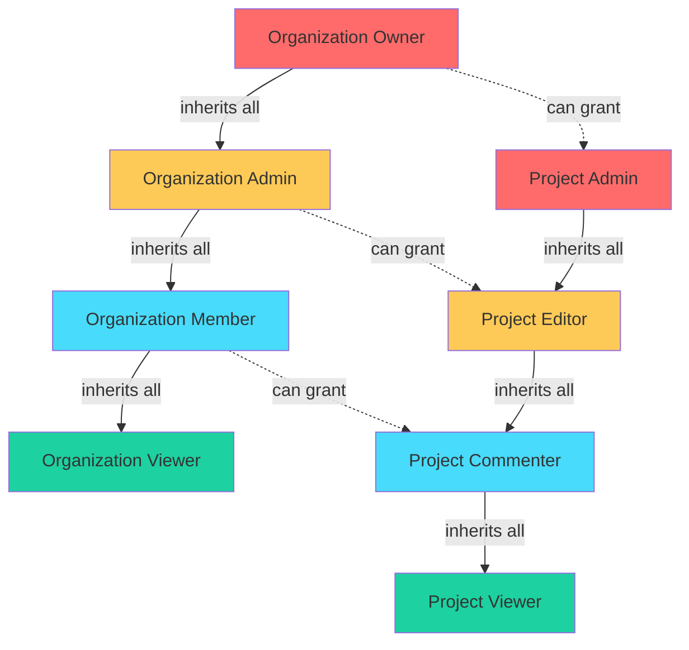
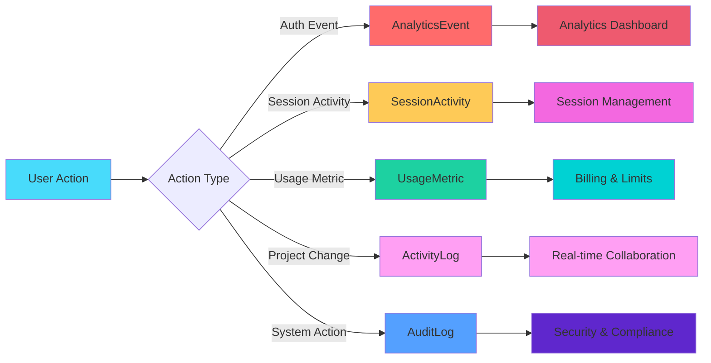

# Database Schema - Qontinui Web

This document provides a comprehensive Entity-Relationship (ER) diagram of the Qontinui Web database schema, showing all major models, relationships, and key architectural patterns.

## Technology Stack

- **SQLAlchemy 2.0.43** - Python ORM for database interactions
- **Alembic 1.16.5** - Database migration management
- **PostgreSQL 15+** - Primary database (production: AWS RDS)
- **AsyncPG** - Async PostgreSQL driver for high-performance queries
- **Pydantic** - Data validation and serialization

## Architecture Overview

The database schema is organized into several logical domains:

1. **User & Authentication** - User accounts, sessions, and device tracking
2. **Organizations & Teams** - Multi-tenant collaboration and permissions
3. **Projects & Workflows** - Project management and workflow configurations
4. **Automation** - Test automation sessions, logs, and screenshots
5. **Analytics & Monitoring** - Usage metrics, analytics events, and audit logs
6. **Subscriptions & Billing** - Stripe integration for payments
7. **ML & Analysis** - Computer vision analysis jobs and results
8. **Collaboration** - Real-time collaboration features (locks, comments, activity)

## Complete ER Diagram

```mermaid
erDiagram
    %% ===========================================
    %% USER & AUTHENTICATION DOMAIN
    %% ===========================================

    User ||--o{ Project : "owns"
    User ||--o{ TeamMember : "member of"
    User ||--o{ DeviceSession : "has devices"
    User ||--o{ SessionActivity : "has sessions"
    User ||--o{ UsageMetric : "generates"
    User ||--o{ AnalyticsEvent : "triggers"
    User ||--o{ AuditLog : "audited"
    User ||--o{ StorageUsage : "uses storage"
    User ||--|| Subscription : "has"
    User ||--o{ AutomationSession : "runs"
    User ||--o{ AnnotationSet : "creates"
    User ||--o{ AnalysisJob : "initiates"
    User ||--o{ RegionAnalysisJob : "initiates"
    User ||--o{ AutomationVideo : "uploads"

    User {
        uuid id PK "gen_random_uuid()"
        string email UK "unique, indexed"
        string username UK "unique, indexed"
        string hashed_password
        string full_name
        boolean is_active
        boolean is_superuser
        boolean is_verified
        boolean is_beta
        string company
        string phone
        string avatar_url
        string subscription_tier "default: free"
        int login_count "default: 0"
        int remember_me_usage_count "default: 0"
        datetime last_login_at "indexed"
        text last_device_fingerprint
        boolean automation_streaming_enabled "default: false, indexed"
        int automation_sessions_limit "null = unlimited"
        int automation_sessions_used "default: 0"
        datetime automation_sessions_reset_at
        datetime created_at
        datetime updated_at
    }

    DeviceSession {
        uuid id PK
        uuid user_id FK "CASCADE, indexed"
        string device_fingerprint "indexed"
        string ip_address "IPv6 compatible"
        text user_agent
        string accept_language
        boolean is_trusted "default: false"
        datetime first_seen
        datetime last_seen
        string last_ip
        string device_name "user-defined"
        boolean email_verified "default: false"
        string verification_token "indexed"
        datetime verification_sent_at
        string country "geolocation"
        string city "geolocation"
        datetime created_at
        datetime updated_at
    }

    SessionActivity {
        uuid id PK "gen_random_uuid()"
        uuid user_id FK "CASCADE, indexed"
        string jti UK "JWT ID, indexed"
        datetime first_login_at
        datetime last_activity_at "sliding window"
        datetime absolute_expiry_at "max session duration"
        datetime created_at
        datetime updated_at
    }

    %% ===========================================
    %% ORGANIZATIONS & TEAMS DOMAIN
    %% ===========================================

    Organization ||--o{ TeamMember : "has members"
    Organization ||--o{ OrganizationInvitation : "sends invitations"
    Organization ||--o{ ProjectAccessControl : "shares projects"

    Organization {
        uuid id PK "gen_random_uuid()"
        string name "indexed"
        string slug UK "indexed"
        text description
        uuid owner_id FK "users.id"
        string avatar_url
        jsonb settings "default: {}"
        boolean is_active "default: true"
        datetime created_at
        datetime updated_at
    }

    TeamMember {
        uuid id PK "gen_random_uuid()"
        uuid organization_id FK "CASCADE, indexed"
        uuid user_id FK "CASCADE, indexed"
        string role "owner|admin|member|viewer"
        jsonb permissions "default: {}"
        uuid invited_by FK "users.id"
        datetime joined_at
        datetime last_active_at
    }

    OrganizationInvitation {
        uuid id PK "gen_random_uuid()"
        uuid organization_id FK "CASCADE, indexed"
        string email "indexed"
        string role "default: member"
        uuid invited_by FK "users.id, SET NULL"
        string token UK "indexed"
        datetime expires_at "default: +7 days"
        datetime accepted_at
        datetime created_at
    }

    %% ===========================================
    %% PROJECTS & ACCESS CONTROL
    %% ===========================================

    Project ||--o{ ProjectAccessControl : "shared via"
    Project ||--o{ ProjectLock : "has locks"
    Project ||--o{ ProjectComment : "has comments"
    Project ||--o{ ActivityLog : "tracks activity"
    Project ||--o{ SnapshotRun : "has snapshots"
    Project ||--o{ StorageUsage : "uses storage"
    Project ||--o{ AutomationVideo : "has videos"

    Project {
        int id PK "auto-increment, indexed"
        string name
        text description
        jsonb configuration "default: {}"
        uuid owner_id FK "users.id"
        datetime created_at
        datetime updated_at
    }

    ProjectAccessControl {
        uuid id PK "gen_random_uuid()"
        int project_id FK "CASCADE, indexed"
        uuid user_id FK "CASCADE, indexed (nullable)"
        uuid organization_id FK "CASCADE, indexed (nullable)"
        string permission_level "view|comment|edit|admin"
        uuid created_by FK "users.id, SET NULL"
        datetime expires_at "optional"
        datetime created_at
    }

    %% ===========================================
    %% COLLABORATION DOMAIN
    %% ===========================================

    ProjectLock {
        uuid id PK "gen_random_uuid()"
        int project_id FK "CASCADE, indexed"
        uuid user_id FK "CASCADE, indexed"
        string resource_type "workflow|state|image|transition|action|project"
        string resource_id "indexed"
        datetime acquired_at
        datetime expires_at "default: +5 minutes"
        boolean auto_release "default: true"
        jsonb metadata
    }

    ProjectComment {
        uuid id PK "gen_random_uuid()"
        int project_id FK "CASCADE, indexed"
        string workflow_id "indexed, optional"
        string action_id "indexed, optional"
        uuid author_id FK "CASCADE, indexed"
        text content
        jsonb position "canvas coordinates {x, y}"
        jsonb mentions "array of user IDs"
        boolean resolved "default: false"
        uuid resolved_by FK "users.id, SET NULL"
        datetime resolved_at
        uuid parent_comment_id FK "CASCADE, indexed"
        datetime created_at
        datetime updated_at
        jsonb metadata "attachments, reactions"
    }

    ActivityLog {
        uuid id PK "gen_random_uuid()"
        int project_id FK "CASCADE, indexed"
        uuid user_id FK "CASCADE, indexed"
        string action_type "created|modified|deleted|shared|etc, indexed"
        string resource_type "workflow|state|image|etc"
        string resource_id "indexed"
        string resource_name "human-readable"
        jsonb changes "detailed change info"
        jsonb metadata
        datetime created_at "indexed"
    }

    %% ===========================================
    %% AUTOMATION DOMAIN
    %% ===========================================

    AutomationSession ||--o{ AutomationLog : "has logs"
    AutomationSession ||--o{ AutomationScreenshot : "captures screenshots"
    AutomationSession ||--o{ AutomationInputEvent : "records inputs"

    AutomationLog ||--o{ ScreenshotInputAssociation : "links to screenshots"
    AutomationScreenshot ||--o{ ScreenshotInputAssociation : "associated with logs"
    AutomationScreenshot ||--o{ AutomationInputEvent : "before/after screenshots"

    AutomationSession {
        uuid id PK "gen_random_uuid()"
        int project_id FK "projects.id, SET NULL, indexed (nullable)"
        uuid user_id FK "CASCADE, indexed"
        string runner_version
        string runner_os
        string runner_hostname
        string status "active|completed|failed, indexed"
        jsonb configuration_snapshot "default: {}"
        datetime created_at
        datetime ended_at
    }

    AutomationLog {
        uuid id PK "gen_random_uuid()"
        uuid session_id FK "CASCADE, indexed"
        int sequence_number
        string level "indexed"
        text message
        jsonb log_data "default: {}, GIN indexed"
        datetime timestamp "indexed"
        datetime created_at
    }

    AutomationScreenshot {
        uuid id PK "gen_random_uuid()"
        uuid session_id FK "CASCADE, indexed"
        string name "indexed"
        string storage_path "S3/MinIO path"
        int width
        int height
        string content_type "default: image/png"
        jsonb automation_metadata "default: {}"
        datetime timestamp "indexed"
        string presigned_url "temporary, nullable"
        datetime created_at
    }

    AutomationInputEvent {
        bigint id PK "auto-increment, indexed"
        uuid session_id FK "CASCADE, indexed"
        string event_type "mouse.clicked|keyboard.text_typed, indexed"
        datetime timestamp "indexed"
        int mouse_x
        int mouse_y
        string mouse_button "left|right|middle"
        int drag_from_x
        int drag_from_y
        int drag_to_x
        int drag_to_y
        float drag_duration
        jsonb drag_path_points
        float drag_avg_speed
        float drag_max_speed
        text text_typed
        int character_count
        uuid screenshot_before_id FK "SET NULL"
        uuid screenshot_after_id FK "SET NULL"
        datetime created_at
    }

    ScreenshotInputAssociation {
        uuid id PK "gen_random_uuid()"
        uuid screenshot_id FK "CASCADE, indexed"
        uuid log_id FK "CASCADE, indexed"
        string input_type "indexed"
        jsonb input_data "default: {}"
        int timestamp_diff_ms
        datetime created_at
    }

    AutomationVideo {
        int id PK "auto-increment, indexed"
        string session_id UK "indexed"
        uuid user_id FK "users.id, indexed"
        int project_id FK "projects.id, indexed (nullable)"
        string s3_key UK "S3 storage key"
        int duration_seconds
        int fps
        string quality
        int file_size_bytes
        datetime created_at
    }

    %% ===========================================
    %% SNAPSHOTS & PATTERNS
    %% ===========================================

    SnapshotRun ||--o{ Screenshot : "contains"
    SnapshotRun ||--o{ Pattern : "detects"

    SnapshotRun {
        int id PK "auto-increment, indexed"
        string run_id UK "indexed"
        string run_name
        int project_id FK "CASCADE, indexed (nullable)"
        int workflow_id "indexed (nullable)"
        datetime timestamp
        datetime created_at
        datetime updated_at
        jsonb states "default: []"
        jsonb metadata "default: {}"
        jsonb tags "default: []"
        int num_screenshots "default: 0"
        int num_patterns "default: 0"
        text description
    }

    Screenshot {
        int id PK "auto-increment, indexed"
        int snapshot_run_id FK "CASCADE, indexed"
        string screenshot_path
        jsonb active_states "default: []"
        datetime timestamp
        int width
        int height
        string state_hash "indexed, for deduplication"
        jsonb metadata "default: {}"
    }

    Pattern {
        int id PK "auto-increment, indexed"
        int snapshot_run_id FK "CASCADE, indexed"
        string pattern_id UK "indexed"
        string name
        string type "indexed"
        string screenshot_path
        jsonb region "{x, y, width, height}"
        jsonb active_states "default: []"
        float confidence
        jsonb metadata "default: {}"
    }

    %% ===========================================
    %% ANNOTATIONS & ML ANALYSIS
    %% ===========================================

    AnnotationSet ||--o{ Annotation : "contains"
    AnnotationSet ||--o{ AnalysisJob : "analyzed by"
    AnnotationSet ||--o{ RegionAnalysisJob : "analyzed by"

    AnalysisJob ||--o{ AnalyzerResult : "runs analyzers"
    AnalyzerResult ||--o{ DetectedElementModel : "detects elements"
    AnalysisJob ||--o{ FusedElement : "produces fused"

    RegionAnalysisJob ||--o{ RegionAnalyzerResult : "runs analyzers"
    RegionAnalyzerResult ||--o{ DetectedRegionModel : "detects regions"
    RegionAnalysisJob ||--o{ FusedRegionModel : "produces fused"

    AnnotationSet {
        uuid id PK
        string screenshot_name "indexed"
        string screenshot_url
        int image_width
        int image_height
        jsonb screenshots "multi-screenshot support"
        datetime created_at
        datetime updated_at
        uuid created_by_id FK "users.id"
        text notes
        int boundary_width "default: 5, matching tolerance"
    }

    Annotation {
        uuid id PK
        uuid annotation_set_id FK "CASCADE"
        int screenshot_index "default: 0, indexed"
        int x "bounding box"
        int y
        int width
        int height
        string label
        text description
        text reason "why element is useful"
        jsonb extra_data
        int order "default: 0"
    }

    AnalysisJob {
        uuid id PK
        uuid annotation_set_id FK "CASCADE, indexed"
        jsonb analyzers_used
        jsonb parameters
        int fusion_enabled "boolean, default: 1"
        jsonb fusion_config
        string status "pending|running|completed|failed, indexed"
        datetime started_at
        datetime completed_at
        text error_message
        int total_elements_found "default: 0"
        int total_fused_elements "default: 0"
        jsonb analyzer_statistics
        datetime created_at
        uuid created_by_id FK "users.id"
    }

    AnalyzerResult {
        uuid id PK
        uuid analysis_job_id FK "CASCADE, indexed"
        string analyzer_name "indexed"
        string analyzer_type "stable_region|pattern_match|single_shot, indexed"
        string analyzer_version
        int elements_found "default: 0"
        float confidence
        jsonb analyzer_metadata
        int execution_time_ms
    }

    DetectedElementModel {
        uuid id PK
        uuid analyzer_result_id FK "CASCADE, indexed"
        int x "bounding box"
        int y
        int width
        int height
        float confidence
        string label
        string element_type "button|input|image, indexed"
        int screenshot_index "default: 0, indexed"
        jsonb element_metadata
    }

    FusedElement {
        uuid id PK
        uuid analysis_job_id FK "CASCADE, indexed"
        int x "averaged bounding box"
        int y
        int width
        int height
        float confidence "combined, indexed"
        int votes "number of analyzers, indexed"
        jsonb sources "analyzer names"
        jsonb source_confidences "{analyzer: confidence}"
        string label
        string element_type "indexed"
        int screenshot_index "default: 0, indexed"
        jsonb element_metadata
    }

    RegionAnalysisJob {
        uuid id PK
        uuid annotation_set_id FK "CASCADE, indexed"
        jsonb analyzers_used
        jsonb parameters
        int fusion_enabled "default: 1"
        jsonb fusion_config
        string status "pending|running|completed|failed, indexed"
        datetime started_at
        datetime completed_at
        text error_message
        int total_regions_found "default: 0"
        int total_fused_regions "default: 0"
        jsonb analyzer_statistics
        datetime created_at
        uuid created_by_id FK "users.id"
    }

    RegionAnalyzerResult {
        uuid id PK
        uuid analysis_job_id FK "CASCADE, indexed"
        string analyzer_name "indexed"
        string analyzer_version
        int regions_found "default: 0"
        float confidence
        jsonb analyzer_metadata
        int execution_time_ms
    }

    DetectedRegionModel {
        uuid id PK
        uuid analyzer_result_id FK "CASCADE, indexed"
        int x "bounding box"
        int y
        int width
        int height
        float confidence
        string label
        string region_type "inventory_grid|minimap|skill_bar, indexed"
        int screenshot_index "default: 0, indexed"
        jsonb grid_metadata "grid structure"
        jsonb region_metadata
    }

    FusedRegionModel {
        uuid id PK
        uuid analysis_job_id FK "CASCADE, indexed"
        int x "averaged bounding box"
        int y
        int width
        int height
        float confidence "indexed"
        int votes "indexed"
        jsonb sources "analyzer names"
        jsonb source_confidences
        string label
        string region_type "indexed"
        int screenshot_index "default: 0, indexed"
        jsonb grid_metadata "fused grid structure"
        jsonb region_metadata
    }

    %% ===========================================
    %% ANALYTICS & MONITORING
    %% ===========================================

    UsageMetric {
        int id PK "auto-increment, indexed"
        uuid user_id FK "CASCADE"
        string metric_type
        decimal value
        datetime timestamp "indexed"
        jsonb metric_metadata
    }

    AnalyticsEvent {
        uuid id PK
        string event_name "indexed"
        uuid user_id FK "CASCADE, indexed (nullable)"
        jsonb properties "JSONB, default: {}"
        datetime timestamp "indexed"
        datetime created_at
    }

    AuditLog {
        int id PK "auto-increment, indexed"
        uuid user_id FK "SET NULL, indexed"
        string action
        string resource_type
        string resource_id
        jsonb log_metadata
        string ip_address
        datetime created_at "indexed"
    }

    StorageUsage {
        int id PK "auto-increment, indexed"
        uuid user_id FK "CASCADE, indexed"
        string file_type
        bigint file_size
        string file_path
        int project_id FK "CASCADE (nullable)"
        datetime created_at
    }

    %% ===========================================
    %% SUBSCRIPTIONS & BILLING
    %% ===========================================

    Subscription {
        int id PK "auto-increment, indexed"
        uuid user_id FK UK "users.id"
        string stripe_customer_id "indexed"
        string stripe_subscription_id "indexed"
        string stripe_price_id
        string tier "free|hobby|pro"
        string status "active|past_due|canceled|etc"
        datetime current_period_start
        datetime current_period_end
        boolean cancel_at_period_end "default: false"
        datetime canceled_at
        datetime created_at
        datetime updated_at
    }
```

## Permission Inheritance & Access Control

### Permission Hierarchy



### Access Control Flow

1. **User → Organization**
   - `TeamMember.role` determines organization-level permissions
   - Roles: `owner` > `admin` > `member` > `viewer`
   - Owner has full control, can delete organization

2. **Organization → Project**
   - Projects can be shared with entire organizations via `ProjectAccessControl`
   - `ProjectAccessControl.organization_id` enables org-wide access
   - All org members inherit minimum permission level

3. **User → Project (Direct)**
   - Individual users can have direct project access via `ProjectAccessControl`
   - `ProjectAccessControl.user_id` grants user-specific permissions
   - Permission levels: `admin` > `edit` > `comment` > `view`

4. **Permission Resolution**
   - User permissions are the MAX of (org-inherited, direct-granted)
   - Project owner always has `admin` permission
   - `ProjectAccessControl.expires_at` can limit time-based access

### Cascade Delete Behavior

**CASCADE (Delete dependent records):**
- `User` deleted → deletes all `DeviceSession`, `SessionActivity`, `TeamMember`, `AutomationSession`, etc.
- `Organization` deleted → deletes all `TeamMember`, `OrganizationInvitation`, `ProjectAccessControl`
- `Project` deleted → deletes all `ProjectLock`, `ProjectComment`, `ActivityLog`, `StorageUsage`
- `AutomationSession` deleted → deletes all `AutomationLog`, `AutomationScreenshot`, `AutomationInputEvent`
- `AnnotationSet` deleted → deletes all `Annotation`, `AnalysisJob`, `RegionAnalysisJob`

**SET NULL (Preserve record, remove reference):**
- `User` deleted → sets `AuditLog.user_id = NULL` (preserve audit trail)
- `User` deleted → sets `OrganizationInvitation.invited_by = NULL`
- `User` deleted → sets `ProjectAccessControl.created_by = NULL`

## Activity & Analytics Data Flow



### Event Tracking Models

1. **AnalyticsEvent** - User behavior tracking
   - Login events (with remember_me flag)
   - Feature usage events
   - Token refresh/expiry events
   - Device validation events
   - JSONB properties for flexible event data
   - Indexed for time-series queries

2. **SessionActivity** - Authentication session tracking
   - Sliding window authentication
   - JWT token management (jti)
   - Absolute session expiry enforcement
   - Last activity tracking for auto-logout

3. **UsageMetric** - Resource consumption
   - Storage usage tracking
   - API call counting
   - Feature usage quotas
   - Billing calculations

4. **ActivityLog** - Project collaboration
   - Real-time activity feed
   - Change tracking (before/after)
   - Resource-level auditing
   - WebSocket notifications

5. **AuditLog** - Security & compliance
   - User action logging
   - IP address tracking
   - Resource access auditing
   - Regulatory compliance (GDPR, SOC2)

## Key Indexes & Performance

### Critical Indexes

**User & Authentication:**
- `users.email` (unique, btree)
- `users.username` (unique, btree)
- `users.last_login_at` (btree)
- `device_sessions.device_fingerprint` (btree)
- `session_activities.jti` (unique, btree)

**Organizations & Teams:**
- `organizations.slug` (unique, btree)
- `team_members.organization_id, user_id` (unique composite)
- `project_access_control.project_id` (btree)
- `project_access_control.user_id` (btree)
- `project_access_control.organization_id` (btree)

**Automation:**
- `automation_sessions.user_id` (btree)
- `automation_logs.session_id, sequence_number` (composite)
- `automation_logs.log_data` (GIN, for JSONB queries)
- `automation_screenshots.session_id` (btree)
- `automation_input_events.session_id, timestamp` (composite)

**Analytics:**
- `analytics_events.event_name, timestamp` (composite)
- `analytics_events.user_id, event_name` (composite)
- `analytics_events.timestamp DESC` (btree)

**ML Analysis:**
- `detected_elements.analyzer_result_id, screenshot_index` (composite)
- `fused_elements.confidence` (btree)
- `fused_elements.votes` (btree)

### JSON Indexing

PostgreSQL GIN indexes for JSONB columns:
- `automation_logs.log_data` - Event type filtering
- `project_access_control.permissions` - Permission queries (future)
- `organization.settings` - Settings queries (future)

## Data Retention & Cleanup

### Automated Cleanup (via ARQ tasks)

1. **Session Cleanup**
   - `SessionActivity` records deleted after absolute expiry
   - `DeviceSession` records with `last_seen > 90 days` marked inactive

2. **Automation Data**
   - `AutomationSession` with `ended_at > 90 days` archived
   - `AutomationScreenshot` presigned URLs regenerated on-demand
   - `AutomationLog` retention based on subscription tier

3. **Analytics & Audit**
   - `AnalyticsEvent` aggregated monthly for reporting
   - `AuditLog` retained for 1 year (compliance requirement)
   - `UsageMetric` aggregated for billing cycles

4. **Orphaned Records**
   - `ProjectLock` auto-released after expiry
   - `OrganizationInvitation` deleted after expiry + 30 days

## Migration History

### Key Migrations

1. **UUID Migration** - Migrated `users.id` from Integer to UUID
2. **Device Sessions** - Added device fingerprinting and verification
3. **Analytics Events** - Comprehensive event tracking system
4. **Automation Streaming** - Session-based automation logging
5. **Multi-Screenshot Annotations** - Enhanced annotation system
6. **Region Analysis** - Specialized grid detection

### Alembic Commands

```bash
# Generate new migration
alembic revision --autogenerate -m "description"

# Apply migrations
alembic upgrade head

# Rollback one migration
alembic downgrade -1

# Show current revision
alembic current

# Show migration history
alembic history
```

## Database Configuration

### Connection Pooling

- **Local Development:** Direct PostgreSQL connection
- **Production (AWS RDS):** Connection pooling via AsyncPG
- **Pool Size:** 20 connections (adjustable via environment)
- **Pool Timeout:** 30 seconds
- **Pool Recycle:** 3600 seconds (1 hour)

### Async Database Operations

SQLAlchemy 2.0 with AsyncPG for non-blocking database operations:

```python
from sqlalchemy.ext.asyncio import create_async_engine, AsyncSession

# Async engine
engine = create_async_engine(
    DATABASE_URL,
    echo=False,
    pool_size=20,
    max_overflow=10,
    pool_pre_ping=True,
    pool_recycle=3600
)

# Async session factory
async_session = sessionmaker(
    engine, class_=AsyncSession, expire_on_commit=False
)
```

## Security Considerations

1. **Password Hashing:** bcrypt with 12 rounds
2. **JWT Tokens:** RS256 algorithm, rotated regularly
3. **Device Fingerprinting:** SHA-256 hashed device characteristics
4. **API Rate Limiting:** Redis-backed token bucket (slowapi)
5. **SQL Injection:** Prevented via SQLAlchemy ORM
6. **CSRF Protection:** Double-submit cookie pattern

## Backup & Disaster Recovery

1. **Automated Backups:** Daily RDS snapshots (production)
2. **Retention:** 7 days automated, 30 days manual
3. **Point-in-Time Recovery:** Enabled on RDS
4. **Export/Import:** JSON export for user data portability

## Future Enhancements

- [ ] Workflow & State models (currently JSON in Project.configuration)
- [ ] Transition tracking for state machines
- [ ] Time-series partitioning for analytics events
- [ ] Read replicas for analytics queries
- [ ] Materialized views for dashboard queries
- [ ] Full-text search via PostgreSQL tsvector

---

**Document Version:** 1.0
**Last Updated:** 2025-11-18
**Database Version:** PostgreSQL 15.x
**SQLAlchemy Version:** 2.0.43
**Alembic Version:** 1.16.5
