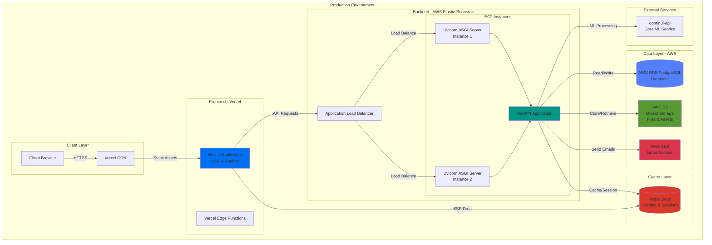
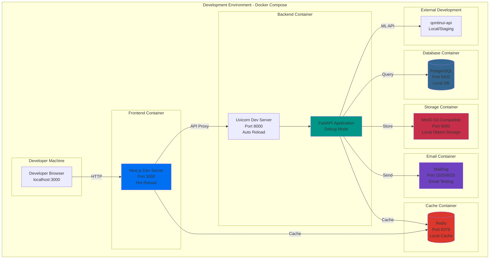
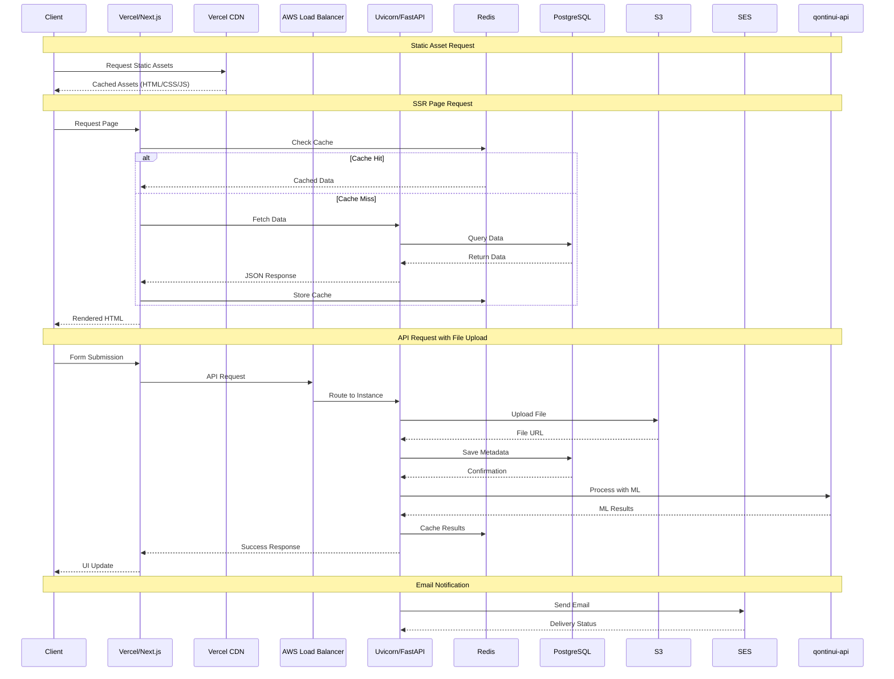
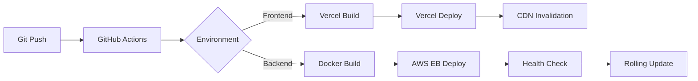
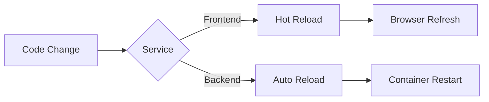

# Deployment & Service Architecture

This document provides a comprehensive overview of the deployment architecture for both production and development environments, including all services, frameworks, and their communication patterns.

## Architecture Overview

## Development Environment

## Cross-Service Communication Patterns

## Service Responsibilities

### Frontend Layer

#### Vercel (Production)
- **Hosting**: Serverless deployment of Next.js application
- **CDN**: Global content delivery network for static assets
- **Edge Functions**: Server-side logic at edge locations
- **SSL/TLS**: Automatic HTTPS certificates
- **Build & Deploy**: CI/CD pipeline integration

#### Next.js Framework
- **SSR (Server-Side Rendering)**: Dynamic page generation
- **Routing**: File-based routing system
- **API Routes**: Backend-for-frontend endpoints
- **Static Generation**: Build-time page optimization
- **Code Splitting**: Automatic bundle optimization
- **Image Optimization**: Next.js Image component

### Backend Layer

#### AWS Elastic Beanstalk
- **Container Management**: Docker container orchestration
- **Auto-scaling**: Dynamic instance scaling
- **Load Balancing**: Traffic distribution across instances
- **Health Monitoring**: Instance health checks
- **Rolling Deployments**: Zero-downtime updates
- **Environment Management**: Dev/Staging/Prod isolation

#### Uvicorn ASGI Server
- **ASGI Protocol**: Async server gateway interface
- **WebSocket Support**: Real-time bidirectional communication
- **HTTP/2**: Modern protocol support
- **Worker Management**: Multi-process handling
- **Performance**: High-throughput request handling

#### FastAPI Application
- **REST API**: RESTful endpoint implementation
- **Authentication**: JWT token validation
- **Authorization**: Role-based access control
- **Data Validation**: Pydantic model validation
- **API Documentation**: Auto-generated OpenAPI/Swagger
- **Business Logic**: Core application functionality

### Data Layer

#### AWS RDS PostgreSQL
- **Primary Database**: Persistent data storage
- **Transactions**: ACID compliance
- **Backups**: Automated daily backups
- **Read Replicas**: Read scaling (if configured)
- **High Availability**: Multi-AZ deployment option
- **Schema**: User data, application state, metadata

#### AWS S3
- **Object Storage**: File and asset storage
- **Versioning**: File version control
- **Lifecycle Policies**: Automatic archival
- **CDN Integration**: CloudFront distribution
- **Security**: Bucket policies and encryption
- **Storage Classes**: Cost optimization

#### Redis
- **Session Storage**: User session management
- **Caching**: Response and query caching
- **Rate Limiting**: API throttling
- **Temporary Data**: Short-lived data storage
- **Pub/Sub**: Real-time messaging (optional)

### Communication Layer

#### AWS SES (Simple Email Service)
- **Transactional Emails**: User notifications
- **Email Templates**: Branded email formatting
- **Delivery Tracking**: Bounce and complaint handling
- **SMTP/API**: Multiple sending methods
- **Domain Verification**: SPF/DKIM/DMARC setup

### Development Environment

#### Docker Compose
- **Service Orchestration**: Multi-container management
- **Networking**: Internal container communication
- **Volume Management**: Persistent data storage
- **Environment Isolation**: Consistent dev environment
- **One-Command Setup**: `docker-compose up`

#### Development Services
- **PostgreSQL**: Local database instance
- **Redis**: Local caching instance
- **MinIO**: S3-compatible local storage
- **Mailhog**: Email testing and inspection
- **Hot Reload**: Automatic code reloading

### External Integration

#### qontinui-api
- **ML Processing**: Machine learning model inference
- **Computer Vision**: Image/video analysis
- **Data Processing**: Advanced analytics
- **Async Jobs**: Background task processing
- **API Gateway**: RESTful integration

## Environment Comparison

| Component | Development | Production |
|-----------|------------|------------|
| Frontend | Next.js Dev Server (localhost:3000) | Vercel + CDN (HTTPS) |
| Backend | Uvicorn Dev (localhost:8000) | AWS Elastic Beanstalk + ALB |
| Database | PostgreSQL (Docker) | AWS RDS PostgreSQL |
| Cache | Redis (Docker) | Redis Cloud/ElastiCache |
| Storage | MinIO (Docker) | AWS S3 |
| Email | Mailhog (Docker) | AWS SES |
| ASGI Server | Uvicorn (single worker) | Uvicorn (multi-worker) |
| SSL | None (HTTP) | Automatic (HTTPS) |
| Scaling | Fixed single instance | Auto-scaling instances |
| Monitoring | Console logs | CloudWatch + APM |

## Communication Protocols

### HTTP/HTTPS
- **Frontend to Backend**: REST API calls
- **Backend to RDS**: PostgreSQL wire protocol
- **Backend to S3**: AWS SDK (HTTPS)
- **Backend to SES**: AWS SDK (HTTPS)
- **Backend to qontinui-api**: REST API (HTTPS)

### Redis Protocol
- **Backend to Redis**: Redis protocol (TCP)
- **Frontend to Redis**: Via backend proxy

### WebSocket (Optional)
- **Real-time Updates**: Uvicorn WebSocket support
- **Notifications**: Server-push events

## Security Layers

1. **Edge Security**: Vercel DDoS protection, WAF
2. **Transport**: TLS 1.3 encryption
3. **Authentication**: JWT tokens, OAuth
4. **Authorization**: RBAC policies
5. **Network**: AWS VPC, Security Groups
6. **Data**: Encryption at rest (RDS, S3)
7. **Secrets**: AWS Secrets Manager/Environment variables

## Deployment Flow

### Production Deployment

### Development Workflow

## Monitoring & Observability

- **Frontend**: Vercel Analytics, Web Vitals
- **Backend**: AWS CloudWatch, Application logs
- **Database**: RDS Performance Insights
- **Cache**: Redis monitoring metrics
- **APM**: Error tracking (Sentry/DataDog)
- **Logs**: Centralized logging (CloudWatch Logs)

## Disaster Recovery

- **RDS Backups**: Automated daily snapshots
- **S3 Versioning**: Object version history
- **Database Replicas**: Read replicas for failover
- **Multi-Region**: Optional cross-region replication
- **Rollback**: Git-based deployment rollback

## Performance Optimization

- **CDN Caching**: Static asset caching at edge
- **Redis Caching**: Database query caching
- **Connection Pooling**: Database connection reuse
- **Load Balancing**: Horizontal scaling
- **Lazy Loading**: On-demand resource loading
- **Code Splitting**: Reduced bundle sizes
- **Image Optimization**: WebP, responsive images
