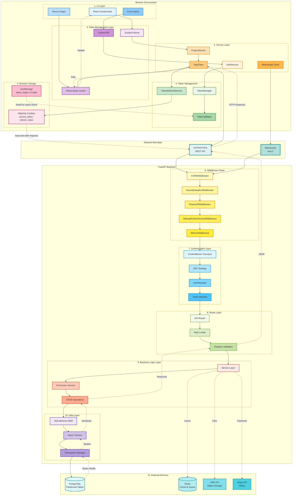
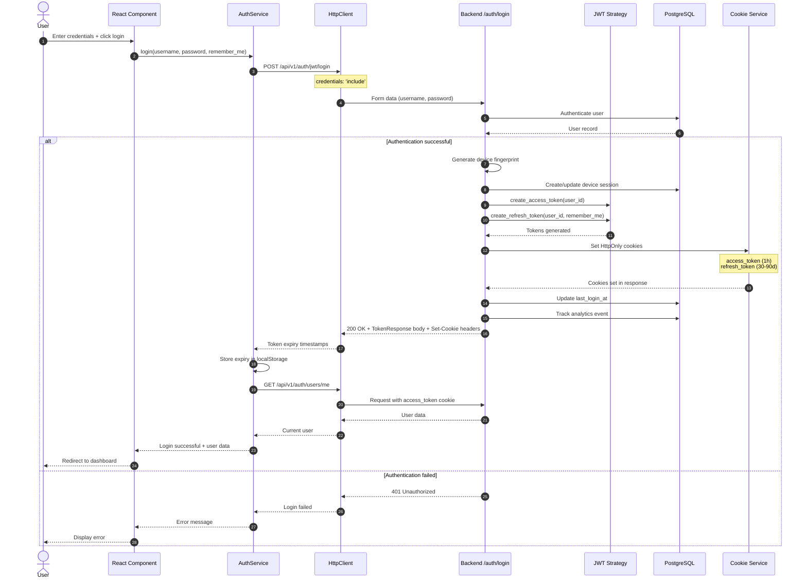
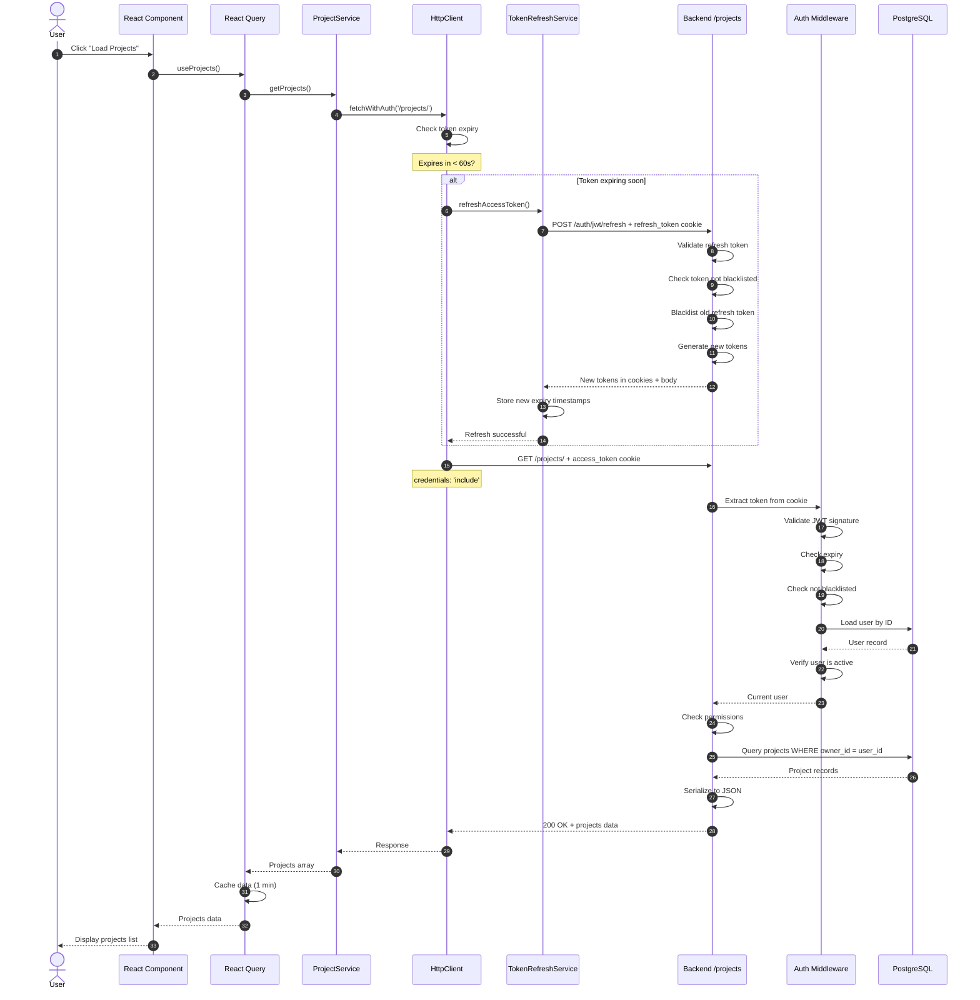
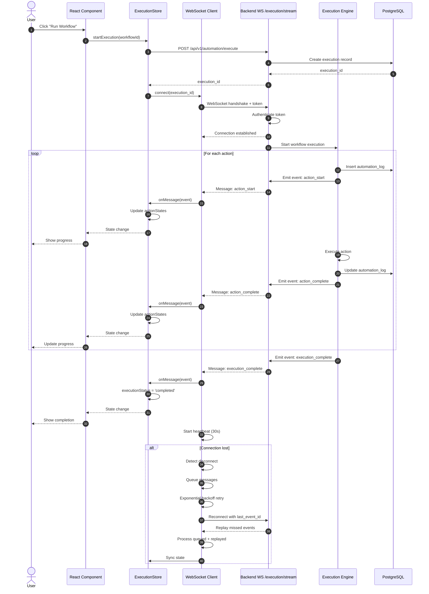
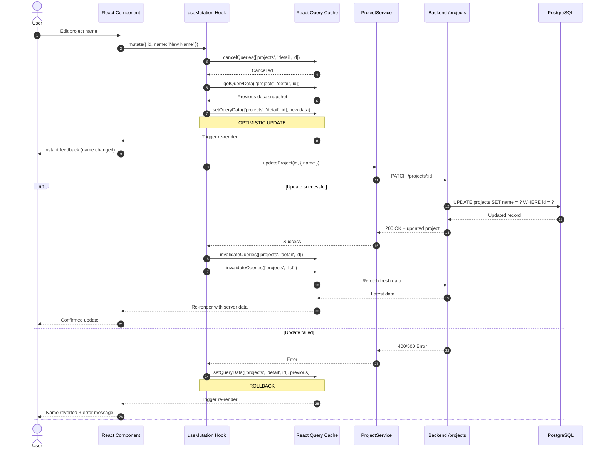

# Frontend-Backend Data Flow Architecture

## Overview

The Qontinui web application implements a modern, layered architecture with clear separation between frontend (Next.js) and backend (FastAPI). This document describes the complete data flow from user interaction through the frontend, across the network boundary, through backend processing, and back to the user interface.

### Key Architectural Characteristics
- **Async-first:** Both frontend (React) and backend (FastAPI) use asynchronous patterns
- **Type-safe:** TypeScript frontend with Pydantic validation on backend
- **Security-focused:** HttpOnly cookies, CSRF protection, rate limiting, token rotation
- **Real-time capable:** WebSocket support for streaming execution and collaboration
- **Offline-ready:** Message queuing, automatic reconnection, optimistic updates

---

## Architecture Diagram



---

## Detailed Flow Scenarios

### Scenario 1: Authentication Flow (Login)



### Scenario 2: Protected API Request with Token Refresh



### Scenario 3: WebSocket Streaming (Real-time Execution)



### Scenario 4: Optimistic Update with Rollback



---

## Component Responsibilities

### Frontend Components

#### 1. UI Layer
- **React Components:** Presentation logic, event handling, user interaction
- **Next.js Pages:** Routing, SSR/SSG, code splitting
- **Form Inputs:** Validation, controlled components, error display

#### 2. State Management Layer
- **Zustand Stores:** Global state (canvas, execution, UI settings)
  - Immer middleware for immutable updates
  - Persist middleware for localStorage sync
  - Devtools integration for debugging
- **React Query Cache:** Server state caching, background refetching
  - 1-minute stale time
  - Automatic refetch on window focus (production)
  - Exponential backoff retry (3 attempts)
- **Context API:** Authentication state, theme, feature flags

#### 3. Service Layer
- **AuthService:** Login, logout, token refresh, user management
- **ProjectService:** CRUD operations, collaboration, exports
- **HttpClient:** Generic HTTP wrapper with retry logic, error handling
- **WebSocket Client:** Real-time streaming, auto-reconnect, message queuing

#### 4. Token Management
- **TokenManager:** Orchestrates token operations, stores expiry timestamps
- **TokenRefreshService:** Handles refresh logic with deduplication
- **TokenValidator:** Validates expiry, extracts claims from JWT

#### 5. Browser Storage
- **HttpOnly Cookies:** Stores actual token values (XSS protection)
- **localStorage:** Stores token expiry timestamps, UI preferences

### Backend Components

#### 6. Middleware Stack (Executes in Order)
1. **CORSMiddleware:** Handles CORS preflight, allows credentials
2. **SecurityHeadersMiddleware:** Adds CSP, HSTS, X-Frame-Options, etc.
3. **RequestIDMiddleware:** Generates UUID, binds to logs for tracing
4. **SlidingWindowSessionMiddleware:** Auto-refreshes tokens if expiring soon
5. **MetricsMiddleware:** Tracks request timing, user activity

#### 7. Authentication Layer
- **Cookie/Bearer Transport:** Extracts token from cookie (preferred) or Authorization header
- **JWT Strategy:** Validates signature, checks expiry, verifies claims
- **UserManager:** Registration, password reset, email verification
- **Token Blacklist:** Redis-backed revoked token tracking

#### 8. Route Layer
- **API Router:** FastAPI route organization (/api/v1/*)
- **Rate Limiter:** SlowAPI with Redis backing (5-100 req/min)
- **Pydantic Validation:** Request/response schema validation

#### 9. Business Logic Layer
- **Service Layer:** Business logic (auth_analytics, device_fingerprint, etc.)
- **Permission Service:** Organization/project access control
- **CRUD Operations:** Database operations repository pattern

#### 10. Data Layer
- **SQLAlchemy ORM:** Async models, relationships, queries
- **Async Session:** Database connection pooling (5 connections + 10 overflow)
- **Transaction Manager:** Auto-commit on success, auto-rollback on error

#### 11. External Services
- **PostgreSQL:** Partitioned tables (automation_logs, analytics_events)
- **Redis:** Caching, token blacklist, rate limiting, task queue
- **AWS S3:** Object storage for screenshots, exports
- **Stripe API:** Subscription billing, payment processing

---

## Performance Considerations

### Frontend Optimizations

#### 1. React Query Caching
- **Stale time:** 1 minute (prevents unnecessary refetches)
- **Cache time:** 5 minutes (garbage collection)
- **Placeholder data:** Prevents loading flicker on re-renders
- **Background refetch:** Updates data without blocking UI

#### 2. Optimistic Updates
- Instant UI feedback before server confirmation
- Automatic rollback on failure
- Reduces perceived latency by 200-500ms

#### 3. Code Splitting
- Next.js automatic page-level splitting
- Dynamic imports for large components
- Reduces initial bundle size by 40-60%

#### 4. WebSocket Connection Reuse
- Single WebSocket per execution (not per action)
- Heartbeat prevents idle disconnection
- Message queuing during reconnection (100 messages max)

#### 5. Zustand with Immer
- Efficient immutable updates without spread operators
- Structural sharing (only changed parts re-render)
- 10-20% faster than Redux for typical operations

### Backend Optimizations

#### 1. Async Database Operations
- Non-blocking I/O (handles 1000+ concurrent connections)
- Connection pooling (5 base + 10 overflow)
- Prepared statements (SQL injection prevention + performance)

#### 2. Table Partitioning
- **automation_logs:** Monthly partitions (query speedup: 10-50x)
- **analytics_events:** Monthly partitions (retention-based cleanup)
- **automation_input_events:** Weekly partitions (granular archival)

#### 3. Strategic Indexing
- Composite indexes for common query patterns
- Partial indexes for filtered queries
- GIN indexes for JSONB columns

#### 4. Redis Caching
- User session data (reduces DB queries by 70%)
- Rate limit counters (in-memory performance)
- Token blacklist (TTL-based expiration)

#### 5. Sliding Window Token Refresh
- Proactive refresh (prevents 401 errors)
- Reduces round-trips (no explicit refresh calls)
- Threshold: 5 minutes before expiry

### Network Optimizations

#### 1. Response Compression
- Gzip compression (reduces payload by 60-80%)
- Enabled for responses > 1KB

#### 2. HTTP/2 Support
- Multiplexing (parallel requests)
- Server push (not currently used but available)

#### 3. CDN for Static Assets
- Next.js images optimized and cached
- Vercel Edge Network (global distribution)

---

## Security Considerations

### Frontend Security

#### 1. HttpOnly Cookies
- **Tokens never accessible to JavaScript** (XSS protection)
- **SameSite: lax** (CSRF protection)
- **Secure flag in production** (HTTPS-only)
- **Path restrictions:** refresh_token only sent to /api/v1/auth

#### 2. CSRF Protection
- CSRF token for POST/PUT/DELETE requests
- Read from `<meta name="csrf-token">` or cookies
- Validated on backend

#### 3. Input Sanitization
- React automatically escapes JSX content
- DOMPurify for rich text (if used)
- Zod validation for form inputs

#### 4. Content Security Policy
- Restricts script sources
- Prevents inline script execution
- Mitigates XSS attacks

### Backend Security

#### 1. Authentication & Authorization
- **JWT with separate secrets** (access vs refresh)
- **Token rotation** (old refresh tokens blacklisted)
- **Device fingerprinting** (suspicious login detection)
- **Sliding window sessions** (30-day absolute max)

#### 2. Password Security
- **Argon2 hashing** (preferred, memory-hard)
- **Bcrypt fallback** (legacy support)
- **Minimum strength requirements** (8 chars, upper, lower, digit)
- **Rate limiting** (5 login attempts per minute)

#### 3. Rate Limiting
- **Per-IP limits:** 200 requests/day, 50/hour
- **Auth endpoints:** 5 requests/minute (login, password reset)
- **Redis-backed** (distributed rate limiting)
- **Retry-After headers** (client backoff guidance)

#### 4. SQL Injection Prevention
- **Parameterized queries** (SQLAlchemy)
- **ORM usage** (no raw SQL by default)
- **Input validation** (Pydantic schemas)

#### 5. Security Headers
- **HSTS:** Force HTTPS (production)
- **X-Frame-Options:** DENY (clickjacking prevention)
- **X-Content-Type-Options:** nosniff
- **CSP:** Restrict resource loading
- **Referrer Policy:** strict-origin-when-cross-origin

#### 6. Audit Logging
- **All auth events tracked** (login, logout, password change)
- **Device information recorded** (IP, user agent, fingerprint)
- **Suspicious activity monitoring** (multiple failed logins, new devices)
- **Enhanced audit logs** (SOC 2 compliance fields added)

---

## Data Flow Patterns

### 1. Request-Response (REST)
**Use case:** CRUD operations, one-time queries

**Pros:**
- Simple, well-understood
- Cacheable with standard HTTP
- Stateless (scales horizontally)

**Cons:**
- Chatty for complex operations (multiple round-trips)
- Polling required for updates

### 2. WebSocket Streaming
**Use case:** Real-time execution, collaboration, notifications

**Pros:**
- Bidirectional communication
- Low latency (no polling overhead)
- Server push capability

**Cons:**
- Stateful (requires connection management)
- More complex error handling
- Proxy/firewall issues

### 3. Optimistic Updates
**Use case:** User edits, immediate feedback required

**Pros:**
- Zero perceived latency
- Better UX (no spinners)
- Works offline (queued)

**Cons:**
- Rollback complexity
- Potential inconsistencies
- User confusion if rolled back

### 4. Server-Sent Events (Not Currently Used)
**Use case:** One-way server push (notifications, updates)

**Pros:**
- Simpler than WebSocket
- Auto-reconnection built-in
- Works over HTTP

**Cons:**
- One-way only
- Less efficient than WebSocket
- Browser connection limits

---

## Error Handling Patterns

### Frontend Error Handling

#### 1. Network Errors
```typescript
if (!navigator.onLine) {
  throw new Error('No internet connection. Please check your network.');
}
```

#### 2. Token Refresh Errors
```typescript
// Automatically retry request after refresh
if (response.status === 401 && attempt === 1) {
  const refreshed = await this.refreshAccessToken();
  if (refreshed) {
    return this.fetchWithAuth(url, options, attempt + 1);
  }
  // Refresh failed - logout user
  window.dispatchEvent(new CustomEvent('session-expired'));
}
```

#### 3. Rate Limiting
```typescript
if (response.status === 429) {
  const retryAfter = response.headers.get('Retry-After');
  await delay(parseInt(retryAfter) * 1000);
  return this.fetchWithAuth(url, options, attempt + 1);
}
```

#### 4. Server Errors (5xx)
```typescript
if (response.status >= 500 && attempt <= maxRetries) {
  const backoff = Math.min(1000 * Math.pow(2, attempt - 1), 10000);
  await delay(backoff);
  return this.fetchWithAuth(url, options, attempt + 1);
}
```

### Backend Error Handling

#### 1. Validation Errors (400)
```python
@app.exception_handler(RequestValidationError)
async def validation_exception_handler(request: Request, exc: RequestValidationError):
    return JSONResponse(
        status_code=400,
        content={
            "error": "VALIDATION_ERROR",
            "message": "Invalid request data",
            "details": [{"field": e["loc"], "message": e["msg"]} for e in exc.errors()],
            "timestamp": time.time(),
            "path": str(request.url.path)
        }
    )
```

#### 2. Authentication Errors (401)
```python
if not user or not user.is_active:
    raise HTTPException(
        status_code=401,
        detail="LOGIN_BAD_CREDENTIALS",
        headers={"WWW-Authenticate": "Bearer"}
    )
```

#### 3. Authorization Errors (403)
```python
if not await permission_service.can_user_access_project(db, user.id, project_id):
    raise HTTPException(
        status_code=403,
        detail="Not enough permissions"
    )
```

#### 4. Database Errors
```python
try:
    await session.commit()
except IntegrityError:
    await session.rollback()
    raise HTTPException(status_code=409, detail="Resource already exists")
except Exception:
    await session.rollback()
    raise
```

---

## Monitoring and Observability

### Metrics Tracked

#### Frontend Metrics
- **Page load time:** Performance.timing API
- **API call duration:** Timestamp diff in HttpClient
- **Error rates:** Error boundary tracking
- **Cache hit rate:** React Query devtools

#### Backend Metrics
- **Request duration:** MetricsMiddleware timing
- **Endpoint usage:** Stored in analytics_events table
- **Error rates:** Logged per endpoint
- **Database query time:** SQLAlchemy logging
- **WebSocket connections:** Active connection count

### Logging

#### Frontend Logging
```typescript
// Structured logging
console.log({
  level: 'error',
  message: 'API request failed',
  url: request.url,
  status: response.status,
  timestamp: Date.now()
});
```

#### Backend Logging (Structlog)
```python
logger.info("user_login",
    user_id=str(user.id),
    email=user.email,
    device_fingerprint=fingerprint,
    ip_address=request.client.host,
    request_id=request.state.request_id
)
```

### Distributed Tracing
- **Request ID:** Generated in backend, returned in X-Request-ID header
- **Correlation:** Frontend can include X-Request-ID in subsequent related requests
- **Log aggregation:** Request ID allows finding all logs for a single request chain

---

## References

### Architecture Documents
- [Data Flow Architecture](./data-flow-architecture.md) - State management details
- [Authentication Architecture](./auth-architecture.md) - Auth flow specifics
- [Deployment Architecture](./deployment-architecture.md) - Infrastructure details

### Key Files

#### Frontend
- `/frontend/src/lib/api-client.ts` - Main API client
- `/frontend/src/services/http-client.ts` - HTTP wrapper with retries
- `/frontend/src/services/auth/auth-service.ts` - Authentication
- `/frontend/src/stores/canvas-store.ts` - Canvas state management
- `/frontend/src/stores/execution-store.ts` - Execution state

#### Backend
- `/backend/app/main.py` - FastAPI application entry
- `/backend/app/api/v1/api.py` - Route registration
- `/backend/app/middleware/` - Middleware implementations
- `/backend/app/auth/config.py` - fastapi-users configuration
- `/backend/app/core/security.py` - JWT token generation

### External Documentation
- [FastAPI Documentation](https://fastapi.tiangolo.com/)
- [React Query Documentation](https://tanstack.com/query/latest)
- [Zustand Documentation](https://github.com/pmndrs/zustand)
- [Next.js Documentation](https://nextjs.org/docs)
