# Image Processing & Computer Vision Pipeline Architecture

This document describes the complete architecture for image processing, pattern matching, and computer vision functionality in the Qontinui system.

## System Overview

The image processing pipeline handles the entire flow from image upload to pattern matching, template optimization, and result caching. It integrates multiple services and frameworks to provide robust computer vision capabilities.

## Architecture Diagram

```mermaid
graph TB
    subgraph "Frontend Layer"
        UI[Frontend Image Library Components]
        Upload[Image Upload Interface]
        PatternUI[Pattern Optimization UI]
        VisualTest[Visual Testing Components]
    end

    subgraph "FastAPI Endpoints - qontinui-web/backend"
        ImgAPI["/api/v1/images/upload<br/>Image Management Endpoints"]
        PatternAPI["/api/v1/pattern-optimization<br/>Pattern Analysis Endpoints"]
        StateAPI["/api/v1/state-discovery<br/>State Detection Endpoints"]
    end

    subgraph "Object Storage Layer"
        Storage{Storage Backend}
        S3[AWS S3<br/>Production Storage]
        MinIO[MinIO<br/>Dev S3-Compatible Storage]
        Local[Local Filesystem<br/>Testing Storage]

        Storage -->|Production| S3
        Storage -->|Development| MinIO
        Storage -->|Testing| Local
    end

    subgraph "Storage Service - qontinui-web/backend"
        ObjectStorage[ObjectStorageService<br/>Unified Storage Interface]
        Boto3[Boto3 AWS SDK<br/>S3 Client Operations]

        ObjectStorage --> Boto3
    end

    subgraph "Image Processing - qontinui-web/backend"
        ImageUtils[ImageProcessor<br/>Pillow + NumPy]
        Base64Enc[Base64 Encoding/Decoding]
        RegionExt[Region Extraction]
        ImgManip[Image Manipulation<br/>Resize, Crop, Format]

        ImageUtils --> Base64Enc
        ImageUtils --> RegionExt
        ImageUtils --> ImgManip
    end

    subgraph "Computer Vision Service - qontinui-api"
        QAPI[qontinui-api Service<br/>Port 8001]

        subgraph "Pattern Matching Engine"
            TemplateMatch[Template Matching<br/>OpenCV cv2.matchTemplate]
            FeatureMatch[Feature Matching<br/>SIFT/ORB/AKAZE]
            SimilarityCalc[Similarity Calculation<br/>Normalized Correlation]
        end

        subgraph "Region Analysis"
            RegionAnalyzer[Region-based Analysis]
            SearchRegion[Search Region Optimization]
            MultiRegion[Multi-region Detection]
        end

        subgraph "Pattern Optimization"
            PatternOpt[Pattern Optimization Service]
            SimilarityMatrix[Similarity Matrix Calculation]
            StatCalc[Statistics Calculator<br/>Mean, Variance, Outliers]
            StrategyEval[Strategy Evaluator<br/>TPR, FPR, Confidence]
        end

        QAPI --> TemplateMatch
        QAPI --> FeatureMatch
        QAPI --> RegionAnalyzer
        QAPI --> PatternOpt
    end

    subgraph "Result Caching Layer"
        Cache{Result Cache}
        Redis[(Redis Cache<br/>Pattern Match Results)]
        Memory[(In-Memory Cache<br/>Screenshot Hashes)]

        Cache --> Redis
        Cache --> Memory
    end

    subgraph "Database Layer"
        DB[(PostgreSQL<br/>Image Metadata)]
        StorageTracking[Storage Tracking<br/>Quota Management]
        ImageMeta[Image Metadata<br/>S3 Keys, URLs, Sizes]
    end

    %% Upload Flow
    UI -->|1. Upload Image| Upload
    Upload -->|2. POST /upload| ImgAPI
    ImgAPI -->|3. Validate MIME Type<br/>Magic Bytes| ImageUtils
    ImgAPI -->|4. Check Quota| StorageTracking
    ImgAPI -->|5. Upload to Storage| ObjectStorage
    ObjectStorage -->|6. Store with Boto3| Storage
    Storage -->|7. Return S3 Key| ImgAPI
    ImgAPI -->|8. Generate Presigned URL<br/>7 days expiration| ObjectStorage
    ImgAPI -->|9. Track Usage| DB
    ImgAPI -->|10. Return Image Data| UI

    %% Pattern Matching Flow
    UI -->|1. Request Pattern Match| PatternUI
    PatternUI -->|2. POST /find or /find_all| QAPI
    QAPI -->|3. Decode Base64| Base64Enc
    QAPI -->|4. Apply Search Region| SearchRegion
    QAPI -->|5. Template Match| TemplateMatch
    TemplateMatch -->|6. OpenCV Processing| SimilarityCalc
    SimilarityCalc -->|7. Check Cache| Cache
    Cache -->|8. Return if Cached| QAPI
    QAPI -->|9. Calculate Matches| RegionAnalyzer
    RegionAnalyzer -->|10. Store Results| Cache
    QAPI -->|11. Return Matches| PatternUI

    %% Pattern Optimization Flow
    PatternUI -->|1. Extract Patterns| PatternAPI
    PatternAPI -->|2. Get Screenshots| DB
    PatternAPI -->|3. Download Images| ObjectStorage
    ObjectStorage -->|4. Retrieve from S3| Storage
    PatternAPI -->|5. Extract Regions| ImageUtils
    ImageUtils -->|6. Process with Pillow| RegionExt
    PatternAPI -->|7. Calculate Similarity| PatternOpt
    PatternOpt -->|8. Build Matrix| SimilarityMatrix
    SimilarityMatrix -->|9. Compute Stats| StatCalc
    StatCalc -->|10. Identify Outliers| PatternAPI
    PatternAPI -->|11. Evaluate Strategies| StrategyEval
    StrategyEval -->|12. Return Recommendations| PatternUI

    %% State Discovery Flow
    VisualTest -->|1. Detect States| StateAPI
    StateAPI -->|2. Multi-pattern Match| QAPI
    QAPI -->|3. Region Analysis| RegionAnalyzer
    RegionAnalyzer -->|4. Match All Patterns| TemplateMatch
    TemplateMatch -->|5. Return Detections| StateAPI
    StateAPI -->|6. Update State Graph| DB
    StateAPI -->|7. Return Active States| VisualTest

    %% Styling
    classDef frontend fill:#e1f5ff,stroke:#0288d1,stroke-width:2px
    classDef api fill:#fff3e0,stroke:#f57c00,stroke-width:2px
    classDef storage fill:#f3e5f5,stroke:#7b1fa2,stroke-width:2px
    classDef cv fill:#e8f5e9,stroke:#388e3c,stroke-width:2px
    classDef cache fill:#fff9c4,stroke:#f9a825,stroke-width:2px
    classDef db fill:#fce4ec,stroke:#c2185b,stroke-width:2px

    class UI,Upload,PatternUI,VisualTest frontend
    class ImgAPI,PatternAPI,StateAPI api
    class Storage,S3,MinIO,Local,ObjectStorage,Boto3 storage
    class QAPI,TemplateMatch,FeatureMatch,RegionAnalyzer,PatternOpt,SimilarityMatrix,StatCalc,StrategyEval cv
    class Cache,Redis,Memory cache
    class DB,StorageTracking,ImageMeta db
```



## Component Responsibilities

### Frontend Components

#### **Frontend Image Library Components**
- **Technology**: React, TypeScript, Next.js
- **Responsibilities**:
  - Image upload UI with drag-and-drop
  - Image gallery with thumbnail previews
  - Image selection and management
  - Display presigned URLs with auto-refresh
- **Location**: `qontinui-web/frontend/src/components/image-library/`

#### **Pattern Optimization UI**
- **Technology**: React, Zustand state management
- **Responsibilities**:
  - Region selection interface
  - Pattern extraction visualization
  - Similarity matrix heatmap
  - Strategy recommendation display
- **Location**: `qontinui-web/frontend/src/components/pattern-optimization/`

#### **Visual Testing Components**
- **Technology**: React, TanStack Query
- **Responsibilities**:
  - State detection visualization
  - Pattern match result display
  - Test execution interface
- **Location**: `qontinui-web/frontend/src/components/VisualTesting/`

### FastAPI Endpoints (qontinui-web/backend)

#### **Image Management Endpoints**
- **Routes**:
  - `POST /api/v1/{project_id}/images/upload` - Upload image
  - `DELETE /api/v1/{project_id}/images/{s3_key}` - Delete image
  - `POST /api/v1/{project_id}/images/{s3_key}/refresh-url` - Refresh presigned URL
- **Responsibilities**:
  - MIME type validation (PNG, JPEG, GIF, WebP)
  - Magic bytes verification
  - File size validation (max 10MB)
  - Storage quota checking
  - S3 upload coordination
  - Storage usage tracking
- **Location**: `qontinui-web/backend/app/api/v1/endpoints/images.py`

#### **Pattern Analysis Endpoints**
- **Routes**:
  - `POST /api/v1/pattern-optimization/analyze` - Analyze pattern similarity
  - `POST /api/v1/pattern-optimization/extract` - Extract patterns from regions
  - `POST /api/v1/pattern-optimization/evaluate` - Evaluate matching strategies
- **Responsibilities**:
  - Pattern extraction orchestration
  - Similarity matrix calculation
  - Statistical analysis (mean, variance, outliers)
  - Strategy evaluation
- **Location**: `qontinui-web/backend/app/api/v1/endpoints/pattern_optimization.py`

### Object Storage Layer

#### **S3/MinIO (Image Storage)**
- **Technology**: AWS S3 (production), MinIO (development)
- **Responsibilities**:
  - Persistent image storage
  - Scalable object storage
  - Automatic redundancy and backup
  - CDN-ready content delivery
- **Storage Structure**: `images/{user_id}/{project_id}/{uuid}.{ext}`

#### **Boto3 (AWS SDK)**
- **Technology**: Python Boto3 library
- **Responsibilities**:
  - S3 API client operations
  - File upload/download
  - Presigned URL generation (7-day expiration)
  - Bucket management
  - Object metadata handling
- **Location**: `qontinui-web/backend/app/services/object_storage.py`

#### **ObjectStorageService (Unified Interface)**
- **Technology**: Python, FastAPI
- **Responsibilities**:
  - Abstract storage backend selection
  - Automatic backend configuration (S3/MinIO/Local)
  - Upload/download coordination
  - Path structure enforcement
  - Error handling and logging
- **Location**: `qontinui-web/backend/app/services/object_storage.py`

### Image Processing Layer

#### **Pillow (Image Manipulation)**
- **Technology**: Python Pillow (PIL)
- **Responsibilities**:
  - Image format conversion (PNG, JPEG, GIF, WebP)
  - Image resizing and cropping
  - Color space conversion
  - Image quality optimization
- **Location**: `qontinui-web/backend/app/utils/image_utils.py`

#### **Base64 Encoding/Decoding**
- **Technology**: Python base64 module + Pillow
- **Responsibilities**:
  - Convert images to base64 for API transport
  - Decode base64 to numpy arrays
  - Encode numpy arrays back to base64
  - Data URL handling for frontend display
- **Location**: `qontinui-web/backend/app/utils/image_utils.py`

#### **ImageProcessor Service**
- **Technology**: NumPy + Pillow
- **Responsibilities**:
  - Region extraction from screenshots
  - Image hash calculation (SHA256)
  - Similarity calculation (normalized correlation)
  - Image validation
- **Location**: `qontinui-web/backend/app/utils/image_utils.py`

### Computer Vision Service (qontinui-api)

#### **qontinui-api Service**
- **Technology**: FastAPI, OpenCV, NumPy
- **Port**: 8001 (local development)
- **Responsibilities**:
  - Core computer vision processing
  - Pattern matching execution
  - State detection
  - Region-based analysis
- **Location**: `/qontinui-api/` (separate repository)

#### **OpenCV (Pattern Matching)**
- **Technology**: OpenCV (cv2) - Template Matching
- **Methods**:
  - `cv2.TM_CCOEFF_NORMED` - Normalized correlation coefficient
  - `cv2.TM_CCORR_NORMED` - Normalized cross-correlation
  - `cv2.TM_SQDIFF_NORMED` - Normalized squared difference
- **Responsibilities**:
  - Template matching across screenshots
  - Multi-scale pattern detection
  - Non-maximum suppression (NMS)
  - Match confidence scoring
- **Location**: `qontinui-api/main.py` and analyzer modules

#### **Template Matching Parameters**
```python
{
    "similarity": 0.7,           # Match threshold (0.0-1.0)
    "match_method": "TM_CCOEFF_NORMED",  # OpenCV method
    "min_template_size": 20,     # Minimum pattern size (px)
    "max_template_size": 200,    # Maximum pattern size (px)
    "nms_threshold": 0.3,        # Overlap threshold for NMS
    "search_region": {           # Optional region constraint
        "x": 0,
        "y": 0,
        "width": 1920,
        "height": 1080
    }
}
```

#### **Region-based Analysis Flow**
1. **Region Definition**: Define search regions in screenshot
2. **Template Extraction**: Extract candidate templates from regions
3. **Multi-region Matching**: Match templates across multiple regions
4. **Confidence Scoring**: Calculate match confidence per region
5. **Result Aggregation**: Combine results from all regions
6. **Outlier Detection**: Identify patterns with low similarity

#### **Pattern Optimization Service**
- **Technology**: NumPy, OpenCV
- **Responsibilities**:
  - Extract patterns from multiple screenshots
  - Calculate N×N similarity matrix
  - Compute statistics (mean, variance, min, max)
  - Identify outlier patterns (< mean - 2σ)
  - Evaluate matching strategies
  - Recommend optimal parameters
- **Location**: `qontinui-web/backend/app/services/pattern_optimization_service.py`

**Similarity Matrix Calculation**:
```python
# For each pattern pair (i, j):
similarity[i][j] = normalized_correlation(pattern_i, pattern_j)

# Statistics:
mean_similarity = mean(all_unique_pairs)
variance = var(all_unique_pairs)
outlier_threshold = mean - 2 * sqrt(variance)
```

**Strategy Evaluation Metrics**:
- True Positive Rate (TPR)
- False Positive Rate (FPR)
- Average Confidence Score
- Processing Time (ms)
- Recommended Threshold
- Confidence Level (high/medium/low)

### Result Caching Layer

#### **Redis Cache (Pattern Match Results)**
- **Technology**: Redis (in-memory data store)
- **Responsibilities**:
  - Cache pattern matching results
  - Store similarity calculations
  - Session state management
  - Fast lookup for repeated queries
- **TTL**: Configurable expiration (default 1 hour)
- **Key Format**: `pattern_match:{screenshot_hash}:{template_hash}:{params_hash}`

#### **In-Memory Cache (Screenshot Hashes)**
- **Technology**: Python dictionaries, LRU cache
- **Responsibilities**:
  - Quick hash lookups
  - Prevent duplicate processing
  - Reduce Redis load
  - Session-scoped caching

### Database Layer

#### **PostgreSQL (Image Metadata)**
- **Technology**: PostgreSQL, SQLAlchemy ORM
- **Tables**:
  - `storage_files` - File metadata and S3 keys
  - `projects` - Project associations
  - `users` - User ownership
- **Responsibilities**:
  - Store S3 keys and paths
  - Track file sizes and quotas
  - Record upload timestamps
  - Maintain presigned URL metadata

#### **Storage Tracking Service**
- **Technology**: SQLAlchemy async
- **Responsibilities**:
  - Track storage usage per user
  - Enforce storage quotas by tier
  - Monitor file uploads/deletions
  - Generate usage reports
- **Location**: `qontinui-web/backend/app/services/storage_service.py`

## Complete Data Flow Examples

### Example 1: Image Upload Flow

```
User uploads screenshot.png (5MB)
    ↓
1. Frontend validates file (client-side)
    ↓
2. POST /api/v1/{project_id}/images/upload
    ↓
3. Validate MIME type (image/png)
    ↓
4. Validate magic bytes (\x89PNG)
    ↓
5. Check file size < 10MB ✓
    ↓
6. Check storage quota (user has 45MB/100MB used) ✓
    ↓
7. Generate UUID: 7f3c4a9e-b21d-4f8a-9c3e-5d6f7e8a9b0c
    ↓
8. S3 key: images/123/456/7f3c4a9e-b21d-4f8a-9c3e-5d6f7e8a9b0c.png
    ↓
9. Upload to S3 via Boto3
    ↓
10. Generate presigned URL (expires in 7 days)
    ↓
11. Store metadata in PostgreSQL:
    - s3_key
    - file_size: 5242880 bytes
    - content_type: image/png
    - user_id: 123
    - project_id: 456
    ↓
12. Update storage usage: 45MB → 50MB
    ↓
13. Return to frontend:
    {
      "image_id": "7f3c4a9e-b21d-4f8a-9c3e-5d6f7e8a9b0c",
      "s3_key": "images/123/456/7f3c4a9e-b21d-4f8a-9c3e-5d6f7e8a9b0c.png",
      "presigned_url": "https://s3.amazonaws.com/...",
      "size": 5242880,
      "content_type": "image/png"
    }
```

### Example 2: Pattern Matching Flow

```
User tests pattern in screenshot
    ↓
1. Frontend converts images to base64
    ↓
2. POST /find_all to qontinui-api
   Request: {
     "screenshot": "iVBORw0KGgoAAAANS...",
     "template": "iVBORw0KGgoAAAANS...",
     "similarity": 0.8,
     "search_region": {"x": 100, "y": 100, "width": 800, "height": 600}
   }
    ↓
3. Decode base64 to numpy arrays
    ↓
4. Calculate hash: SHA256(screenshot + template + params)
    ↓
5. Check Redis cache with key: "pattern_match:hash123:hash456:hash789"
    ↓
6. Cache MISS → Perform matching
    ↓
7. Apply search region (crop to 800×600 at 100,100)
    ↓
8. OpenCV template matching:
   - Method: cv2.TM_CCOEFF_NORMED
   - Threshold: 0.8
    ↓
9. Find all matches above threshold
    ↓
10. Apply NMS (non-maximum suppression)
    ↓
11. Calculate match regions and scores:
    [
      {region: {x: 250, y: 300, w: 64, h: 32}, score: 0.95},
      {region: {x: 450, y: 320, w: 64, h: 32}, score: 0.89},
      {region: {x: 650, y: 310, w: 64, h: 32}, score: 0.87}
    ]
    ↓
12. Store results in Redis cache (TTL: 1 hour)
    ↓
13. Return to frontend:
    {
      "found": true,
      "matches": [...],
      "best_match": {score: 0.95, ...},
      "total_matches": 3
    }
```

### Example 3: Pattern Optimization Flow

```
User analyzes pattern similarity across 5 screenshots
    ↓
1. Frontend sends pattern regions for extraction
    ↓
2. POST /api/v1/pattern-optimization/analyze
   Request: {
     "screenshots": ["base64_1", "base64_2", ...],
     "regions": [
       {"x": 100, "y": 200, "width": 64, "height": 32},
       {"x": 105, "y": 198, "width": 64, "height": 32},
       ...
     ]
   }
    ↓
3. Retrieve screenshots from S3 (if not provided)
    ↓
4. For each screenshot:
   - Decode base64 to numpy array
   - Extract region using Pillow
   - Generate pattern ID
   - Encode back to base64
    ↓
5. Build 5×5 similarity matrix:
   [
     [1.00, 0.95, 0.93, 0.91, 0.94],
     [0.95, 1.00, 0.96, 0.92, 0.95],
     [0.93, 0.96, 1.00, 0.90, 0.93],
     [0.91, 0.92, 0.90, 1.00, 0.89],  ← Outlier (low similarity)
     [0.94, 0.95, 0.93, 0.89, 1.00]
   ]
    ↓
6. Calculate statistics:
   - mean_similarity: 0.931
   - variance: 0.0006
   - min: 0.89, max: 0.96
   - threshold: 0.931 - 2*√0.0006 = 0.882
   - outliers: ["pattern_4"] (avg similarity: 0.905)
    ↓
7. Evaluate strategies:
   - Template Match: {TPR: 0.92, FPR: 0.05, confidence: 0.85}
   - Feature Match: {TPR: 0.88, FPR: 0.03, confidence: 0.78}
    ↓
8. Return recommendations:
   {
     "patterns": [...],
     "similarity_matrix": [...],
     "statistics": {
       "mean_similarity": 0.931,
       "outliers": ["pattern_4"]
     },
     "recommendations": {
       "optimal_threshold": 0.85,
       "suggested_strategy": "template_match",
       "confidence_level": "high"
     }
   }
```

## Performance Considerations

### Caching Strategy
- **Level 1**: In-memory cache for screenshot hashes (instant lookup)
- **Level 2**: Redis cache for match results (sub-millisecond)
- **Level 3**: Database for image metadata (milliseconds)

### Optimization Techniques
1. **Lazy Loading**: Download images only when needed
2. **Region Constraints**: Limit search space to reduce computation
3. **Multi-scale Matching**: Test multiple template sizes efficiently
4. **Result Batching**: Group similar requests together
5. **Presigned URL Caching**: Reuse URLs within expiration window

### Scalability
- **Horizontal**: Add more qontinui-api instances for CV processing
- **Vertical**: Increase Redis memory for larger cache
- **Storage**: S3 scales automatically with usage
- **Database**: PostgreSQL read replicas for metadata queries

## Security & Validation

### Upload Security
1. **MIME Type Validation**: Whitelist allowed image types
2. **Magic Bytes Verification**: Prevent disguised file uploads
3. **File Size Limits**: Max 10MB per image
4. **Storage Quotas**: Per-user limits by subscription tier
5. **Path Isolation**: S3 keys scoped to user/project

### API Security
1. **Authentication**: JWT tokens required for all endpoints
2. **Authorization**: Verify project ownership before operations
3. **Rate Limiting**: Prevent abuse of CV endpoints
4. **CORS Configuration**: Restricted origins
5. **Presigned URLs**: Time-limited access (7 days)

## Monitoring & Logging

### Key Metrics
- **Upload Success Rate**: % successful uploads
- **Pattern Match Latency**: Average matching time
- **Cache Hit Rate**: % requests served from cache
- **Storage Usage**: Per-user quota consumption
- **API Error Rate**: Failed requests by endpoint

### Logging Events
- Image uploads (user, project, size)
- Pattern matches (template size, match count, duration)
- Cache operations (hits, misses, evictions)
- Storage operations (uploads, downloads, deletions)
- Errors and exceptions (with stack traces)

## Future Enhancements

### Planned Features
1. **GPU Acceleration**: Use CUDA for faster OpenCV operations
2. **Advanced Strategies**: Deep learning-based pattern matching
3. **Batch Processing**: Process multiple screenshots in parallel
4. **Result Streaming**: WebSocket updates for long operations
5. **Pattern Library**: Share and reuse common patterns
6. **Auto-optimization**: ML-based parameter tuning

### Architecture Evolution
- Migrate to distributed task queue (Celery/ARQ)
- Implement CDN for faster image delivery
- Add image preprocessing pipeline (denoise, enhance)
- Support video frame extraction and analysis
- Integrate with cloud vision APIs (AWS Rekognition, Google Vision)

## Related Documentation

- [Authentication Architecture](./auth-architecture.md)
- [Deployment Architecture](./deployment-architecture.md)
- [API Reference](../api-reference/)
- [Storage Service Guide](../implementation/S3_MINIO_SETUP.md)

---

**Last Updated**: 2025-11-18
**Version**: 1.0.0
**Maintained by**: Qontinui Development Team
