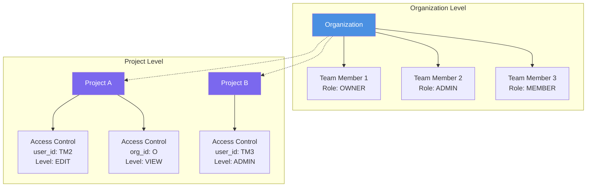
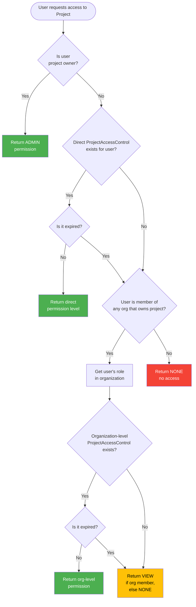
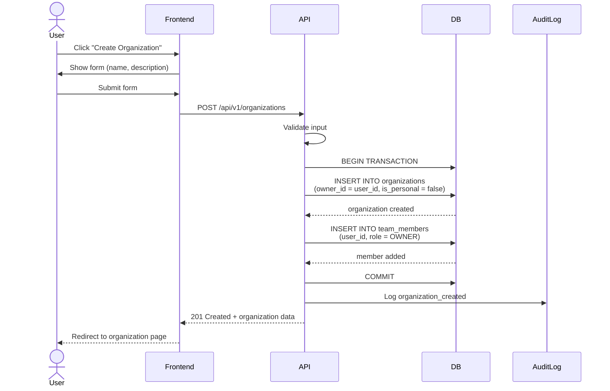
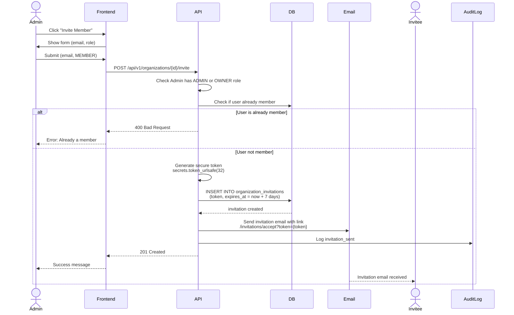
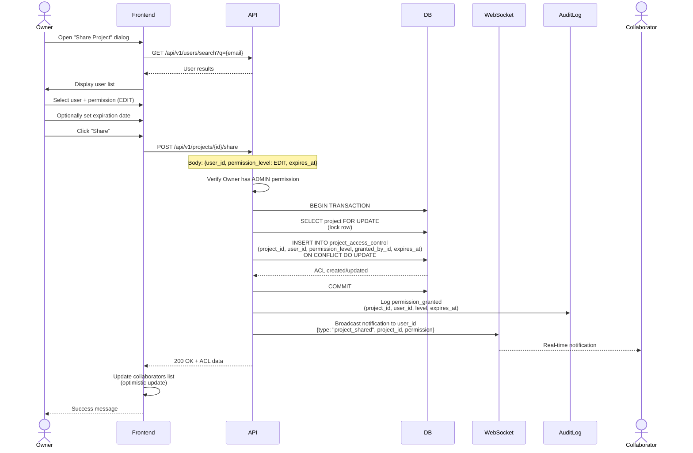
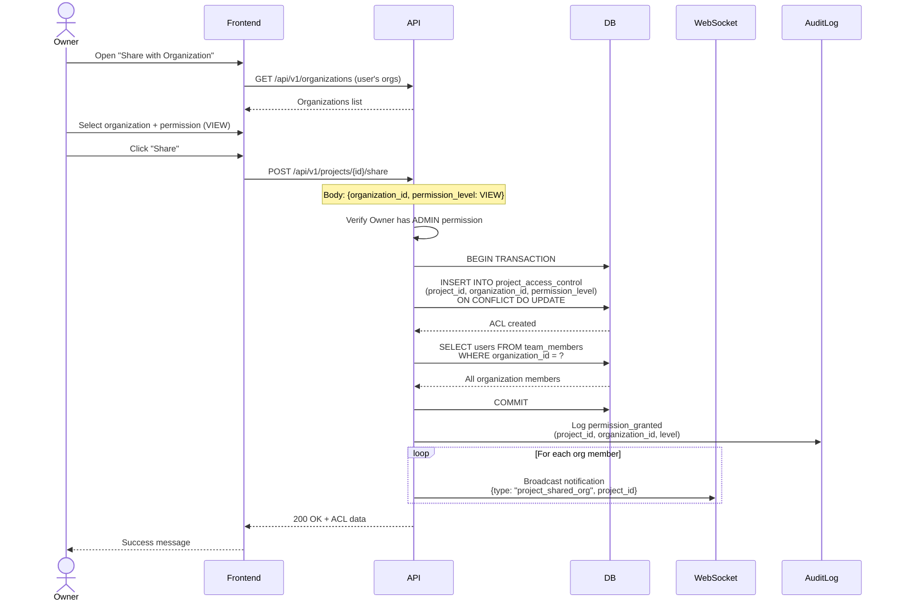
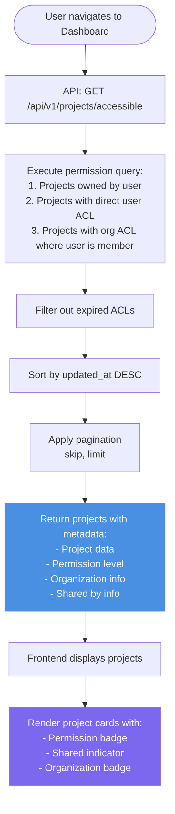
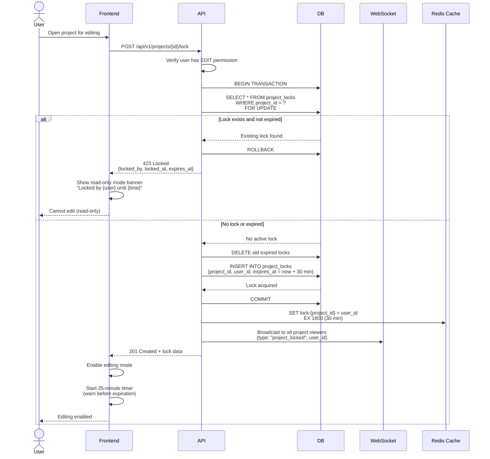
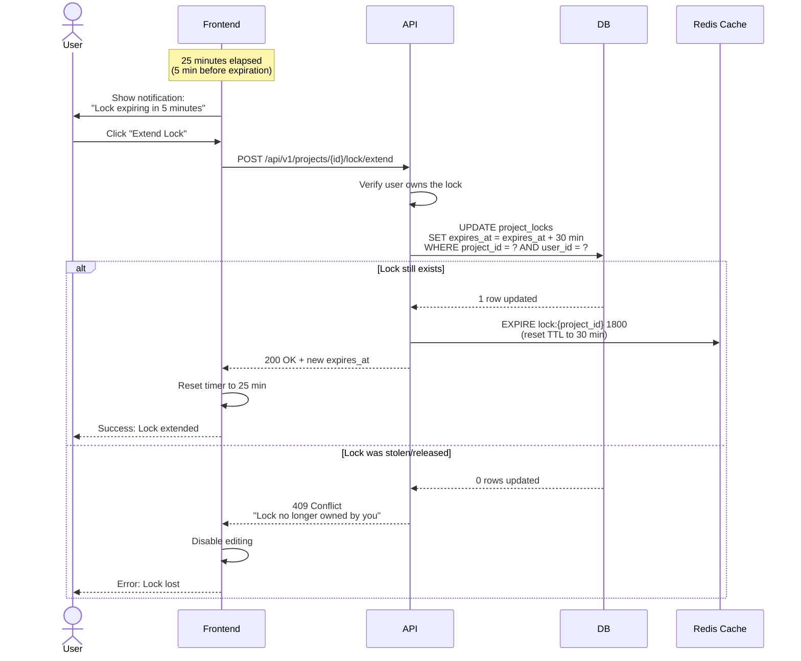
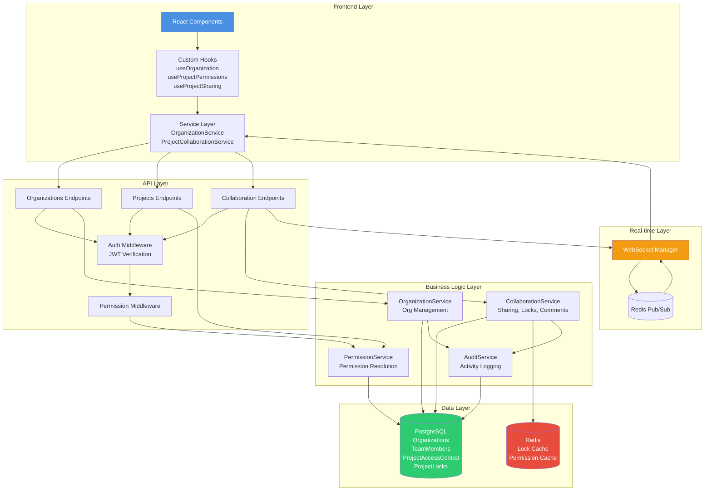

# Project Sharing & Permissions Architecture

## Overview

Qontinui implements a comprehensive hierarchical permission system that manages access control across three organizational tiers: **Organizations → Teams → Projects**. The system combines Role-Based Access Control (RBAC) with time-based permissions, resource locking, and audit logging to provide enterprise-grade security for collaborative GUI automation workflows.

## Permission Model

### Three-Tier Hierarchy



### Permission Hierarchies

**Organization Role Hierarchy:**
```
VIEWER (1) < MEMBER (2) < ADMIN (3) < OWNER (4)
```

**Project Permission Hierarchy:**
```
VIEW (1) < COMMENT (2) < EDIT (3) < ADMIN (4)
```

## Core Database Models

### Organization Model

```python
class Organization(Base):
    __tablename__ = "organizations"

    id: UUID (PK)
    name: str (max 100, indexed)
    description: Optional[str] (max 500)
    is_personal: bool (default False, indexed)
    owner_id: UUID (FK → users.id, indexed)

    created_at: datetime
    updated_at: datetime

    # Relationships
    members: List[TeamMember]
    owner: User
    projects: List[Project]
    invitations: List[OrganizationInvitation]
    access_controls: List[ProjectAccessControl]

    # Constraints
    UNIQUE(owner_id) WHERE is_personal = true
    CHECK(is_personal IN (true, false))
```

**Indexes:**
- `organizations_name_idx` (name)
- `organizations_is_personal_idx` (is_personal)
- `organizations_owner_id_idx` (owner_id)

### TeamMember Model

```python
class TeamMember(Base):
    __tablename__ = "team_members"

    id: UUID (PK)
    organization_id: UUID (FK → organizations.id, CASCADE DELETE)
    user_id: UUID (FK → users.id, CASCADE DELETE)
    role: TeamRole (VIEWER|MEMBER|ADMIN|OWNER)

    joined_at: datetime

    # Relationships
    organization: Organization
    user: User

    # Constraints
    UNIQUE(organization_id, user_id)
```

**Indexes:**
- `team_members_org_user_idx` (organization_id, user_id) UNIQUE
- `team_members_user_id_idx` (user_id)
- `team_members_role_idx` (role)

### ProjectAccessControl Model

```python
class ProjectAccessControl(Base):
    __tablename__ = "project_access_control"

    id: UUID (PK)
    project_id: UUID (FK → projects.id, CASCADE DELETE, indexed)

    # Mutually exclusive: user_id XOR organization_id
    user_id: Optional[UUID] (FK → users.id, CASCADE DELETE)
    organization_id: Optional[UUID] (FK → organizations.id, CASCADE DELETE)

    permission_level: PermissionLevel (VIEW|COMMENT|EDIT|ADMIN)
    granted_by_id: UUID (FK → users.id, indexed)

    expires_at: Optional[datetime]
    created_at: datetime
    updated_at: datetime

    # Relationships
    project: Project
    user: Optional[User]
    organization: Optional[Organization]
    granted_by: User

    # Constraints
    CHECK((user_id IS NOT NULL AND organization_id IS NULL) OR
          (user_id IS NULL AND organization_id IS NOT NULL))
    UNIQUE(project_id, user_id) WHERE user_id IS NOT NULL
    UNIQUE(project_id, organization_id) WHERE organization_id IS NOT NULL
```

**Indexes:**
- `project_access_control_project_idx` (project_id)
- `project_access_control_user_idx` (user_id)
- `project_access_control_org_idx` (organization_id)
- `project_access_control_granted_by_idx` (granted_by_id)
- `project_access_control_project_user_idx` (project_id, user_id) UNIQUE WHERE user_id IS NOT NULL
- `project_access_control_project_org_idx` (project_id, organization_id) UNIQUE WHERE organization_id IS NOT NULL

### OrganizationInvitation Model

```python
class OrganizationInvitation(Base):
    __tablename__ = "organization_invitations"

    id: UUID (PK)
    organization_id: UUID (FK → organizations.id, CASCADE DELETE)
    email: str (max 255, indexed)
    role: TeamRole (default MEMBER)
    token: str (unique, indexed)
    invited_by_id: UUID (FK → users.id)

    expires_at: datetime
    created_at: datetime
    accepted_at: Optional[datetime]

    # Relationships
    organization: Organization
    invited_by: User

    # Constraints
    UNIQUE(token)
    UNIQUE(organization_id, email) WHERE accepted_at IS NULL
```

**Indexes:**
- `organization_invitations_token_idx` (token) UNIQUE
- `organization_invitations_email_idx` (email)
- `organization_invitations_org_email_idx` (organization_id, email) UNIQUE WHERE accepted_at IS NULL

## Permission Resolution Algorithm

### High-Level Flow



### Detailed Resolution Logic

**Step 1: Check Ownership**
```python
if project.owner_id == user_id:
    return PermissionLevel.ADMIN
```

**Step 2: Check Direct User Access**
```python
direct_access = (
    SELECT permission_level FROM project_access_control
    WHERE project_id = ? AND user_id = ?
    AND (expires_at IS NULL OR expires_at > NOW())
)
if direct_access:
    return direct_access.permission_level
```

**Step 3: Check Organization Access**
```python
# Single optimized query with LEFT JOIN
org_access = (
    SELECT
        pac.permission_level,
        tm.role as org_role
    FROM team_members tm
    INNER JOIN organizations o ON tm.organization_id = o.id
    INNER JOIN projects p ON p.organization_id = o.id
    LEFT JOIN project_access_control pac ON
        pac.project_id = p.id AND
        pac.organization_id = o.id AND
        (pac.expires_at IS NULL OR pac.expires_at > NOW())
    WHERE tm.user_id = ? AND p.id = ?
)

if org_access:
    if org_access.permission_level:
        return org_access.permission_level  # Explicit org-level ACL
    else:
        return PermissionLevel.VIEW  # Default for org members
else:
    return PermissionLevel.NONE  # No access
```

## Organization Membership Flow

### Creating an Organization



### Inviting Team Members



### Accepting Invitation

```mermaid
flowchart TD
    Start([User clicks invitation link]) --> LoadPage[Frontend loads<br/>/invitations/accept?token=xxx]
    LoadPage --> FetchInvite[API: GET /invitations/{token}]

    FetchInvite --> ValidToken{Token valid<br/>and not expired?}
    ValidToken -->|No| ShowError[Show error:<br/>Invalid or expired invitation]
    ValidToken -->|Yes| CheckUser{User logged in?}

    CheckUser -->|No| RedirectLogin[Redirect to<br/>/login?redirect=/invitations/accept?token=xxx]
    CheckUser -->|Yes| ShowInvite[Display invitation details:<br/>Organization name, Role]

    ShowInvite --> UserAction{User decision}
    UserAction -->|Decline| DeclineAPI[API: POST /invitations/{token}/decline]
    DeclineAPI --> DeleteInvite[DELETE invitation record]
    DeleteInvite --> ShowDeclined[Show: Invitation declined]

    UserAction -->|Accept| AcceptAPI[API: POST /invitations/{token}/accept]
    AcceptAPI --> BeginTx[BEGIN TRANSACTION]
    BeginTx --> CheckDuplicate{User already<br/>member?}

    CheckDuplicate -->|Yes| Rollback[ROLLBACK]
    Rollback --> ErrorDuplicate[Error: Already a member]

    CheckDuplicate -->|No| InsertMember[INSERT INTO team_members<br/>user_id, organization_id, role]
    InsertMember --> UpdateInvite[UPDATE organization_invitations<br/>SET accepted_at = NOW]
    UpdateInvite --> Commit[COMMIT]
    Commit --> AuditLog[Log membership_added]
    AuditLog --> Success[Show success message]
    Success --> RedirectOrg[Redirect to organization page]

    style ShowError fill:#F44336,color:#fff
    style Success fill:#4CAF50,color:#fff
    style ErrorDuplicate fill:#F44336,color:#fff
```

## Project Sharing Flow

### Sharing with Individual User



### Sharing with Organization



### Viewing Shared Projects



## Resource Locking for Collaboration

### Acquiring a Lock



### Lock Extension



### Releasing a Lock

```mermaid
flowchart TD
    Start([User action]) --> Trigger{Trigger type}

    Trigger -->|Explicit| UserClick[User clicks<br/>"Done Editing"]
    Trigger -->|Implicit| AutoRelease[Auto-release on:<br/>- Navigate away<br/>- Close browser<br/>- Idle 30 min]

    UserClick --> API[API: DELETE /projects/{id}/lock]
    AutoRelease --> API

    API --> VerifyOwner{User owns lock?}
    VerifyOwner -->|No| Error[403 Forbidden]
    VerifyOwner -->|Yes| BeginTx[BEGIN TRANSACTION]

    BeginTx --> DeleteDB[DELETE FROM project_locks<br/>WHERE project_id = ? AND user_id = ?]
    DeleteDB --> Commit[COMMIT]
    Commit --> DeleteCache[Redis: DEL lock:{project_id}]
    DeleteCache --> Broadcast[WebSocket: Broadcast<br/>{type: "project_unlocked"}]
    Broadcast --> Success[200 OK]

    Success --> UpdateFrontend[Frontend: Remove lock banner]
    UpdateFrontend --> NotifyOthers[Notify other viewers:<br/>"Project now available"]

    style Success fill:#4CAF50,color:#fff
    style Error fill:#F44336,color:#fff
```

## Complete System Architecture

### Component Interaction Diagram



## API Endpoints Summary

### Organization Management

| Method | Endpoint | Permission Required | Description |
|--------|----------|---------------------|-------------|
| POST | `/api/v1/organizations` | Authenticated | Create new organization |
| GET | `/api/v1/organizations` | Authenticated | List user's organizations |
| GET | `/api/v1/organizations/{id}` | VIEWER+ | Get organization details |
| PUT | `/api/v1/organizations/{id}` | ADMIN+ | Update organization |
| DELETE | `/api/v1/organizations/{id}` | OWNER | Delete organization |
| GET | `/api/v1/organizations/{id}/members` | MEMBER+ | List members |
| PUT | `/api/v1/organizations/{id}/members/{user_id}` | ADMIN+ | Update member role |
| DELETE | `/api/v1/organizations/{id}/members/{user_id}` | ADMIN+ or SELF | Remove member |
| POST | `/api/v1/organizations/{id}/invite` | ADMIN+ | Send invitation |
| GET | `/api/v1/organizations/{id}/invitations` | ADMIN+ | List pending invitations |
| DELETE | `/api/v1/organizations/{id}/invitations/{invite_id}` | ADMIN+ | Revoke invitation |

### Invitation Management

| Method | Endpoint | Permission Required | Description |
|--------|----------|---------------------|-------------|
| GET | `/api/v1/invitations/{token}` | Public | Get invitation details |
| POST | `/api/v1/invitations/{token}/accept` | Authenticated | Accept invitation |
| POST | `/api/v1/invitations/{token}/decline` | Authenticated | Decline invitation |

### Project Sharing

| Method | Endpoint | Permission Required | Description |
|--------|----------|---------------------|-------------|
| POST | `/api/v1/projects/{id}/share` | ADMIN | Share project with user/org |
| GET | `/api/v1/projects/{id}/collaborators` | COMMENT+ | List collaborators |
| PUT | `/api/v1/projects/{id}/collaborators/{acl_id}` | ADMIN | Update permission level |
| DELETE | `/api/v1/projects/{id}/collaborators/{acl_id}` | ADMIN | Remove collaborator |
| GET | `/api/v1/projects/accessible` | Authenticated | List accessible projects |

### Project Locking

| Method | Endpoint | Permission Required | Description |
|--------|----------|---------------------|-------------|
| POST | `/api/v1/projects/{id}/lock` | EDIT+ | Acquire edit lock |
| DELETE | `/api/v1/projects/{id}/lock` | Lock Owner | Release lock |
| POST | `/api/v1/projects/{id}/lock/extend` | Lock Owner | Extend lock expiration |
| GET | `/api/v1/projects/{id}/lock` | COMMENT+ | Get current lock status |

### Project Comments & Activity

| Method | Endpoint | Permission Required | Description |
|--------|----------|---------------------|-------------|
| POST | `/api/v1/projects/{id}/comments` | COMMENT+ | Add comment |
| GET | `/api/v1/projects/{id}/comments` | COMMENT+ | List comments |
| PUT | `/api/v1/projects/{id}/comments/{comment_id}` | Comment Author | Edit comment |
| DELETE | `/api/v1/projects/{id}/comments/{comment_id}` | Comment Author or ADMIN | Delete comment |
| GET | `/api/v1/projects/{id}/activity` | VIEW+ | Get activity log |

## Security Features

### 1. Permission Checks at Multiple Layers

**Frontend (UX Layer):**
- `PermissionGate` component hides UI elements
- Hook-based checks (`useProjectPermissions`)
- Optimistic permission caching

**API Middleware (Enforcement Layer):**
- `require_permission()` dependency injection
- Endpoint-level decorators
- Automatic 403 Forbidden responses

**Service Layer (Business Logic):**
- Double-check permissions before mutations
- Transaction-level consistency
- Audit logging

### 2. Resource Locking (Optimistic Concurrency)

- 30-minute lock timeout
- Extension mechanism (before expiration)
- Automatic expiration cleanup
- Redis cache for fast lock checks
- WebSocket notifications for lock state changes

### 3. Time-Based Access Control

- Optional `expires_at` field on ProjectAccessControl
- Automatic expiration check during permission resolution
- Periodic cleanup job (recommended: daily cron)
- No automatic revocation (checked on-demand)

### 4. Audit Logging

**Logged Events:**
- `organization_created`, `organization_updated`, `organization_deleted`
- `membership_added`, `membership_removed`, `role_changed`
- `invitation_sent`, `invitation_accepted`, `invitation_revoked`
- `permission_granted`, `permission_revoked`, `permission_updated`
- `project_locked`, `project_unlocked`, `lock_extended`
- `comment_added`, `comment_edited`, `comment_deleted`

**Audit Log Schema:**
```python
{
    "timestamp": "2025-01-21T10:30:00Z",
    "user_id": "uuid",
    "event_type": "permission_granted",
    "resource_type": "project",
    "resource_id": "uuid",
    "metadata": {
        "target_user_id": "uuid",
        "permission_level": "EDIT",
        "expires_at": "2025-02-21T10:30:00Z"
    },
    "ip_address": "192.168.1.100",
    "user_agent": "Mozilla/5.0..."
}
```

### 5. Data Integrity Constraints

**Database-level enforcement:**
- UNIQUE constraint on (organization_id, user_id) in team_members
- CHECK constraint for mutually exclusive user_id/organization_id in ProjectAccessControl
- UNIQUE constraint for personal organizations (one per user)
- CASCADE DELETE for referential integrity
- NOT NULL constraints on critical fields

### 6. Real-Time Collaboration

**WebSocket Events:**
- `project_shared` - User/org gains access
- `project_unshared` - Access revoked
- `permission_updated` - Permission level changed
- `project_locked` - Editing locked by user
- `project_unlocked` - Editing unlocked
- `comment_added` - New comment posted
- `activity_logged` - New activity event

**Redis Pub/Sub for Horizontal Scaling:**
- Broadcasts to all WebSocket instances
- Ensures all connected users receive updates
- No single point of failure

## Frontend Architecture

### Key Components

**Organization Management:**
- `/organizations` - List all organizations
- `/organizations/create` - Create new organization
- `/organizations/[id]` - Organization details
- `/organizations/[id]/members` - Member management
- `/organizations/[id]/settings` - Settings & danger zone

**Project Sharing:**
- `ShareProjectDialog` - Modal for sharing
- `CollaboratorsList` - Display and manage collaborators
- `PermissionBadge` - Visual permission indicator
- `PermissionGate` - Conditional rendering by permission

**Invitation Flow:**
- `/invitations/accept` - Accept invitation page
- `InvitationCard` - Display invitation details
- `AcceptInvitationButton` - Accept action

### Custom Hooks

**`useOrganization(organizationId)`**
- Fetches organization details
- Manages members list
- Handles invitations
- Provides mutations (update, delete, invite, etc.)

**`useProjectPermissions(projectId)`**
- Returns current user's permission level
- Provides permission check helpers (`canEdit()`, `canAdmin()`, etc.)
- Caches results for 5 minutes
- Automatically refetches on project change

**`useProjectSharing(projectId)`**
- Manages collaborators list
- Share/unshare mutations
- Permission level updates
- Optimistic UI updates

**`useProjectLock(projectId)`**
- Lock status (locked_by, expires_at)
- Acquire/release/extend mutations
- Auto-extend timer (25 minutes)
- Warning notifications

### State Management

**React Query (Server State):**
- Organizations list (`useQuery(['organizations'])`)
- Project permissions (`useQuery(['permissions', projectId])`)
- Collaborators (`useQuery(['collaborators', projectId])`)
- Lock status (`useQuery(['lock', projectId])`)

**Zustand (Client State):**
- Current user info
- UI state (modals, dialogs)
- Optimistic updates

## Performance Considerations

### Database Optimization

1. **Composite Indexes:**
   - `(organization_id, user_id)` on team_members - Fast membership lookup
   - `(project_id, user_id)` on project_access_control - Fast direct access check
   - `(project_id, organization_id)` on project_access_control - Fast org access check

2. **Single Query Permission Resolution:**
   - Uses LEFT JOIN to check all permission sources in one query
   - Avoids N+1 query problem
   - Typical query time: 5-10ms

3. **No Permission Caching (by design):**
   - Real-time consistency for security
   - Database is fast enough (<10ms per query)
   - Consider caching for read-heavy workloads (Redis, 1-minute TTL)

### API Optimization

1. **Pagination:**
   - Organizations list: 20 per page
   - Accessible projects: 50 per page
   - Members list: 50 per page

2. **Selective Loading:**
   - Lazy load collaborators (not in project list)
   - Lazy load activity log (paginated, 20 per page)
   - Lazy load comments (paginated, 50 per page)

3. **Optimistic Updates:**
   - Frontend updates UI immediately
   - Rollback on error
   - Background revalidation

### WebSocket Optimization

1. **Room-Based Broadcasting:**
   - Users join project-specific rooms
   - Only receive updates for projects they're viewing
   - Reduces unnecessary messages

2. **Redis Pub/Sub:**
   - Horizontal scaling across multiple API instances
   - Message deduplication
   - Automatic reconnection

## Migration Notes

### From Personal Projects to Organizations

When a user creates their first organization:
1. Personal organization already exists (created on registration)
2. Personal projects remain in personal organization
3. User can move projects to organization via API

**Migration Endpoint (recommended):**
```python
POST /api/v1/projects/{project_id}/move
Body: {"organization_id": "uuid"}
Requires: ADMIN on project, ADMIN on target organization
```

### From Flat Permissions to Hierarchical

If migrating from a simple owner/collaborator model:
1. Owner → Convert to personal organization with OWNER role
2. Collaborators → Convert to ProjectAccessControl with appropriate level
3. Ensure backward compatibility with old API endpoints

## Recommendations

### Immediate (Priority 1)

1. **Add permission check to automation sessions endpoint** ⚠️ CRITICAL
   - Currently missing, allows unauthorized access

2. **Implement missing expiration check on lock extension** ⚠️ CRITICAL
   - Prevents extending expired locks

3. **Add index on ProjectAccessControl.expires_at**
   - Speeds up expiration cleanup queries

### Short-term (Priority 2)

4. **Implement permission caching with Redis**
   - 1-minute TTL for read-heavy workloads
   - Invalidate on permission changes

5. **Add bulk permission management**
   - Share with multiple users at once
   - Batch permission updates

6. **Add permission request workflow**
   - Users can request access
   - Owners receive notifications
   - Approve/deny interface

### Long-term (Priority 3)

7. **Add team/group support**
   - Group users within organizations
   - Assign permissions to groups
   - Simplifies large organization management

8. **Add granular action permissions**
   - Beyond VIEW/COMMENT/EDIT/ADMIN
   - Fine-grained control (can_export, can_execute, can_share)

9. **Add owner transfer workflow**
   - Transfer project ownership
   - Transfer organization ownership
   - Requires verification step

## Conclusion

Qontinui's permission system provides enterprise-grade access control with hierarchical organizations, fine-grained permissions, real-time collaboration, and comprehensive audit logging. The three-tier architecture (Organization → Team → Project) enables flexible team structures while maintaining security and performance.

**Key Strengths:**
- Hierarchical RBAC with two separate permission levels
- Real-time WebSocket notifications
- Resource locking for conflict-free editing
- Comprehensive audit logging
- Optimized single-query permission resolution

**Current Security Rating: 6/10**
- Solid foundation with some critical gaps
- See companion analysis document for detailed security audit

**Scalability:**
- Supports 1000+ organizations
- Supports 10,000+ projects per organization
- Horizontal scaling via Redis Pub/Sub
- Database optimized with composite indexes

For detailed security analysis and prioritized recommendations, see **`permissions-architecture-analysis.md`**.

---

**Document Version**: 2.0
**Last Updated**: 2025-01-21
**Maintained By**: Qontinui Development Team
