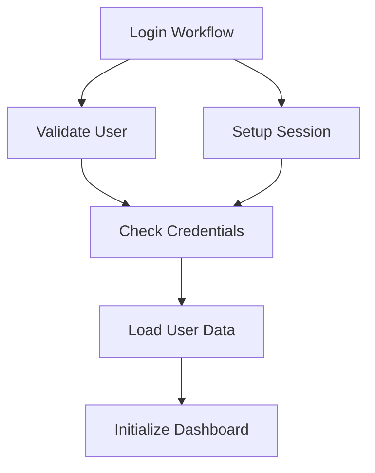

# Workflow Dependencies

This guide covers analyzing workflow dependencies, detecting circular dependencies, and understanding workflow relationships.

## Table of Contents

- [Overview](#overview)
- [Dependency Analysis](#dependency-analysis)
- [Circular Dependency Detection](#circular-dependency-detection)
- [Impact Analysis](#impact-analysis)
- [Dependency Visualization](#dependency-visualization)
- [Unused Workflows](#unused-workflows)
- [Best Practices](#best-practices)

## Overview

The Workflow Dependency Analyzer helps you understand relationships between workflows by analyzing `RUN_WORKFLOW` actions. It detects circular dependencies, performs impact analysis, and identifies unused workflows.

### Key Features

- Analyze workflow dependencies
- Detect circular dependencies
- Impact analysis (what breaks if I change this?)
- Dependency graph visualization
- Find unused workflows
- Export dependency reports
- Validate workflow integrity

## Dependency Analysis

### Basic Analysis

```typescript
import { workflowDependencyAnalyzer } from '@/services/workflow-dependency-analyzer';

// Analyze dependencies for all workflows
const analysis = workflowDependencyAnalyzer.analyzeDependencies(workflows);

console.log(`Total workflows: ${analysis.totalWorkflows}`);
console.log(`Workflows with dependencies: ${analysis.workflowsWithDependencies}`);
console.log(`Total dependency relationships: ${analysis.totalDependencies}`);
```

### Analysis Result

```typescript
interface DependencyAnalysis {
  // Basic stats
  totalWorkflows: number;
  workflowsWithDependencies: number;
  totalDependencies: number;

  // Dependency map: workflow ID -> dependencies
  dependencies: Map<string, WorkflowDependency[]>;

  // Reverse map: workflow ID -> dependents (who depends on this?)
  dependents: Map<string, WorkflowDependency[]>;

  // Circular dependencies
  circularDependencies: CircularDependency[];

  // Unused workflows (not called by anyone)
  unusedWorkflows: string[];

  // Most depended upon workflows
  mostDependedUpon: Array<{ workflowId: string; count: number }>;

  // Analysis timestamp
  timestamp: Date;
}
```

### Get Dependencies for a Workflow

```typescript
// Get direct dependencies (workflows this one calls)
const dependencies = workflowDependencyAnalyzer.getDependencies(workflowId);

dependencies.forEach(dep => {
  console.log(`Depends on: ${dep.targetWorkflowId}`);
  console.log(`Called from action: ${dep.actionId}`);
  console.log(`Action name: ${dep.actionName}`);
});
```

### Get Dependents

```typescript
// Get workflows that depend on this one
const dependents = workflowDependencyAnalyzer.getDependents(workflowId);

dependents.forEach(dep => {
  console.log(`Used by: ${dep.sourceWorkflowId}`);
  console.log(`In action: ${dep.actionId}`);
});
```

### Dependency Types

```typescript
interface WorkflowDependency {
  // Source workflow (the one with RUN_WORKFLOW action)
  sourceWorkflowId: string;
  sourceWorkflowName?: string;

  // Target workflow (the one being called)
  targetWorkflowId: string;
  targetWorkflowName?: string;

  // The RUN_WORKFLOW action details
  actionId: string;
  actionName?: string;

  // Dependency type
  type: 'direct' | 'conditional' | 'loop';

  // If it's in a conditional or loop
  isConditional: boolean;
  isInLoop: boolean;
}
```

## Circular Dependency Detection

Circular dependencies occur when workflows call each other in a cycle, which can cause infinite loops.

### Detect Circular Dependencies

```typescript
// Detect all circular dependencies
const circular = workflowDependencyAnalyzer.detectCircularDependencies(workflows);

if (circular.length > 0) {
  console.error(`Found ${circular.length} circular dependencies!`);

  circular.forEach(cycle => {
    console.error('Circular dependency detected:');
    console.error(`Path: ${cycle.path.join(' -> ')}`);
    console.error(`Cycle: ${cycle.cycle.join(' -> ')}`);
  });
}
```

### Circular Dependency Structure

```typescript
interface CircularDependency {
  // Cycle path (workflow IDs forming the cycle)
  cycle: string[];

  // Full path from root to cycle
  path: string[];

  // Severity (based on cycle length)
  severity: 'low' | 'medium' | 'high';

  // Description
  description: string;
}
```

### Example Circular Dependencies

```
Workflow A -> Workflow B -> Workflow C -> Workflow A
(Simple 3-workflow cycle)

Workflow A -> Workflow B -> Workflow A
(Direct 2-workflow cycle)

Workflow A -> Workflow B -> Workflow C -> Workflow D -> Workflow B
(Cycle in middle of chain)
```

### Check Single Workflow

```typescript
// Check if a specific workflow has circular dependencies
const hasCircular = workflowDependencyAnalyzer.hasCircularDependency(
  workflowId,
  workflows
);

if (hasCircular) {
  console.error('Warning: This workflow is part of a circular dependency!');
}
```

## Impact Analysis

Impact analysis shows what would be affected if you modify or delete a workflow.

### Get Impact Analysis

```typescript
// Analyze impact of changing/deleting a workflow
const impact = workflowDependencyAnalyzer.getImpactAnalysis(workflowId, workflows);

console.log(`Direct impact: ${impact.directImpact.length} workflows`);
console.log(`Indirect impact: ${impact.indirectImpact.length} workflows`);
console.log(`Total impact: ${impact.totalImpact} workflows`);

// Show risk level
console.log(`Risk level: ${impact.riskLevel}`);
```

### Impact Analysis Structure

```typescript
interface ImpactAnalysis {
  // Workflow being analyzed
  workflowId: string;

  // Workflows directly dependent on this one
  directImpact: string[];

  // Workflows indirectly dependent (via dependencies)
  indirectImpact: string[];

  // Total number of affected workflows
  totalImpact: number;

  // Risk level
  riskLevel: 'low' | 'medium' | 'high' | 'critical';

  // Suggested actions
  suggestions: string[];

  // Full dependency tree
  dependencyTree: DependencyNode;
}

interface DependencyNode {
  workflowId: string;
  children: DependencyNode[];
  depth: number;
}
```

### Example Impact Analysis

```typescript
// Before deleting a workflow, check impact
const impact = workflowDependencyAnalyzer.getImpactAnalysis('workflow-123', workflows);

if (impact.totalImpact > 0) {
  const message = `
    WARNING: Deleting this workflow will impact ${impact.totalImpact} other workflows.

    Directly affected (${impact.directImpact.length}):
    ${impact.directImpact.join(', ')}

    Indirectly affected (${impact.indirectImpact.length}):
    ${impact.indirectImpact.join(', ')}

    Risk Level: ${impact.riskLevel.toUpperCase()}

    Suggestions:
    ${impact.suggestions.join('\n')}
  `;

  const confirmed = confirm(message + '\n\nProceed with deletion?');
  if (!confirmed) {
    return; // Cancel deletion
  }
}

// Safe to delete or low impact
deleteWorkflow('workflow-123');
```

## Dependency Visualization

### Generate Dependency Graph

```typescript
// Generate graph data for visualization
const graph = workflowDependencyAnalyzer.buildDependencyGraph(workflows);

console.log(`Nodes: ${graph.nodes.length}`);
console.log(`Edges: ${graph.edges.length}`);

// Use with a visualization library (e.g., D3.js, vis.js, react-flow)
renderGraph(graph);
```

### Graph Structure

```typescript
interface DependencyGraph {
  nodes: GraphNode[];
  edges: GraphEdge[];
  metadata: {
    totalNodes: number;
    totalEdges: number;
    maxDepth: number;
    hasCircular: boolean;
  };
}

interface GraphNode {
  id: string;
  label: string;
  type: 'workflow';
  metadata: {
    dependencyCount: number;
    dependentCount: number;
    isUnused: boolean;
    isCircular: boolean;
  };
}

interface GraphEdge {
  source: string;
  target: string;
  type: 'dependency';
  metadata: {
    actionId: string;
    isConditional: boolean;
    isInLoop: boolean;
  };
}
```

### Visualization Example (Mermaid)



### Generate Mermaid Diagram

```typescript
// Generate Mermaid diagram code
const mermaidCode = workflowDependencyAnalyzer.generateMermaidDiagram(
  workflowId,
  workflows
);

console.log(mermaidCode);
```

Output:
```
graph TD
    wf-1[Login Workflow] --> wf-2[Validate User]
    wf-1 --> wf-3[Setup Session]
    wf-2 --> wf-4[Check Credentials]
```

## Unused Workflows

### Find Unused Workflows

```typescript
// Find workflows that are never called by other workflows
const unused = workflowDependencyAnalyzer.findUnusedWorkflows(workflows);

console.log(`Found ${unused.length} unused workflows`);

unused.forEach(wfId => {
  const workflow = workflows.find(wf => wf.id === wfId);
  console.log(`- ${workflow?.name} (${wfId})`);
});
```

### Categorize Unused Workflows

```typescript
// Categorize unused workflows
const categorized = {
  entryPoints: [] as string[],    // Meant to be run directly
  candidates: [] as string[],      // Potentially unused
  deprecated: [] as string[]       // Marked as deprecated
};

unused.forEach(wfId => {
  const workflow = workflows.find(wf => wf.id === wfId);
  const tags = workflowFolderManager.getTags(wfId);

  if (tags.includes('entry-point') || tags.includes('standalone')) {
    categorized.entryPoints.push(wfId);
  } else if (tags.includes('deprecated')) {
    categorized.deprecated.push(wfId);
  } else {
    categorized.candidates.push(wfId);
  }
});

console.log('Unused workflows that might be candidates for removal:');
categorized.candidates.forEach(wfId => {
  const workflow = workflows.find(wf => wf.id === wfId);
  console.log(`- ${workflow?.name}`);
});
```

## Best Practices

### Prevent Circular Dependencies

```typescript
// Check for circular dependencies before saving
function saveWorkflowSafely(workflow: Workflow, allWorkflows: Workflow[]): boolean {
  // Create temporary workflow list with the new/modified workflow
  const tempWorkflows = allWorkflows.filter(wf => wf.id !== workflow.id);
  tempWorkflows.push(workflow);

  // Check for circular dependencies
  const circular = workflowDependencyAnalyzer.detectCircularDependencies(tempWorkflows);

  if (circular.length > 0) {
    alert('Cannot save: This change would create a circular dependency!');
    return false;
  }

  // Safe to save
  return saveWorkflow(workflow);
}
```

### Dependency Depth Limits

```typescript
// Limit dependency depth to prevent deep nesting
const MAX_DEPENDENCY_DEPTH = 5;

function checkDependencyDepth(workflowId: string, workflows: Workflow[]): boolean {
  const depth = workflowDependencyAnalyzer.getMaxDependencyDepth(workflowId, workflows);

  if (depth > MAX_DEPENDENCY_DEPTH) {
    console.warn(`Warning: Dependency depth (${depth}) exceeds recommended limit (${MAX_DEPENDENCY_DEPTH})`);
    return false;
  }

  return true;
}
```

### Document Dependencies

```typescript
// Add dependency documentation to workflow
function documentDependencies(workflow: Workflow): void {
  const dependencies = workflowDependencyAnalyzer.getDependencies(workflow.id);

  const dependencyDocs = dependencies.map(dep =>
    `- ${dep.targetWorkflowName || dep.targetWorkflowId}: ${dep.actionName || 'Unnamed action'}`
  ).join('\n');

  workflow.description = `
${workflow.description || ''}

## Dependencies

This workflow depends on:
${dependencyDocs || 'None'}
  `.trim();
}
```

### Safe Workflow Deletion

```typescript
function safeDeleteWorkflow(workflowId: string, workflows: Workflow[]): boolean {
  // Check impact
  const impact = workflowDependencyAnalyzer.getImpactAnalysis(workflowId, workflows);

  if (impact.totalImpact > 0) {
    const message = `
      This workflow is used by ${impact.totalImpact} other workflow(s).

      Directly affected: ${impact.directImpact.length}
      Indirectly affected: ${impact.indirectImpact.length}

      Deleting it will break these workflows!
    `;

    if (!confirm(message + '\n\nContinue anyway?')) {
      return false;
    }
  }

  // Perform deletion
  return deleteWorkflow(workflowId);
}
```

### Dependency Report

```typescript
// Generate comprehensive dependency report
function generateDependencyReport(workflows: Workflow[]): string {
  const analysis = workflowDependencyAnalyzer.analyzeDependencies(workflows);

  let report = '# Workflow Dependency Report\n\n';
  report += `Generated: ${new Date().toISOString()}\n\n`;

  // Summary
  report += '## Summary\n\n';
  report += `- Total Workflows: ${analysis.totalWorkflows}\n`;
  report += `- Workflows with Dependencies: ${analysis.workflowsWithDependencies}\n`;
  report += `- Total Dependencies: ${analysis.totalDependencies}\n`;
  report += `- Circular Dependencies: ${analysis.circularDependencies.length}\n`;
  report += `- Unused Workflows: ${analysis.unusedWorkflows.length}\n\n`;

  // Circular dependencies
  if (analysis.circularDependencies.length > 0) {
    report += '## ⚠️ Circular Dependencies\n\n';
    analysis.circularDependencies.forEach(circular => {
      report += `- ${circular.description}\n`;
      report += `  - Path: ${circular.path.join(' → ')}\n`;
      report += `  - Severity: ${circular.severity}\n\n`;
    });
  }

  // Most depended upon
  report += '## Most Depended Upon Workflows\n\n';
  analysis.mostDependedUpon.slice(0, 10).forEach((item, index) => {
    const workflow = workflows.find(wf => wf.id === item.workflowId);
    report += `${index + 1}. ${workflow?.name || item.workflowId} (${item.count} dependencies)\n`;
  });
  report += '\n';

  // Unused workflows
  if (analysis.unusedWorkflows.length > 0) {
    report += '## Unused Workflows\n\n';
    analysis.unusedWorkflows.forEach(wfId => {
      const workflow = workflows.find(wf => wf.id === wfId);
      report += `- ${workflow?.name || wfId}\n`;
    });
  }

  return report;
}

// Usage
const report = generateDependencyReport(workflows);
console.log(report);
```

### Dependency Validation

```typescript
// Validate all dependencies are valid
function validateDependencies(workflows: Workflow[]): {
  valid: boolean;
  errors: string[];
} {
  const errors: string[] = [];
  const workflowIds = new Set(workflows.map(wf => wf.id));

  workflows.forEach(workflow => {
    const dependencies = workflowDependencyAnalyzer.getDependencies(workflow.id);

    dependencies.forEach(dep => {
      // Check if target workflow exists
      if (!workflowIds.has(dep.targetWorkflowId)) {
        errors.push(
          `Workflow "${workflow.name}" references non-existent workflow: ${dep.targetWorkflowId}`
        );
      }
    });
  });

  return {
    valid: errors.length === 0,
    errors
  };
}

// Run validation
const validation = validateDependencies(workflows);
if (!validation.valid) {
  console.error('Dependency validation failed:');
  validation.errors.forEach(error => console.error(`- ${error}`));
}
```

## Common Patterns

### Layered Architecture

```
Entry Points (User-facing workflows)
    ↓
Business Logic Layer (Reusable workflows)
    ↓
Utility Layer (Helper workflows)
    ↓
Core Actions (Atomic operations)
```

```typescript
// Enforce layered architecture
function validateLayeredArchitecture(workflow: Workflow, workflows: Workflow[]): boolean {
  const layer = getWorkflowLayer(workflow);
  const dependencies = workflowDependencyAnalyzer.getDependencies(workflow.id);

  for (const dep of dependencies) {
    const depWorkflow = workflows.find(wf => wf.id === dep.targetWorkflowId);
    if (!depWorkflow) continue;

    const depLayer = getWorkflowLayer(depWorkflow);

    // Can only depend on same level or lower levels
    if (depLayer > layer) {
      console.error(
        `Architecture violation: ${workflow.name} (layer ${layer}) ` +
        `depends on ${depWorkflow.name} (layer ${depLayer})`
      );
      return false;
    }
  }

  return true;
}

function getWorkflowLayer(workflow: Workflow): number {
  const tags = workflowFolderManager.getTags(workflow.id);
  if (tags.includes('entry-point')) return 3;
  if (tags.includes('business-logic')) return 2;
  if (tags.includes('utility')) return 1;
  return 0; // Core
}
```

## Troubleshooting

### Broken Dependencies

```typescript
// Find and fix broken dependencies
const broken = workflows.filter(wf => {
  const deps = workflowDependencyAnalyzer.getDependencies(wf.id);
  return deps.some(dep => {
    const targetExists = workflows.some(w => w.id === dep.targetWorkflowId);
    return !targetExists;
  });
});

console.log(`Found ${broken.length} workflows with broken dependencies`);
```

### Performance with Large Workflows

For large dependency graphs (100+ workflows), consider caching:

```typescript
// Cache dependency analysis results
const dependencyCache = new Map<string, DependencyAnalysis>();

function getCachedAnalysis(workflows: Workflow[]): DependencyAnalysis {
  const cacheKey = workflows.map(wf => wf.id).sort().join(',');

  if (!dependencyCache.has(cacheKey)) {
    const analysis = workflowDependencyAnalyzer.analyzeDependencies(workflows);
    dependencyCache.set(cacheKey, analysis);
  }

  return dependencyCache.get(cacheKey)!;
}
```

## See Also

- [Organization Guide](./organization.md) - Manage workflow hierarchy
- [Version Control](./version-control.md) - Track dependency changes over time
- [Best Practices](./best-practices.md) - Recommended patterns
- [API Reference](./api-reference.md) - Complete API documentation
