# Config Migration System - Complete Architecture

## System Overview

The Config Migration System provides automatic backward compatibility for all historical JSON export formats. When users import old configurations, the system detects the version and applies necessary migrations using an intelligent BFS pathfinding algorithm.

**Current Version:** 2.0.1
**Location:** `/frontend/src/lib/config-migration/`
**Pattern:** Client-side, automatic, transparent

---

## High-Level Architecture

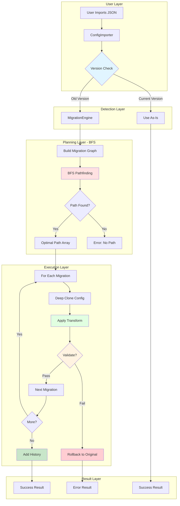

---

## Complete Data Flow: User Import Journey

```mermaid
sequenceDiagram
    participant U as User
    participant UI as Import Dialog
    participant CI as ConfigImporter
    participant ME as MigrationEngine
    participant MR as Migration Registry
    participant M1 as Migration v1→v2
    participant M2 as Migration v2→v2.0.1
    participant DB as IndexedDB/State

    U->>UI: Upload JSON config
    UI->>CI: importConfiguration(json)

    activate CI
    CI->>CI: Parse JSON
    CI->>CI: Check version field

    alt Version is current (2.0.1)
        CI->>DB: Import directly
        CI-->>UI: Success (no migration)
    else Version is old (e.g., 1.0.0)
        CI->>ME: migrateToLatest(config)

        activate ME
        ME->>ME: parseVersion('1.0.0')
        ME->>ME: compareVersions('1.0.0', '2.0.1')
        ME->>MR: Get all migrations
        MR-->>ME: [migV1→V2, migV2→V2.0.1]

        ME->>ME: buildMigrationGraph()
        ME->>ME: BFS from 1.0.0 to 2.0.1

        alt Path found
            ME->>ME: Path: [migV1→V2, migV2→V2.0.1]
            ME->>ME: structuredClone(config)

            loop For each migration
                ME->>M1: isApplicable(config)?
                M1-->>ME: true
                ME->>M1: migrate(config, context)

                activate M1
                M1->>M1: Transform to v2.0.0
                M1->>M1: Add warnings to context
                M1-->>ME: Migrated config v2.0.0
                deactivate M1

                ME->>M1: validate(config)?
                M1-->>ME: true (valid)

                ME->>M2: isApplicable(config)?
                M2-->>ME: true
                ME->>M2: migrate(config, context)

                activate M2
                M2->>M2: Transform to v2.0.1
                M2->>M2: Add warnings
                M2-->>ME: Migrated config v2.0.1
                deactivate M2

                ME->>M2: validate(config)?
                M2-->>ME: true (valid)
            end

            ME->>ME: addMigrationHistory()
            ME-->>CI: {success: true, config, warnings}
            deactivate ME

            CI->>DB: Import migrated config
            CI-->>UI: Success with warnings
            UI->>U: Show success + migration log

        else No path found
            ME-->>CI: {success: false, errors}
            deactivate ME
            CI-->>UI: Error: Cannot migrate
            UI->>U: Show error message
        end
    end
    deactivate CI
```

---

## BFS Pathfinding Algorithm Deep Dive

```mermaid
graph TB
    subgraph "Migration Graph Construction"
        A[ALL_MIGRATIONS Array] --> B[Build Adjacency List]
        B --> C[Map: fromVersion → Migration[]]
        C --> D["Example:<br/>1.0.0 → [migV1toV2]<br/>2.0.0 → [migV2toV201]"]
    end

    subgraph "BFS Initialization"
        D --> E[Initialize Queue]
        E --> F["Queue: [{version: '1.0.0', path: []}]"]
        F --> G[Initialize Visited Set]
        G --> H["Visited: Set(['1.0.0'])"]
    end

    subgraph "BFS Iteration"
        H --> I[Dequeue Current]
        I --> J{Is Target Version?}
        J -->|Yes| K[Return Path - FOUND!]
        J -->|No| L[Get Neighbors from Graph]
        L --> M{For Each Neighbor}
        M --> N{Already Visited?}
        N -->|Yes| O[Skip]
        N -->|No| P[Add to Visited]
        P --> Q[Enqueue with Updated Path]
        Q --> R{Queue Empty?}
        R -->|No| I
        R -->|Yes| S[Return null - NO PATH]
    end

    subgraph "Example Path Finding"
        T["Start: 1.0.0<br/>Target: 2.0.1"] --> U["Iteration 1:<br/>Current: 1.0.0<br/>Neighbor: 2.0.0<br/>Path: [migV1→V2]"]
        U --> V["Iteration 2:<br/>Current: 2.0.0<br/>Neighbor: 2.0.1<br/>Path: [migV1→V2, migV2→V201]"]
        V --> W["Iteration 3:<br/>Current: 2.0.1<br/>MATCH! Return path"]
    end

    style K fill:#c8e6c9
    style S fill:#ffcdd2
    style W fill:#c8e6c9
```

---

## Migration Execution Pipeline

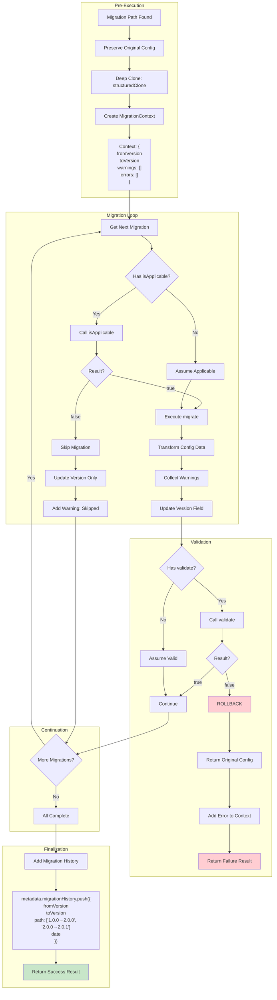

---

## Component Architecture

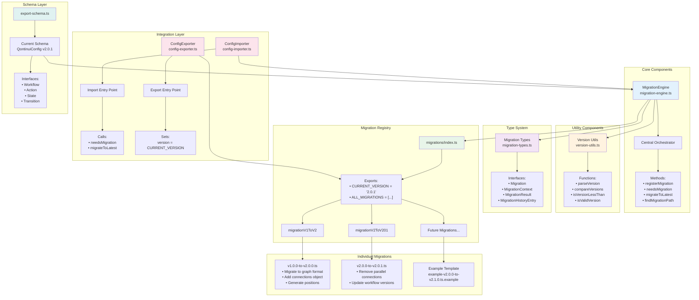

---

## Error Handling & Rollback Flow

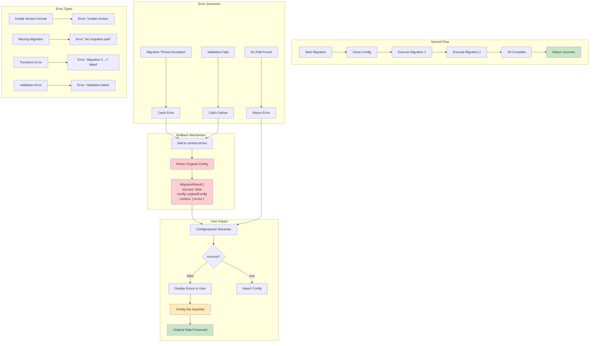

---

## Migration History Tracking

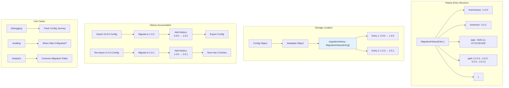

---

## Version Progression Timeline

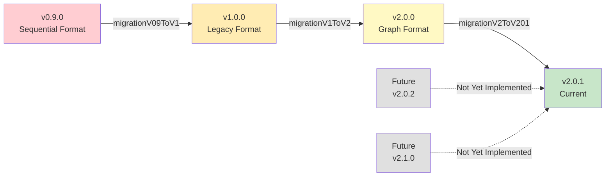

---

## Integration Points

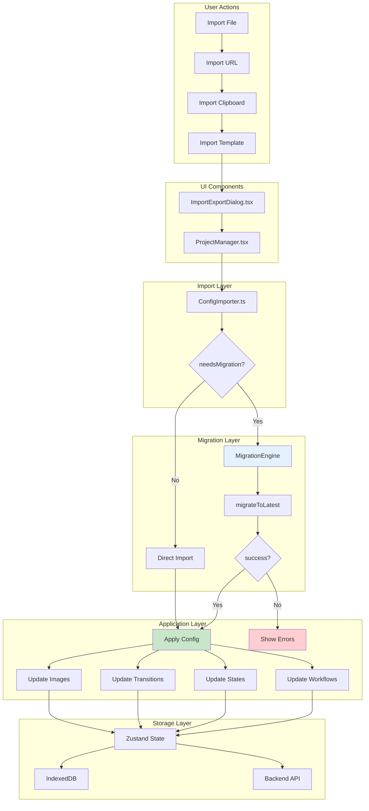

---

## Migration Examples

### Example 1: Simple Field Rename

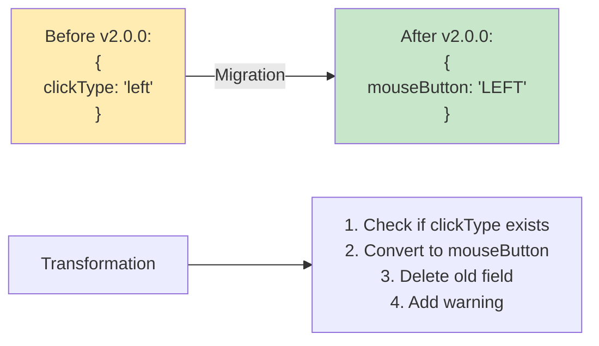

### Example 2: Type Conversion (String → Array)

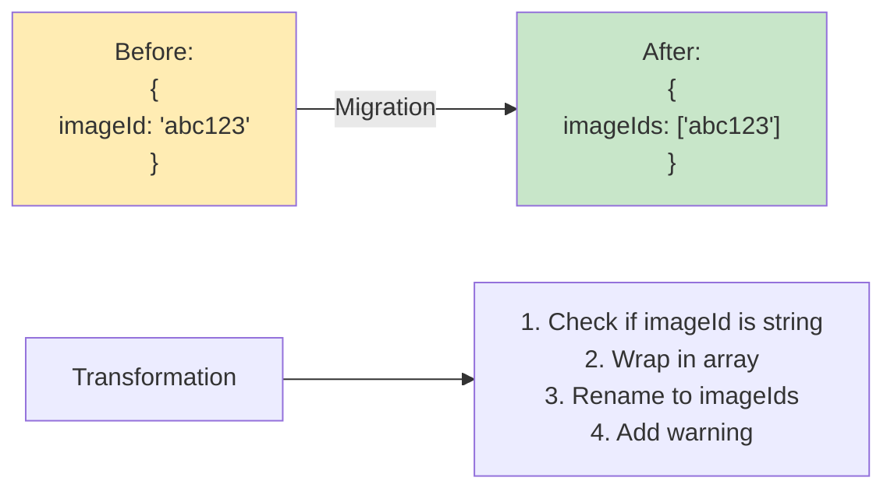

### Example 3: Object Restructuring

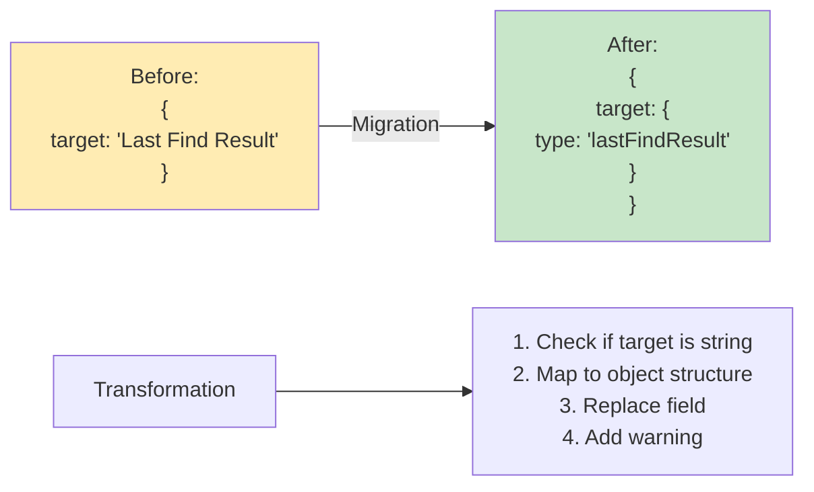

---

## Key Design Principles

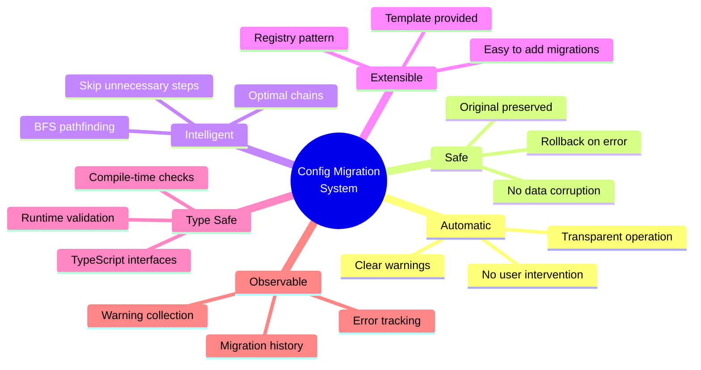

---

## Performance Characteristics

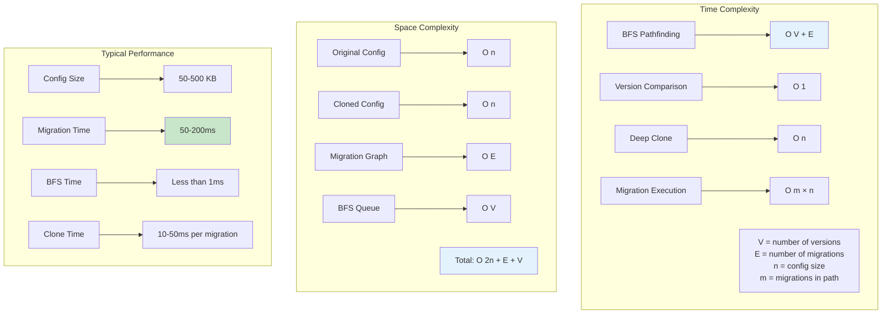

---

## Future Enhancement Opportunities

```mermaid
graph TB
    subgraph "Caching"
        A[Migration Result Cache] --> B[Cache by version + hash]
        B --> C[Speed up repeated imports]
    end

    subgraph "Preview"
        D[Migration Preview UI] --> E[Show changes before applying]
        E --> F[User approval required]
    end

    subgraph "Analytics"
        G[Track Migration Patterns] --> H[Which versions are common?]
        H --> I[Identify problem migrations]
    end

    subgraph "Validation"
        J[Enhanced Validation] --> K[Zod schema per version]
        K --> L[Stricter checks]
    end

    subgraph "Downgrade"
        M[Downgrade Support] --> N[Rollback to older versions]
        N --> O[Testing compatibility]
    end

    subgraph "Parallel Paths"
        P[Multiple Target Versions] --> Q[Support branching strategies]
        Q --> R[Environment-specific versions]
    end

    style C fill:#c8e6c9
    style F fill:#fff9c4
    style I fill:#e3f2fd
    style L fill:#c8e6c9
    style O fill:#ffecb3
    style R fill:#fff9c4
```

---

## References

**Core Implementation:**
- Migration Engine: `/frontend/src/lib/config-migration/migration-engine.ts`
- Migration Types: `/frontend/src/lib/config-migration/migration-types.ts`
- Version Utils: `/frontend/src/lib/config-migration/version-utils.ts`
- Registry: `/frontend/src/lib/config-migration/migrations/index.ts`

**Migrations:**
- v1→v2: `/frontend/src/lib/config-migration/migrations/v1.0.0-to-v2.0.0.ts`
- v2→v2.0.1: `/frontend/src/lib/config-migration/migrations/v2.0.0-to-v2.0.1.ts`
- Template: `/frontend/src/lib/config-migration/migrations/example-v2.0.0-to-v2.1.0.ts.example`

**Integration:**
- Config Importer: `/frontend/src/lib/config-importer.ts`
- Export Schema: `/frontend/src/lib/export-schema.ts`

**Documentation:**
- Full Guide: `/qontinui-dev-notes/qontinui/guides/CONFIG_MIGRATION_SYSTEM.md`

---

## Summary

The Config Migration System is a production-ready, intelligent solution for handling backward compatibility of JSON configurations. Key features:

✅ **Automatic** - Detects old versions and migrates transparently
✅ **Safe** - Preserves original data, rolls back on errors
✅ **Optimal** - BFS algorithm finds shortest migration path
✅ **Extensible** - Easy to add new migrations via registry pattern
✅ **Type-Safe** - Full TypeScript coverage with runtime validation
✅ **Observable** - Complete migration history and warning system

**Status:** Production-ready, actively used, well-documented
